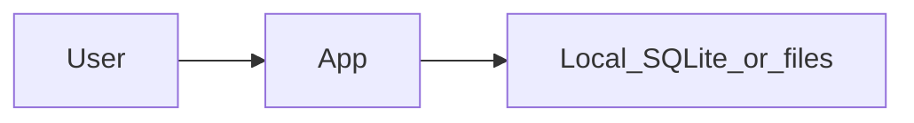
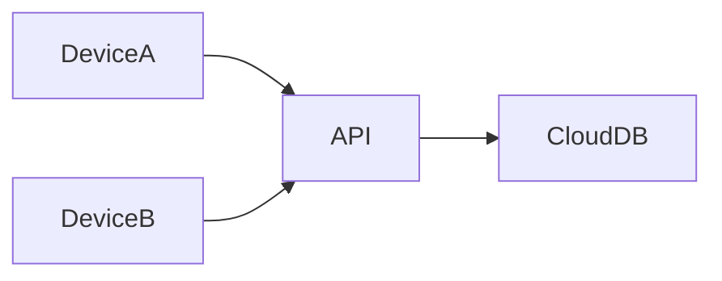
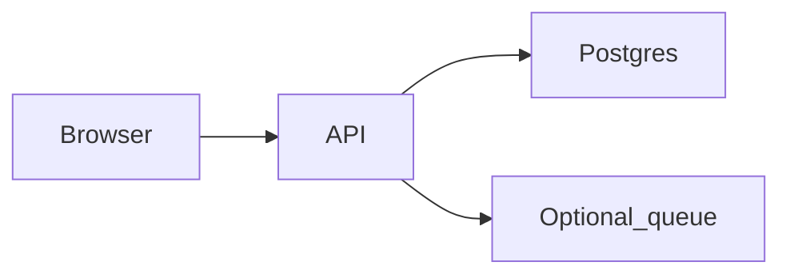
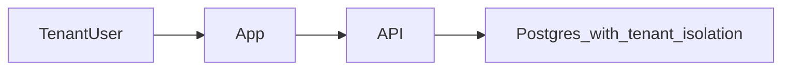
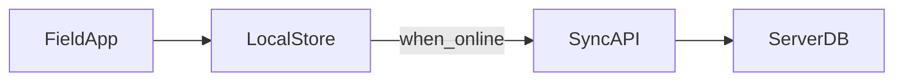

# Architecture defaults

Agents: run this **after** DISCOVERY has D0 stories (B-S9), unless the human explicitly asks to suggest stack early.

Pick **one** profile using user model + devices + **deploy target** + NFRs + journey shape. Propose; do not present a long menu.

Explain with 1 Mermaid diagram + 5 bullets, then ask to lock or change one thing. In **Why this fits**, cite those requirements. On lock, copy into `.cursor/brain/DECISIONS.md`, then run DISCOVERY **Step RULES**.

See [examples/solo-habit-tracker.md](./examples/solo-habit-tracker.md) for RE-first order (stories before stack).

## Platform × deploy → starter stack

Use this table to pick a concrete starter, then map to a profile below.

| Devices (day one) | Deploy target | Opinionated starter | Typical profile |
|-------------------|---------------|---------------------|-----------------|
| Phone / tablet | App Store / Play | Flutter **or** React Native + local DB; add sync API if multi-device | 1 or 2 or 5 |
| Phone | Local-only | Flutter/RN or mobile web PWA + SQLite; no backend | 1 |
| Browser | Public web (hosted) | React + TypeScript (Vite) · FastAPI or Node API · PostgreSQL · JWT/session | 3 or 4 |
| Browser | Self-hosted / on-prem | Same web stack; deploy as containers or VM behind org reverse proxy | 3 |
| Desktop | Installers + local-only | Tauri (or Electron) + SQLite | 1 |
| Desktop | Installers + sync account | Tauri/Electron + small sync API + cloud DB | 2 |
| Mixed web + mobile | Hosted API | React web + RN/Flutter clients · shared API · Postgres | 3 or 4 |
| Any | Offline field capture | Local store + outbox + sync API + server DB | 5 |

Still propose **one** stack. If the human rejects, offer a **one-line** alternative only.

## Profiles

### 1. Local single-user

**When:** One person; phone or desktop; no accounts; data stays on device; deploy = local-only or store without backend.

| Layer | Default |
|-------|---------|
| Client | Native or lightweight desktop/mobile UI |
| Backend | None (or embedded only) |
| Data | Local SQLite / files |
| Auth | None (device lock is enough) |
| Sync | N/A |



### 2. Multi-device same person

**When:** One human, several devices; needs the same data everywhere.

| Layer | Default |
|-------|---------|
| Client | Web and/or native |
| Backend | Small sync API |
| Data | Cloud DB + local cache optional |
| Auth | Single-user account (email/OAuth) |
| Sync | Last-write or CRDT-lite; conflict UX |



**Opinionated starter:** React or Flutter clients · Node or FastAPI sync · Postgres or managed DB · OAuth/email.

### 3. Small team / one org

**When:** A few people in one company; roles matter; not selling multi-tenant SaaS yet; deploy = hosted web or on-prem.

| Layer | Default |
|-------|---------|
| Client | Web app (PWA if mobile needed) or native + web |
| Backend | REST/JSON API |
| Data | PostgreSQL (single tenant) |
| Auth | Email/password or SSO; roles |
| Jobs | Queue only if long tasks exist |



**Opinionated starter (web):** React + TypeScript (Vite) · FastAPI or Node API · PostgreSQL · JWT/session auth.

### 4. Multi-tenant SaaS

**When:** Many separate customers/orgs; isolation required; deploy = public hosted web.

| Layer | Default |
|-------|---------|
| Client | Web (mobile later) |
| Backend | Multi-tenant API |
| Data | PostgreSQL + tenant isolation (RLS or schema-per-tenant) |
| Auth | Org membership + roles |
| Billing | Later phase; stub entitlements OK |



**Opinionated starter:** Same as small-team web stack + mandatory `tenant_id` on rows + RLS or equivalent.

### 5. Offline-first field

**When:** Users work without reliable network; must capture then sync; often phone/tablet + hosted or on-prem sync API.

| Layer | Default |
|-------|---------|
| Client | Mobile or desktop with local store |
| Backend | Sync API |
| Data | Local DB + server system of record |
| Auth | Login when online; cached session |
| Sync | Outbox queue; explicit conflict rules |



## How to propose (template)

Copy into chat, then into DECISIONS on lock:

```markdown
## Proposed architecture — <profile name>

<mermaid diagram>

1. Client: …
2. API: …
3. Data: …
4. Auth: …
5. Sync/jobs: …

**Why this fits:** (cite user model, deploy target, NFRs, D0 journeys)
**Tradeoff:** …
**Lock?** yes / change: …
```

## Anti-patterns

- Do not propose stack before D0 stories exist (unless human asked early).
- Do not default every app to “microservices.”
- Do not invent multi-tenant RLS for a personal tool.
- Do not skip offline conflict rules if profile 5 is chosen.
- Do not lock a stack the human rejected; record the tweak in DECISIONS.
- Do not ignore deploy target (e.g. App Store app with “hosted SPA only” and no mobile plan).
