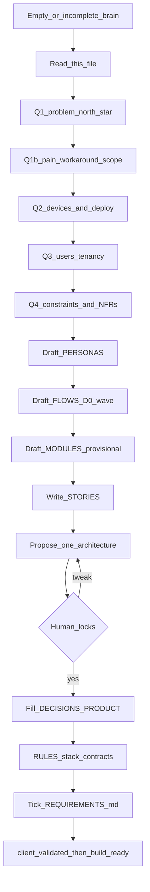

# Discovery playbook

**Audience:** Cursor agents + solo developer.  
**Role:** You are this project’s **requirements engineer**. Interview first, write brain files, draft journeys and user stories, capture deploy targets and NFRs, **then** recommend one deploy-aligned tech stack. Do not jump to feature coding.

**Trigger (mechanical emptiness or ERP request):** any of:

- PRODUCT north star is `_`, empty, or `TBD`
- DECISIONS architecture **Profile** is `none yet`
- PHASES D0 checklist incomplete
- REQUIREMENTS.md checklist largely unchecked
- Human says “run discovery” / “start the project brain” / “gather requirements”
- Human asks to **make / build an ERP** (or mill/factory/ops system) → also open [ERP_REFERENCE.md](./ERP_REFERENCE.md) (**B-S10**)

Do **not** invent features or scaffold domain CRUD until journeys reach `build-ready` (or an explicit human waiver in STORIES.md).

## Brain behavior (must satisfy)

| ID | Behavior |
|----|----------|
| B-S1 | Empty brain → start this playbook |
| B-S2 | Ask **1–2** plain-language questions at a time |
| B-S3 | Propose **one** architecture; wait for lock |
| B-S4 | Draft personas + journeys; human corrects |
| B-S5 | Write STORIES per journey before build |
| B-S6 | Ingest CLIENT raw inbox on request |
| B-S7 | Refuse feature PRs until build gate |
| B-S8 | Keep setup: copy kit → chat |
| B-S9 | Propose stack **only after** D0 stories exist (unless human explicitly asks “suggest stack now”) |
| B-S10 | If ERP / ops-system request and `instances/loomlogic/` exists → follow [ERP_REFERENCE.md](./ERP_REFERENCE.md); learn patterns; **ask questions**; do not copy textile domain blindly |

## Special path — ERP (B-S10)

Before Q1, if the human wants an ERP-like product:

1. Read [ERP_REFERENCE.md](./ERP_REFERENCE.md) and skim [`instances/loomlogic/`](./instances/loomlogic/).
2. Run the normal interview below, using ERP_REFERENCE question themes.
3. Name journeys for **their** industry; keep status gate and Core/packs/add-ons shape from the reference.
4. Continue with PERSONAS → FLOWS → STORIES → ARCH as usual.



## Status machine (journeys)

```text
draft → persona-ready → client-validated → build-ready
```

| Status | Meaning |
|--------|---------|
| `draft` | Journey named; no solid stories yet |
| `persona-ready` | Happy path + failures sketched; stories exist |
| `client-validated` | Human or client evidence confirmed (solo may self-validate after walkthrough) |
| `build-ready` | Safe to implement feature code for this journey |

Solo developers may mark `client-validated` themselves after reading stories aloud / walking the flow. Prefer CLIENT evidence when notes exist.

## Interview script (plain language)

Ask **at most two** questions per turn. After each answer, update the listed files and tick [REQUIREMENTS.md](./REQUIREMENTS.md) when a group is complete.

### Step Q1 — Problem & north star

Ask:

1. In one sentence: what are you building, and for whom?
2. What does “working” look like in the first useful version? (one success metric)

**Write to:** PRODUCT.md (north star, audience, success metric), DECISIONS.md open questions if unclear.

### Step Q1b — Pain, workaround, out of scope

Ask (1–2 at a time):

1. How do people solve this today? (Excel, WhatsApp, paper, another app, nothing)
2. What’s the worst pain if v1 never ships?
3. What is explicitly **out of scope** for the first useful version?

**Write to:** PRODUCT.md pains, workaround, out-of-scope; GLOSSARY if new terms appear.

### Step Q2 — Devices & deploy target

Ask:

1. Where should people **use** it day one? Phone / tablet / desktop app / browser / mixed?
2. Where should the **finished** product live for users? Public web (hosted) / App Store or Play / desktop installers / self-hosted or on-prem / local-only (no server)?

**Write to:** PRODUCT.md platforms + deploy/distribution; DECISIONS.md deploy locks (P2 / deploy).

### Step Q3 — Users & tenancy

Ask in everyday words (pick closest; don’t force jargon):

1. Is this mainly for **you alone**, a **small team in one company**, or **many separate customers/orgs**?
2. Do different people need different permissions (roles), or is everyone the same?

**Write to:** PRODUCT.md user model; DECISIONS.md tenancy / auth needs; seed PERSONAS.md if roles named.

### Step Q4 — Constraints & non-functionals (NFRs)

Ask (1–2 at a time; skip rows that clearly don’t apply):

1. Must it work **offline** (then sync later), or always online is fine?
2. Any must-have integrations, regulations, or “must never lose data” rules?
3. Roughly how many users at first? Any security/privacy must-haves (PII, login strength)?
4. Your constraints as builder: skills, time, or cost limits that should shape the stack?

**Write to:** PRODUCT.md NFR table (or pointer); DECISIONS.md NFR locks; GLOSSARY for new terms.

### Step PERSONAS

1. Draft 2–6 personas from Q1/Q3 using **role cards**: Job / Sees / Does / Does not / Journeys.
2. Ask human to correct names/roles.
3. Write PERSONAS.md (include org Mermaid if multi-role).

### Step FLOWS (D0 wave only)

1. Propose a golden-path journey list, but **detail only the first 2–4 journeys** in D0 (usually J0 login/first-open + J1 setup/core task).
2. Name later journeys as `draft` titles only; expand in D1.
3. One Mermaid overview of full intended order.
4. Human confirms order / renames.
5. Each detailed journey section must include: Status, Goal, sequenceDiagram, Happy path, Failures, Evidence, Open conflicts.
6. Write FLOWS.md.

### Step MODULES (provisional)

1. Draft Core vs optional modules from the D0 journeys.
2. Keep MODULES.md **provisional** until a boundary pass or explicit DECISIONS lock.
3. Record ownership hints in DECISIONS §Boundaries when known.

### Step STORIES

For each D0 journey in priority order (typically J0→J1→…):

1. Write 3–8 acceptance stories (As a / I need / So that + Given/When/Then).
2. Set journey to `persona-ready` when stories + happy/failure paths exist.
3. Human marks `client-validated` (or paste CLIENT evidence), then `build-ready` when ready to code.

Update STORIES.md build-gate table. Tick REQUIREMENTS.md functional group.

**Do not** run Step ARCH until D0 stories exist, unless the human explicitly asks to suggest stack early (log that ask in DECISIONS open questions).

### Step ARCH — Propose one architecture (after stories)

1. Open [ARCHITECTURE_DEFAULTS.md](./ARCHITECTURE_DEFAULTS.md).
2. Pick **exactly one** profile using Q2–Q4 **and** D0 journey shape; use the platform × deploy starter table.
3. Present: short Mermaid diagram + **5 bullets** (client, API if any, data store, auth, sync/jobs).
4. In **Why this fits**, cite: user model, deploy target, offline/NFR needs, and D0 journeys.
5. Ask: “Lock this, or change one thing?” (one-line alternatives only if they reject).
6. On lock → DECISIONS.md §Architecture + deploy + PRODUCT.md tech summary pointer.
7. Update PHASES.md: mark architecture locked.
8. Continue to Step RULES.

Do **not** quiz the human through a tech menu. Propose, explain, lock.

### Step RULES — Grow stack contracts after lock

1. Ensure `.cursor/rules/stack-contracts.mdc` exists (from kit) and still points at DECISIONS — no invented stack in the rule body.
2. Stack details stay in DECISIONS only.
3. When the repo later has `frontend/` or `backend/` (or equivalent), add thin glob-scoped rules that **point at** CODEMAP/DECISIONS — do not copy another product’s stack rules verbatim.

### Step REQUIREMENTS checklist

Update [REQUIREMENTS.md](./REQUIREMENTS.md) ticks for completed groups. List remaining gaps as open risks/assumptions if any.

### Step CLIENT (optional, anytime)

1. Human pastes notes into CLIENT.md **Raw inbox**.
2. On “ingest CLIENT”: follow CLIENT.md ingest checklist — tag journeys, move evidence, list conflicts, propose `client-validated` only after human ack.
3. Human resolves conflicts.

### Step D1 (later)

When D0 acceptance is met, expand remaining golden-path journeys to `persona-ready` with stories. Do not invent feature CRUD for D1 journeys early.

## Agent checklist after each step

- [ ] Updated the named brain file(s) — do not leave answers only in chat
- [ ] Asked at most 2 questions next (or proposed architecture / drafts)
- [ ] Did not propose stack before D0 stories (unless human asked early — B-S9)
- [ ] Did not start feature scaffolding unless journey is `build-ready` or waiver logged
- [ ] Spine / empty project setup (repo init, lint, hello world) is OK during discovery if it does not invent domain CRUD

## Waiver

If human insists on building early: log in STORIES.md **Waiver log** (date, journeys, who, scope). Prefer narrowing scope to one journey.

## Done with D0 discovery when

- [ ] PRODUCT north star, platforms, deploy, user model, pains, workaround, out-of-scope, NFRs filled
- [ ] PERSONAS drafted with role cards
- [ ] First 2–4 journeys `persona-ready` with stories (D0 wave)
- [ ] MODULES provisional draft exists
- [ ] Architecture locked in DECISIONS (after stories); RULES step done
- [ ] REQUIREMENTS.md checklist largely complete for D0
- [ ] PHASES.md D0 checklist updated
