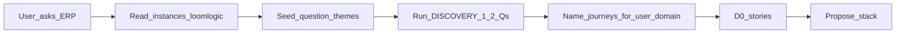

# ERP reference playbook

**When:** User asks to make / build an **ERP**, mill/factory/ops system, or similar (“complete operations software”, “business ERP”, etc.).

**Reference project:** [`instances/loomlogic/`](./instances/loomlogic/) — a filled Brainiac brain for LoomLogic (textile ERP). Use it to **learn structure and interview themes**, not to clone textile domain blindly.

## Agent steps (must)

1. Open this file + skim `instances/loomlogic/` — especially PRODUCT, FLOWS (status gate), MODULES (Core / packs / add-ons), DECISIONS (boundaries), REQUIREMENTS, CLIENT (conflict parking).
2. Follow [DISCOVERY.md](./DISCOVERY.md) (B-S10). Ask **1–2** questions at a time; write answers into the **new** project’s `.cursor/brain/` (or empty `brain/` stubs after install).
3. **Do not** copy Yarn / Weave / Dye / bales / greige into the new product unless the user is building a textile mill system.
4. Propose journeys **analogous** to the reference shape, renamed for their domain:
   - J0 — Login / roles / visibility
   - J1 — Setup masters enough to run a day
   - J2 — Commercial order → confirmed
   - J3+ — Domain ops (receive → process → QC → pack → dispatch / inventory) as their industry requires
5. Suggest **Core vs optional packs vs later add-ons** (reference deferred Analytics + AI assistant until ops ERP works).
6. Still **B-S9**: D0 stories before stack lock (unless they ask to suggest stack early).

## Question themes seeded from the reference

Use these themes (adapt wording; do not dump as a long quiz):

| Theme | Example ask |
|-------|-------------|
| Industry / north star | What operations must the ERP cover day one? |
| Deploy | On-prem single site vs hosted multi-tenant? |
| Devices | Browser only, or floor tablets/phones too? |
| Scale | Roughly how many people will use it? |
| Success metric | What does “complete enough ops ERP” exclude for later (analytics, AI, accounting)? |
| Backup | Prefer automatic scheduled backups with no routine IT clicks? |
| Roles | Park final role/nav matrix until client meeting, or lock now? |
| Workaround | What do they use today (Excel, WhatsApp, paper)? |

## Anti-patterns

- Pasting LoomLogic FLOWS/STORIES verbatim into a non-textile ERP
- Skipping interview because “the reference already answered”
- Proposing multi-tenant SaaS when they said on-prem single site (or the reverse)
- Building Analytics/AI before the operational golden path is journey-ready
