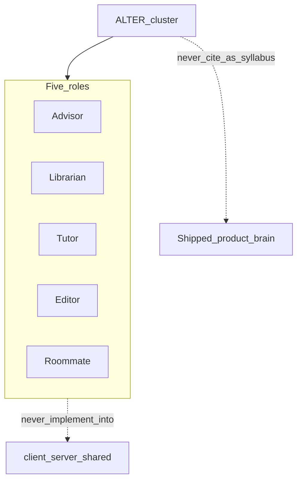
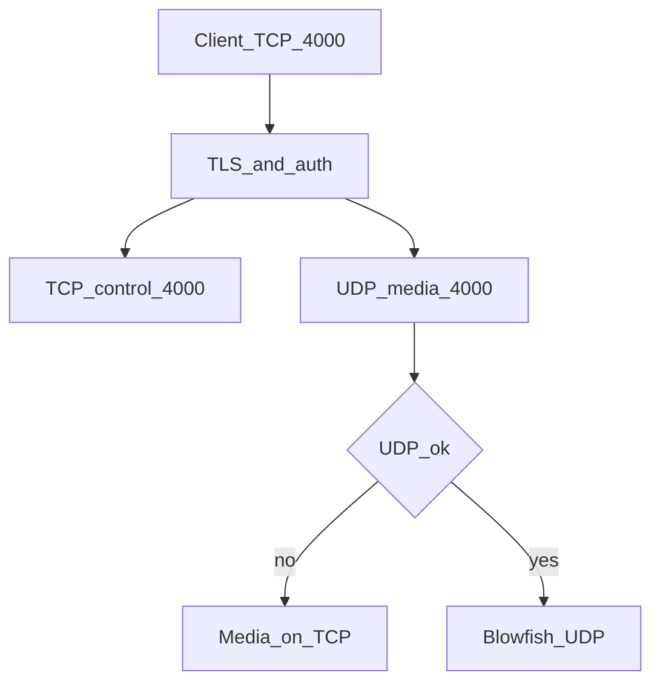
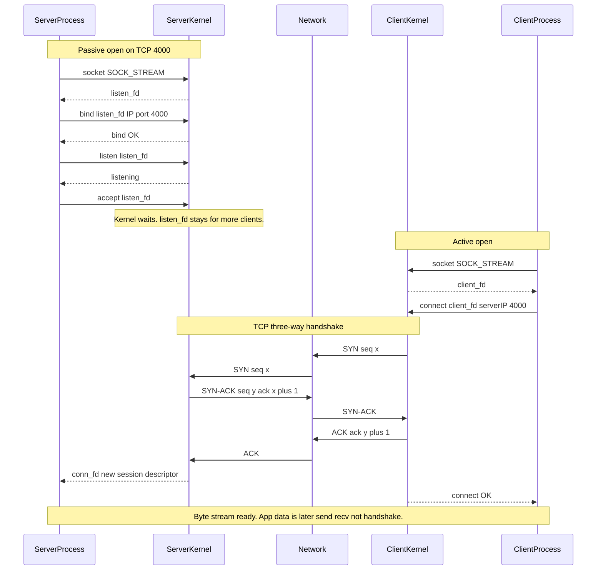

# ALTER (independent learning path)

A.L.T.E.R. trains new hires, undergraduates, and the existing team on a **self-hosted, peer-to-peer remote desktop and terminal** systems-programming curriculum (conceptually modeled on NoMachine NX). Target language for labs: modern C++ (C++17/C++20) on POSIX/Linux.

This cluster is **not** the shipped product brain. Syllabus and agent roles live here. Do not teach ALTER from PRODUCT, DECISIONS, FLOWS, CODEMAP, or GLOSSARY. Do not implement ALTER labs under `client/`, `server/`, or `shared/`. Later labs, if requested, get their own tree.

Evidence: [ALTER_CLIENT.md](./ALTER_CLIENT.md). Learners: [ALTER_PERSONAS.md](./ALTER_PERSONAS.md). Journeys: [ALTER_FLOWS.md](./ALTER_FLOWS.md). Stories: [ALTER_STORIES.md](./ALTER_STORIES.md). Terms: [ALTER_GLOSSARY.md](./ALTER_GLOSSARY.md).

## North star

A learner who knows little or nothing about remote desktop internals can be oriented, given grounded NX-style specs, warned about architectural pitfalls, held to defensive C++ rules, and given stable metaphors — so they can eventually contribute without inventing ports, ciphers, or codecs.

## Success metric (D0)

In this repo, Cursor consistently acts as **Advisor, Librarian, Tutor, Editor, and Roommate** using only this cluster. D0 does not require a lesson site or lab binaries.

## Out of scope (D0)

Written exercise packs, a hosted LMS, and any C++ under `client/` `server/` `shared/`. NX-like toy code is a later wave and must use a separate tree.

---

## Advisor — curriculum and milestones

Execute stages **in order**. Validate each milestone (in a future lab tree) with tests before the next stage.

### Stage 1 — Tunnel and control daemon

- **Concepts:** POSIX sockets (`SOCK_STREAM`, `SOCK_DGRAM`), non-blocking I/O, `epoll` or `select`, session negotiation.
- **Blueprint:** Event loop listens on **TCP 4000**. Accept connections, read capability strings, spawn session state. Negotiate a parallel UDP socket for multimedia.
- **Milestone:** Client–server pair completes a secure handshake, TCP control channel, negotiated UDP port and key, two-way packet exchange.

### Stage 2 — Graphics and codec pipeline

- **Concepts:** Capture, frame buffers, real-time encode, adaptive streaming.
- **Blueprint:** Capture display frames. Multi-codec manager. Dynamic content identification (progressive refinement).
- **Milestone:** High-motion regions H.264 or VP8; static areas JPEG; stream over UDP with loss recovery.

### Stage 3 — Security and system integration

- **Concepts:** TLS wrapping, AES-GCM / Blowfish, Linux PAM, privacy notifications.
- **Blueprint:** TCP with OpenSSL **`ECDHE-RSA-AES128-GCM-SHA256`**. UDP with Blowfish; keys rotated on TCP. PAM (+ MFA path). No-stealth: tray and/or desktop notification (Rule 3).
- **Milestone:** PAM-authenticated tunnel, encrypted P2P channels, mandatory tray and/or desktop session notifications (no stealth).

### Stage 4 — Standalone terminal

- **Concepts:** `pty`, fork/exec, non-persistent shells.
- **Blueprint:** CLI-only session; master/slave pty; I/O on multiplexed TCP; concurrent limits.
- **Milestone:** Interactive shell, clean disconnect, server enforces session counts.

---

## Librarian — grounded specs (ALTER truth)

Do not invent alternate defaults unless the human explicitly asks.

**Ports and transports**

- `nxd` default TCP **4000**. UDP default **4000** (negotiated, matched to TCP); must be reachable on host and nodes.
- UDP negotiation fail → multiplex multimedia onto the existing TCP socket.
- SSH (port **22**): UDP **disabled**; control and media through the SSH tunnel.
- Web: HTTPS **443** (Apache `mod_ssl` analog). UDP for web only if WebRTC is negotiated.

**Crypto**

- TCP: OpenSSL TLS 1.2, cipher **`ECDHE-RSA-AES128-GCM-SHA256`**.
- UDP: symmetric **Blowfish**; keys negotiated and rotated on TCP.
- Self-hosted P2P. Session bytes and keys must **not** pass through third-party servers.

**Codecs**

- Video: **H.264** or **VP8**. Prefer NVENC / Quick Sync / AMD; else `libx264` / ffmpeg software.
- Audio: **Opus**, fallback **Vorbis**. Mic: **Speex**.

**X11 vector (lightweight) mode**

1. Text and GUI: compressed X11 primitives (`nxproxy` / `nxagent` analog).
2. Static images: **JPEG**.
3. Active video regions: H.264 or VP8.

**Remote terminal**

- No graphical desktop. Config keys: **`RemoteTerminalsLimit`**, **`RemoteTerminalsUserLimit`**.
- Non-persistent: disconnect terminates shell subprocesses.

---

## Tutor — mental models

### Dual-transport state machine

The daemon is a multiplexer: TLS + auth on TCP 4000, then TCP control (mouse, keys, files, smartcards) **and** UDP media (H.264, Opus) with Blowfish. If UDP is blocked, fail over media onto TCP.

### Stage 1 — TCP mailbox and kernel handshake

The C++ process only issues POSIX syscalls (`SOCK_STREAM`). **SYN / SYN-ACK / ACK are kernel work.** UDP 4000 is negotiated after this TCP path and is omitted here. TLS (`ECDHE-RSA-AES128-GCM-SHA256`) wraps the byte stream later; it is not this figure.

- **listen_fd** = the door; **conn_fd** = this client’s session. `accept` does not consume the listening socket.
- Handshake completes **before** either process sees a successful `connect` / `accept` return.

### Adaptive bitrate

Not push-and-forget. Monitor RTT; encode time vs decode time; socket write queues (drop unsent UDP frames rather than send late ones); progressive refinement of static regions toward lossless text.

---

## Editor — defensive C++ (future ALTER labs)

Rigid from day one. Future lab C++ (separate tree, never `client/` `server/` `shared/`) must satisfy these.

**Rule 1 — Ignore or handle `SIGPIPE`.** If the daemon `write`s (or `send`s) to a TCP peer that has already disconnected, the Linux kernel delivers `SIGPIPE`. The default action **terminates the entire process**. Lab code must not leave that default. Either:

- ignore: `signal(SIGPIPE, SIG_IGN)`, or
- handle: `sigaction` with `sa_handler = SIG_IGN` (or a handler that does not abort the daemon).

A single dropped client must not take down the server.

**Rule 2 — Avoid stack / buffer overflows on receive.** Incoming socket bytes go into a buffer. If the peer sends more than that buffer can hold and the code copies without a bound, memory is corrupted. Lab code must:

- allocate a bounded buffer (`std::vector<uint8_t>` or `std::array`, not an unchecked `char buf[1024]` receive), and
- use **strict boundary checks**: honor the return value of `read()` / `recv()` (and never copy more bytes than the buffer length or than that return size).

Treat a negative return as error; treat `0` on TCP as orderly close. Do not assume the peer sent exactly `sizeof(buf)` bytes.

**Rule 3 — Absolutely no stealth mode.** A remote session must be **visible on the host**: system tray icon and/or desktop notification on incoming connection. Silent, undetected background operation **must not** be implemented. Do not add a “hidden session” or “no indicator” path.

- `O_NONBLOCK` + `epoll_create1` / `epoll_ctl` / `epoll_wait`. Not thread-per-connection.
- Pty: `openpty` / `login_tty`; do not exec raw client strings as shell; reap process groups (no zombies).

---

## Roommate — metaphors (ALTER class names)

These names are **curriculum modules**, not files in the shipped trees.

| Component | Module idea | Metaphor |
|-----------|-------------|----------|
| Control TCP daemon (`nxd`) | `TcpControlDaemon` | Maître D': admits guests, checks the reservation, seats them |
| Blowfish UDP stream | `UdpMediaPipeline` | Sushi conveyor: miss a plate, take the next |
| X11 vector agent (`nxagent`) | `VectorGraphicsProxy` | Recipe book: send how to bake, not the cake |
| GPU H.264 hook | `HardwareVideoEncoder` | Industrial slicer: dedicated hardware, kitchen (CPU) stays free |
| Remote terminal | `StandaloneTerminalSession` | Intercom: voice pipe, no graphical kitchen |
