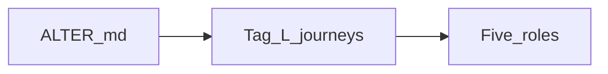

# ALTER evidence (independent ingest)

Not the shipped-product [CLIENT.md](./CLIENT.md). Do not copy this ingest there.

## Intake status

| Field | Value |
|-------|--------|
| Source | [ALTER.md](./ALTER.md) (live syllabus). Original five-section prompt ingested 2026-09-01, then removed as a duplicate file. |
| Last ingest | 2026-09-01 — structured into ALTER cluster |
| Open conflicts | None inside ALTER. Independent of shipped-product locks. |

## Raw inbox

_(empty — ingested 2026-09-01)_

## Archive — ingest 2026-09-01

The original ingest was a five-section system prompt now living in [ALTER.md](./ALTER.md): Advisor (four stages), Librarian (NX-derived ports, ciphers, codecs, vector mode, remote terminal), Tutor (dual-transport + adaptive bitrate), Editor (POSIX / no-stealth / pty), Roommate (five module metaphors). Language: C++17/20 POSIX/Linux. Objective: self-hosted P2P remote desktop and terminal, conceptually NX.

## Evidence by role / journey

### Cross-cutting

| ID | Paraphrase | Implication |
|----|------------|-------------|
| AE0 | Guide a high-performance self-hosted P2P remote desktop and terminal system | ALTER north star |
| AE1 | Modern C++ on POSIX/Linux | Lab language when labs exist |
| AE2 | Five named agent roles (Advisor, Librarian, Tutor, Editor, Roommate) | D0 success = agent plays these |
| AE3 | Do not hallucinate NX defaults | L1 Librarian |

### L0 Advisor

| ID | Paraphrase | Implication |
|----|------------|-------------|
| AE10 | Four sequential stages with unit-test gates | Teach order Stage 1→4 |
| AE11 | Stage 1: TCP 4000, UDP negotiate, handshake milestone | L0 orientation |
| AE12 | Stage 2: H.264/VP8 motion, JPEG static, UDP + loss recovery | After tunnel |
| AE13 | Stage 3: TLS cipher, Blowfish UDP, PAM, no-stealth | After graphics |
| AE14 | Stage 4: pty, limits, non-persistent shells | Last |

### L1 Librarian

| ID | Paraphrase | Implication |
|----|------------|-------------|
| AE20 | TCP/UDP 4000; UDP fail → TCP; SSH disables UDP; web 443 / WebRTC | Port table |
| AE21 | TLS `ECDHE-RSA-AES128-GCM-SHA256`; UDP Blowfish; keys on TCP | Crypto table |
| AE22 | No third-party for session bytes or keys | Trust model |
| AE23 | H.264 or VP8; GPU then software; Opus/Vorbis; Speex mic | Codecs |
| AE24 | X11 vector: primitives + JPEG + video regions | Lightweight mode |
| AE25 | `RemoteTerminalsLimit` / `RemoteTerminalsUserLimit`; kill shells on close | Terminal |

### L2 Tutor

| ID | Paraphrase | Implication |
|----|------------|-------------|
| AE30 | Dual path: TCP control vs UDP media; failover | State machine |
| AE31 | RTT, encode vs decode, drop late UDP, progressive refinement | Bitrate |

### L3 Editor

| ID | Paraphrase | Implication |
|----|------------|-------------|
| AE40 | Vector/array; Rule 2 honor `read`/`recv` size; Rule 1 `SIGPIPE`; non-blocking epoll | Socket hardlines |
| AE41 | Rule 3: tray and/or desktop notify; no silent mode; openpty; no raw exec; reap process groups | Privacy + pty |

### Roommate (mode)

| ID | Paraphrase | Implication |
|----|------------|-------------|
| AE50 | `TcpControlDaemon`, `UdpMediaPipeline`, `VectorGraphicsProxy`, `HardwareVideoEncoder`, `StandaloneTerminalSession` | Curriculum class names only |
