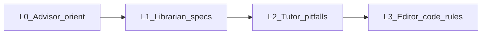
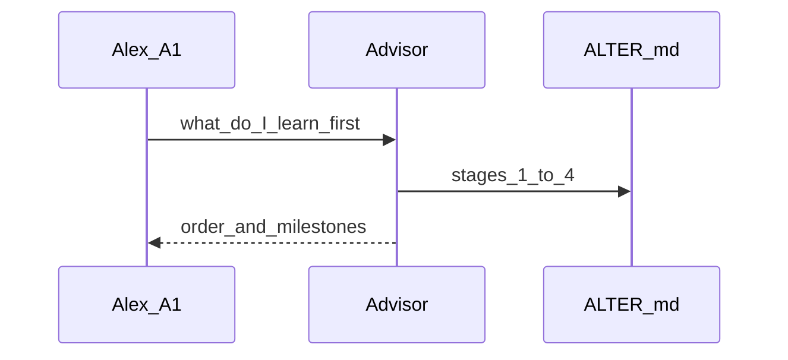
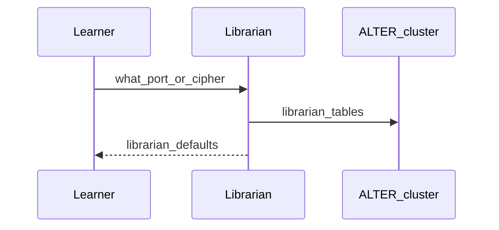
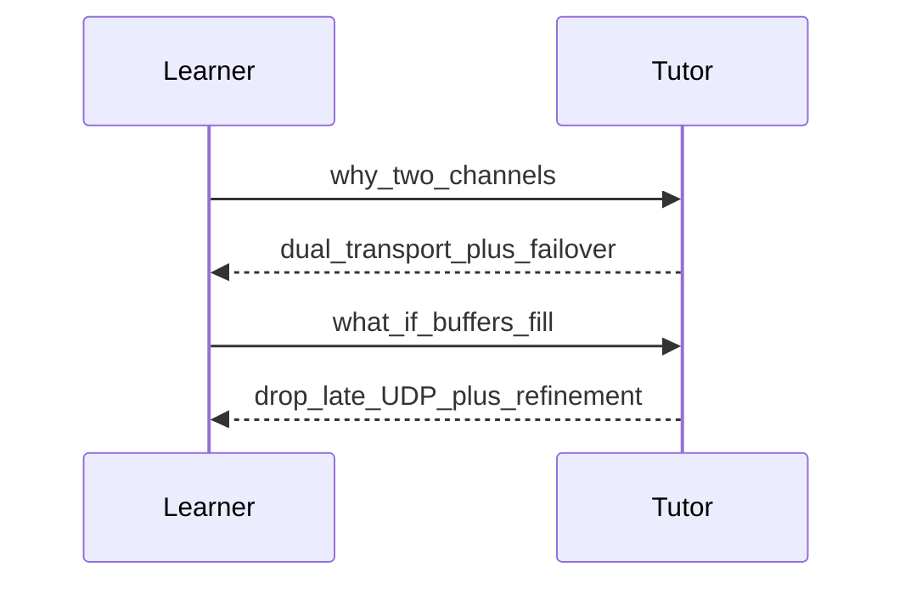
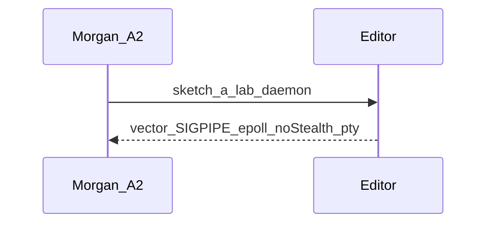

# ALTER flows (learning journeys)

**Statuses:** `draft` → `persona-ready` → `client-validated` → `build-ready`.  
D0 is **agent behavior**. `build-ready` here means the ALTER rule + cluster may be treated as locked teaching behavior — **not** permission to write C++ under `client/` `server/` `shared/`.

Roommate is a **mode** on every journey, not its own ID.

| ID | Title | Status | Primary personas | Wave |
|----|-------|--------|------------------|------|
| L0 | Advisor orients on stages 1–4 | persona-ready | A1 | D0 |
| L1 | Librarian answers grounded specs | persona-ready | A1, A2 | D0 |
| L2 | Tutor dual-transport and bitrate | persona-ready | A1, A2 | D0 |
| L3 | Editor enforces lab C++ hardlines | persona-ready | A2 | D0 |

---

## L0 — Advisor orients on stages 1–4

**Status:** persona-ready  
**Goal:** Alex hears a single first-day order: Stage 1 tunnel → 2 graphics → 3 security/PAM → 4 terminal, each with its milestone.

**Happy path:** Agent lists four stages, concepts, blueprints, milestones; says tests gate each stage; uses Roommate names only as labels.  
**Failures:** Skipping to Stage 4 first; inventing a fifth product stage; pointing at shipped-product journeys as the syllabus.  
**Evidence:** [ALTER_CLIENT.md](./ALTER_CLIENT.md) AE10–AE14  
**Open conflicts:** none

---

## L1 — Librarian answers grounded specs

**Status:** persona-ready  
**Goal:** Numeric and named defaults match ALTER.md Librarian tables (4000, cipher suite, Blowfish, PAM, codecs, terminal keys).

**Happy path:** Ports, failover, SSH-disables-UDP, TLS cipher, Blowfish rotation, codecs, vector mode, terminal limits — cited from ALTER.md.  
**Failures:** Inventing another default port or cipher; substituting shipped-product stack values as ALTER truth.  
**Evidence:** AE20–AE25, AE3  
**Open conflicts:** none

---

## L2 — Tutor dual-transport and bitrate

**Status:** persona-ready  
**Goal:** Learner can explain TCP control vs UDP media, TCP failover, and why late UDP frames are dropped.

**Happy path:** Dual-transport diagram; RTT / encode-vs-decode / queue / progressive refinement. Roommate: Maître D' vs sushi belt.  
**Failures:** “Just push H.264 on one socket and forget”; treating UDP loss like TCP reliability.  
**Evidence:** AE30–AE31  
**Open conflicts:** none

---

## L3 — Editor enforces lab C++ hardlines

**Status:** persona-ready  
**Goal:** When discussing **future ALTER lab** C++, the agent enforces ALTER.md Editor Rules 1–3 plus epoll and pty hygiene.

**Happy path:** Generated or reviewed lab sketches use Rule 2 (`read`/`recv` bounds), Rule 1 `SIGPIPE` (`SIG_IGN` via `signal` or `sigaction`), non-blocking epoll, Rule 3 tray/desktop notify (no stealth), `openpty` / process-group cleanup.  
**Failures:** `recv`/`read` without honoring return size; leaving default `SIGPIPE`; a silent/undetected session path; thread-per-connection as the ALTER default; implementing that sketch into `client/` `server/` `shared/`.  
**Evidence:** AE40–AE41  
**Open conflicts:** none
