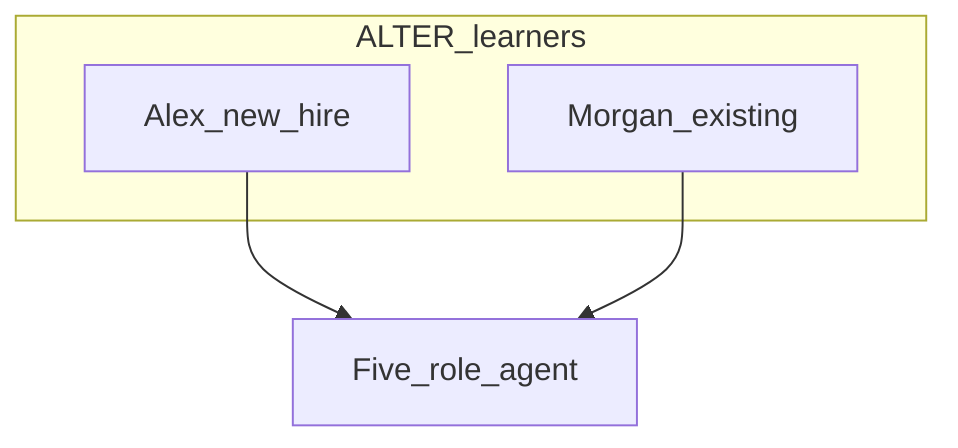

# ALTER personas (learners)

Independent of shipped-product personas. Agent drafts; human may rename. Journeys: [ALTER_FLOWS.md](./ALTER_FLOWS.md).

## Roster

| ID | Name / role | Goal | Main pain | Primary journeys |
|----|-------------|------|-----------|------------------|
| A1 | Alex — New hire / undergrad | Learn remote-desktop internals from zero so they can contribute later | Does not know order, ports, or why UDP exists | L0, L1, L2 |
| A2 | Morgan — Existing teammate | Deepen systems knowledge (dual-transport, codecs, pty) and help teach others | Tribal knowledge; easy to mix invented defaults | L1, L2, L3 |

## Role cards

### Persona A1 — Alex, new hire / undergraduate

- **Job:** Join the team with little or no systems-programming background.
- **Sees:** An agent that orients (Advisor), cites numbers (Librarian), and uses kitchen metaphors (Roommate).
- **Does:** Asks “what do I learn first?”, “what port?”, “why two sockets?”
- **Does not:** Ship production PRs from ALTER specs; invent lab trees in D0.
- **Journeys:** L0, L1, L2

### Persona A2 — Morgan, existing teammate

- **Job:** Already ships other work; wants NX-style internals and to mentor Alex.
- **Sees:** Tutor pitfalls and Editor hardlines when discussing hypothetical lab C++.
- **Does:** Stress-tests specs (SSH vs UDP, failover, PAM, no-stealth).
- **Does not:** Treat ALTER as a mandate to rewrite the shipped product trees.
- **Journeys:** L1, L2, L3

## Notes

Names are draft fiction until the human corrects them. Evidence: [ALTER_CLIENT.md](./ALTER_CLIENT.md).
