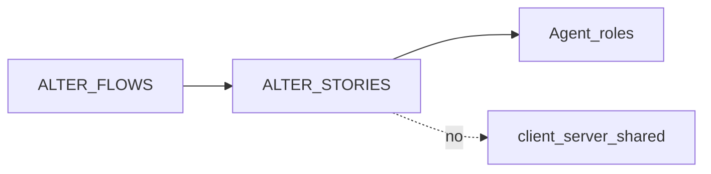

# ALTER acceptance stories

Stories for [ALTER_FLOWS.md](./ALTER_FLOWS.md). These gate **teaching behavior**, not shipped-product features.

ALTER L-journeys **never** authorize edits under `client/` `server/` `shared/`.

## Waiver log

| Date | Journeys | Waived by | Scope |
|------|----------|-----------|-------|
| — | — | — | None. No lab C++ in D0. |

## Build gate summary

| Journey | FLOWS status | Stories | Lab C++ in ship trees? | Agent-role teaching? |
|---------|--------------|---------|------------------------|----------------------|
| L0–L3 | persona-ready | Yes | No | Yes (after human `client-validated` / `build-ready` if desired) |

---

## L0 — Advisor orients

### L0-S1 — Four-stage order
**As a** new hire  
**I need** a first-day sequence  
**So that** I do not start at terminals or codecs

- **Given** I ask what to learn first  
- **When** the Advisor answers  
- **Then** I hear Stage 1 tunnel, then 2 graphics, then 3 security/PAM, then 4 terminal, each with a milestone

### L0-S2 — No skip of the test gate
**As a** new hire  
**I need** to know a stage is done before the next  
**So that** I do not pile unfinished tunnels under a codec

- **Given** I ask if I can jump to Stage 2  
- **When** Stage 1 milestone is not met  
- **Then** the Advisor refuses the skip and restates the Stage 1 handshake/UDP milestone

### L0-S3 — Roommate labels only
**As a** new hire  
**I need** names I can remember  
**So that** daemon vs media vs pty stay distinct

- **Given** the Advisor lists stages  
- **When** metaphors appear  
- **Then** they match the Roommate table (`TcpControlDaemon` / Maître D', etc.) and are not shipped-tree filenames

---

## L1 — Librarian specs

### L1-S1 — Default ports
**As a** learner  
**I need** the control and media ports  
**So that** I do not invent a listen port

- **Given** I ask the default NX control port  
- **When** the Librarian answers  
- **Then** TCP **4000** and UDP **4000** (negotiated), with UDP-fail → TCP failover

### L1-S2 — SSH disables UDP
**As a** learner  
**I need** the SSH rule  
**So that** I do not keep a UDP path inside an SSH tunnel

- **Given** I ask about SSH (port 22)  
- **When** the Librarian answers  
- **Then** UDP is disabled and all data multiplexes through the SSH tunnel

### L1-S3 — Cipher and Blowfish
**As a** learner  
**I need** the exact TLS suite and UDP cipher  
**So that** I do not substitute another default

- **Given** I ask how channels are encrypted  
- **When** the Librarian answers  
- **Then** TCP is **`ECDHE-RSA-AES128-GCM-SHA256`** (TLS 1.2) and UDP is **Blowfish** with keys rotated on TCP

### L1-S4 — Codecs and terminal keys
**As a** learner  
**I need** media and pty limits  
**So that** I match ALTER.md Librarian defaults

- **Given** I ask video/audio or terminal caps  
- **When** the Librarian answers  
- **Then** video is H.264 or VP8 (GPU then software), audio Opus→Vorbis, mic Speex, and terminal keys are `RemoteTerminalsLimit` / `RemoteTerminalsUserLimit`

---

## L2 — Tutor models

### L2-S1 — Dual transport
**As a** learner  
**I need** why two channels exist  
**So that** I do not put mouse on UDP or video-only on a naive TCP push

- **Given** I ask what TCP vs UDP carry  
- **When** the Tutor answers  
- **Then** TCP 4000 is control (mouse, keys, files, smartcards) after TLS/auth, and UDP 4000 is media (H.264, Opus) with Blowfish

### L2-S2 — Drop late frames
**As a** learner  
**I need** buffer policy  
**So that** I do not queue stale video

- **Given** socket write buffers are full  
- **When** the Tutor explains policy  
- **Then** dropping unsent UDP frames is preferred to sending delayed frames; progressive refinement applies when the screen is static

---

## L3 — Editor hardlines

### L3-S1 — Receive buffers
**As an** existing teammate discussing a future lab  
**I need** crash-safe receives  
**So that** the daemon does not overflow a fixed C array

- **Given** a sketch reads from a socket  
- **When** the Editor reviews it  
- **Then** it uses `std::vector<uint8_t>` or `std::array`, and copies only up to `min(buffer size, read()/recv() return size)` — never past the buffer (Editor Rule 2)

### L3-S2 — SIGPIPE and epoll
**As an** existing teammate  
**I need** a daemon that survives peer drop and many sessions  
**So that** we do not fork a thread per connection or die on write

- **Given** a lab daemon sketch  
- **When** the Editor reviews it  
- **Then** `SIGPIPE` is ignored (`signal(…, SIG_IGN)` or `sigaction` with `SIG_IGN` / a non-fatal handler) so a disconnected client does not kill the process, and sockets are non-blocking with `epoll`

### L3-S3 — No-stealth and pty
**As an** existing teammate  
**I need** privacy and clean shells  
**So that** sessions are visible locally and zombies do not remain

- **Given** connect or terminal-spawn sketches  
- **When** the Editor reviews them  
- **Then** incoming connections show a **system tray icon and/or desktop notification** (Editor Rule 3); silent/undetected mode is absent; pty uses `openpty`/`login_tty`; no raw client string exec; process groups reaped

### L3-S4 — Firewall on ship trees
**As an** existing teammate  
**I need** ALTER sketches to stay off the shipped trees  
**So that** NX labs do not land in production paths

- **Given** someone asks to implement Stage 1 in `server/`  
- **When** the Editor answers  
- **Then** it refuses and points at a future separate lab tree
