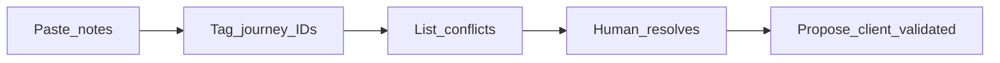

# Client / notes evidence

Hybrid discovery: **personas first** ([PERSONAS.md](./PERSONAS.md)), **notes second** (this file), then upgrade journey status in [FLOWS.md](./FLOWS.md).

Works for external clients **or** your own voice notes / WhatsApp dumps.

## Intake status

| Field | Value |
|-------|--------|
| Source / client | _TBD_ |
| Profile / product slice assumed | _TBD_ |
| Last ingest | — |
| Open conflicts | 0 |

**How to paste:** Drop messy bullets under **Raw inbox**, then ask an agent to “ingest CLIENT.md.”

---

## Raw inbox

<!-- Paste new notes below this line. Do not edit structured sections until ingest. -->

_(empty)_

---

## Evidence by journey

### J0 — _

| ID | Quote or paraphrase | Source | Implication |
|----|---------------------|--------|-------------|
| — | — | — | — |

### J1 — _

| ID | Quote or paraphrase | Source | Implication |
|----|---------------------|--------|-------------|
| — | — | — | — |

---

## Conflicts (persona vs client / notes)

| Conflict ID | Journey | Persona default | Client / notes say | Resolution | Owner |
|-------------|---------|-----------------|--------------------|------------|-------|
| — | — | — | — | _open_ | — |

When resolved, update [FLOWS.md](./FLOWS.md) status and [PERSONAS.md](./PERSONAS.md) if role cards change.

---

## Ingest checklist (agent)

1. Move Raw inbox items into Evidence tables; tag journey IDs (`J0`, `J1`, …).
2. Add Conflict rows where notes contradict PERSONAS/FLOWS/DECISIONS.
3. Do **not** silently change locked DECISIONS without human confirm.
4. Propose status: `client-validated` only after human ack on that journey (solo may ack themselves).
5. Clear Raw inbox after structured move (keep an archive subsection if needed).
6. Never jump straight to `build-ready` from ingest — human sets build-ready when ready to code.
