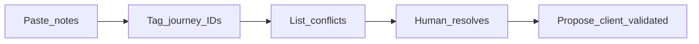

# Client / notes evidence

Hybrid discovery: **personas first** ([PERSONAS.md](./PERSONAS.md)), **notes second** (this file), then upgrade journey status in [FLOWS.md](./FLOWS.md).

Works for external clients **or** your own voice notes / WhatsApp dumps.

## Intake status

| Field | Value |
|-------|--------|
| Source / client | Builder notes: [README.md](../../README.md), [remote-desktop-app-context.md](../../remote-desktop-app-context.md), discovery Q1 (2026-08-30) |
| Profile / product slice assumed | Small-team LAN/VPN remote desktop; mouse+keyboard; no relay |
| Last ingest | 2026-08-30 — context handoff + Q1 |
| Open conflicts | 0 remaining (C1–C2 resolved by Q1) |

**How to paste:** Drop messy bullets under **Raw inbox**, then ask an agent to “ingest CLIENT.md.”

---

## Raw inbox

<!-- Paste new notes below this line. Do not edit structured sections until ingest. -->

_(empty — ingested 2026-08-30)_

---

## Archive — ingest 2026-08-30

Source files ingested in full as evidence (not copied verbatim here): `README.md`, `remote-desktop-app-context.md`. Q1 answers: audience = small team; v1 success = connect/view/control **plus** disconnect/reconnect without restarting the server.

---

## Evidence by journey

### Q1 / product (cross-cutting)

| ID | Quote or paraphrase | Source | Implication |
|----|---------------------|--------|-------------|
| E0 | Hobby project: macOS and Ubuntu users, remote screen + mouse + keyboard | README.md | Desktop peer apps, not a hosted web product |
| E1 | Client on macOS and Ubuntu; server Ubuntu only | context §Requirements | Platforms day one locked as desktop, not browser/mobile |
| E2 | Screen viewing and control; mouse and keyboard only | context §Requirements | File transfer / audio / clipboard not in v1 |
| E3 | Backend screen-sharing must be fast — C++ | context §Requirements | Builder NFR: capture/encode path in C++ |
| E4 | Client UI: IP, username, password, port, then connect | context §Requirements | J1 connection form fields |
| E5 | Direct IP:port; NAT/relay out of scope unless requested | context §Open questions | Deploy = self-hosted host + LAN/VPN reachability |
| E6 | v1 is for a small team sharing Ubuntu hosts | Q1 2026-08-30 | User model = small team, not solo, not multi-tenant SaaS |
| E7 | “Working” = connect, see screen, mouse/keyboard, then disconnect and reconnect without restarting the server | Q1 2026-08-30 | J3 is D0, not a later nice-to-have |

### J0 — Host prepares the server

| ID | Quote or paraphrase | Source | Implication |
|----|---------------------|--------|-------------|
| E10 | Server app: auth & session, capture + encoder, input injector, network server | context §Architecture | Host must run a dedicated Ubuntu server binary |
| E11 | Never store or transmit plaintext passwords; salted hashes; challenge-response; TLS | context §Auth | Credential store on host; TLS before session |
| E12 | Packaging: `.deb` / AppImage (Ubuntu) | context §Stack | Installable server on Ubuntu |

### J1 — Connect and authenticate

| ID | Quote or paraphrase | Source | Implication |
|----|---------------------|--------|-------------|
| E20 | Enter IP, username, password, port, then connect | context §Requirements | Connection dialog is the J1 UX |
| E21 | Challenge-response: nonce + HMAC; raw password never on the wire | context §Auth | Auth failure must be visible without leaking why too broadly |
| E22 | Control channel: handshake, auth, keepalive, codec negotiation, errors | context §Protocol | Auth is a control-channel step, not a web login |

### J2 — View and control

| ID | Quote or paraphrase | Source | Implication |
|----|---------------------|--------|-------------|
| E30 | Server → client: encoded video; client → server: mouse & keyboard | context §Architecture | Two directions after auth |
| E31 | Map local cursor coordinates to remote screen space | context §Client | Resolution mismatch is in v1, not optional |
| E32 | Input not queued behind video | context §Threading | Control stays responsive if video lags |
| E33 | X11 vs Wayland is the biggest complexity driver | context §Open questions | Defer Wayland unless chosen for v1 (not chosen) |
| E34 | Multi-monitor needs capture + injection selection | context §Open questions | Single display for v1 |

### J3 — Disconnect and reconnect

| ID | Quote or paraphrase | Source | Implication |
|----|---------------------|--------|-------------|
| E40 | Reconnect without restarting the server is part of “working” | Q1 2026-08-30 | Server session manager must survive client drop |
| E41 | Keepalive / error signaling on control channel | context §Protocol | Detect dead clients; accept a new handshake |

---

## Conflicts (persona vs client / notes)

| Conflict ID | Journey | Persona default | Client / notes say | Resolution | Owner |
|-------------|---------|-----------------|--------------------|------------|-------|
| C1 | J2 | Support X11 and Wayland from day one | Context flags both; Q1 did **not** pick the bigger v1 (Wayland / multi-monitor) | **Resolved:** v1 is X11-only, single display. Wayland + multi-monitor = D1 titles | Builder 2026-08-30 |
| C2 | J3 vs later | Context listed reconnect as a later suggested step | Q1 made disconnect/reconnect part of first useful version | **Resolved:** J3 is D0 | Builder 2026-08-30 |

When resolved, update [FLOWS.md](./FLOWS.md) status and [PERSONAS.md](./PERSONAS.md) if role cards change.

---

## Ingest checklist (agent)

1. Move Raw inbox items into Evidence tables; tag journey IDs (`J0`, `J1`, …).
2. Add Conflict rows where notes contradict PERSONAS/FLOWS/DECISIONS.
3. Do **not** silently change locked DECISIONS without human confirm.
4. Propose status: `client-validated` only after human ack on that journey (solo may ack themselves).
5. Clear Raw inbox after structured move (keep an archive subsection if needed).
6. Never jump straight to `build-ready` from ingest — human sets build-ready when ready to code.
