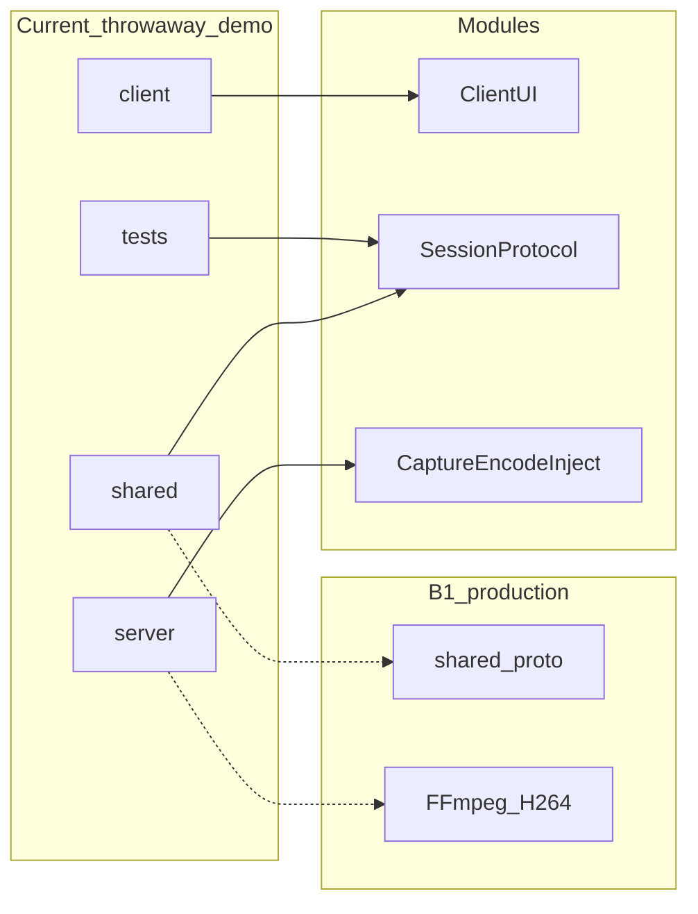

# Code map

> Keep current → target renames visible so agents don’t invent parallel trees.

## Current tree (JPEG senior demo — do not extend as the starter)

| Current path | Target module | Route / entry | Notes |
|--------------|---------------|---------------|-------|
| `client/main.cpp` | Client UI | `peerdesk-client` | Qt6 Widgets entry |
| `client/MainWindow.*` | Client UI | connect form + video | J1–J3 |
| `client/SessionWorker.*` | Session + decode | TLS I/O thread | Input must not wait on recv |
| `client/keymap.*` | Decode & render | Qt key → protocol | J2 keyboard |
| `server/main.cpp` | Server | `peerdesk-server` | `--synthetic` / X11 |
| `server/host_server.*` | Session occupancy | TLS accept + one session | J0, J1-S5, J3 |
| `server/users.*` | Auth | Argon2id file store | B1; no hardcoded prod passwords |
| `server/capture.*` | Capture | X11 or synthetic canvas | `--synthetic` is explicit |
| `server/inject.*` | Input inject | XTest | J2 |
| `shared/include/peerdesk/` | Wire, TLS, auth, JPEG, map | linked by both | Packed structs + JPEG **demo only** |
| `shared/src/{protocol,auth,tls,jpeg,map}.cpp` | same | | B4 |
| `tests/peerdesk_smoke.cpp` | Session / auth | `peerdesk-smoke` | Auth, busy, reconnect; no Qt |
| `scripts/run_demo.sh` | Demo spine | LAN walkthrough | Not a production installer |
| `docs/DEMO.md` | — | senior walkthrough | Honest JPEG shortcuts |
| `CMakeLists.txt` | Spine | system pkgs | libjpeg + Qt6 + OpenSSL + X11; **not** vcpkg/Protobuf/FFmpeg |

## B1 production target (locked — [DECISIONS.md](./DECISIONS.md) / [CONTEXT.md](./CONTEXT.md))

| Target path (intent) | Module | Notes |
|----------------------|--------|-------|
| `shared/proto/` (or equivalent) | Session protocol | **Protobuf** schemas shared by both binaries — replace packed structs |
| `shared/` TLS + auth helpers | Auth & TLS | Keep Argon2id + HMAC; pin certs (drop verify-none) |
| `server/` capture → encode | Capture & encode | **FFmpeg** `libx264` (+ VAAPI when present); drop JPEG as the wire codec |
| `client/` decode → Qt | Decode & render | FFmpeg decode into the existing Widgets video surface |
| `CMakeLists.txt` + manifest | Spine | **vcpkg or Conan**; installers `.app` / `.deb` or AppImage |

Do not grow `shared/src/jpeg.cpp` or packed-struct frames as if they were the locked contract.

## Import / ownership rules

- One module directory → one owner / one PR when possible
- Do not silently fall back from file credential store to hardcoded passwords on the server path (CLI bootstrap may *create* the file)
- `--synthetic` is an explicit flag, not a silent capture fake
- Server owns credentials and session occupancy; client owns UI and coordinate mapping ([DECISIONS.md](./DECISIONS.md) B1–B2)
