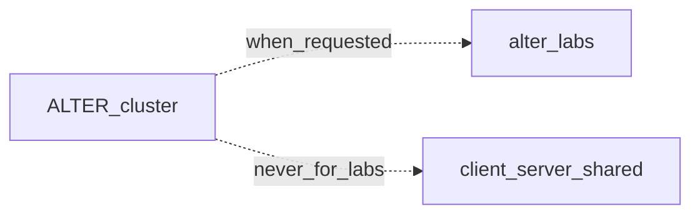

# Code map

No source trees yet. This repo is the ALTER learning path; labs start from scratch.

| Path | Status |
|------|--------|
| `alter-labs/` | Empty until a stage lab is requested |
| `client/` `server/` `shared/` `tests/` | Must not hold ALTER labs. Absent until a later product build |
| CMake / vcpkg / packaging | Absent; add only with a lab or product spine |

When a lab lands, list its files here. Do not invent parallel trees.
