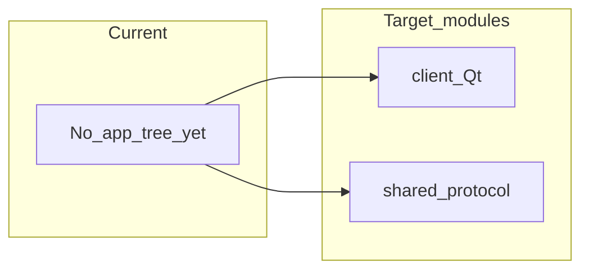

# Code map

> **Fill as you scaffold.** Empty until the repo has real paths.  
> Keep current → target renames visible so agents don’t invent parallel trees.

Target layout is **planned only** (architecture not human-locked). Do not create these folders until J0 is `build-ready` (or a waiver).

## Frontend / client

| Current path | Target module | Route / entry | Notes |
|--------------|---------------|---------------|-------|
| — | Client UI + decode/render | planned `client/` | Qt6; J1–J3 |
| — | Shared protocol/protobuf | planned `shared/` | Used by client + server |

## Backend / API

| Current path | Target module | API prefix | Notes |
|--------------|---------------|------------|-------|
| — | Server | planned `server/` | No HTTP. TLS TCP. J0–J3 |

## Shared types / contracts

| Path | Owns | Notes |
|------|------|-------|
| planned `shared/` | Frame types, auth messages | After architecture lock |

## Import / ownership rules

- One module directory → one owner / one PR when possible
- Do not silently fall back from DB to in-memory fakes in production paths
- Cross-module communication via documented events/APIs — record here when introduced
- Server owns credentials and session occupancy; client owns UI and coordinate mapping ([DECISIONS.md](./DECISIONS.md) B1–B2)
