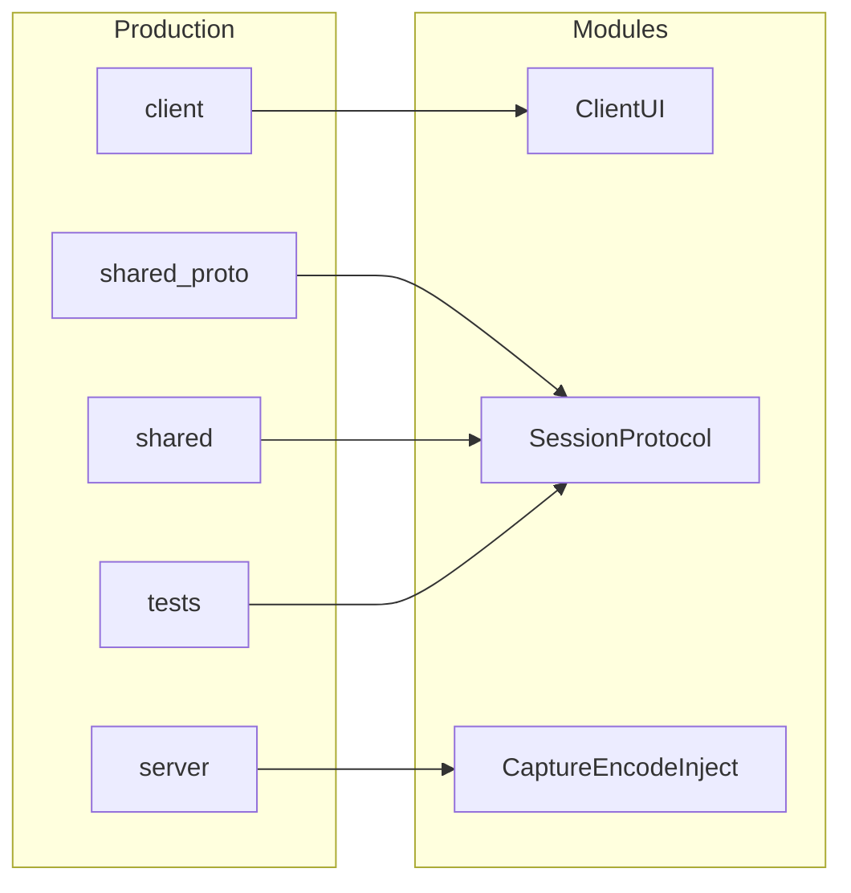

# Code map

> Keep current → target renames visible so agents don’t invent parallel trees.

## Production tree (locked stack)

| Path | Module | Route / entry | Notes |
|------|--------|---------------|-------|
| `client/main.cpp` | Client UI | `peerdesk-client` | Qt6 Widgets; macOS `.app` |
| `client/MainWindow.*` | Client UI | connect form + video | J1–J3 |
| `client/SessionWorker.*` | Session + decode | Asio TLS I/O thread | Input must not wait on recv |
| `client/keymap.*` | Decode & render | Qt key → X11 keysym | J2 keyboard |
| `server/main.cpp` | Server | `peerdesk-server` | `--synthetic` / X11 |
| `server/host_server.*` | Session occupancy | Asio TLS accept + one session | J0, J1-S5, J3 |
| `server/users.*` | Auth | Argon2id file store | no hardcoded prod passwords |
| `server/capture.*` | Capture | X11 XShm/XDamage or `--synthetic` | `--synthetic` is explicit |
| `server/inject.*` | Input inject | XTest | J2; Linux only |
| `shared/proto/peerdesk.proto` | Session protocol | generated C++ | length-prefixed Envelope |
| `shared/src/{auth,net,cert,codec,map}.cpp` | Auth, TLS, H.264, mapping | linked by both | B4 |
| `tests/peerdesk_smoke.cpp` | Session / auth | `peerdesk-smoke` | Auth, busy, reconnect, H.264; no Qt |
| `vcpkg.json` | Spine | CMake + vcpkg | Asio, OpenSSL, protobuf, FFmpeg, Qt6, argon2 |
| `CMakeLists.txt` | Spine | vcpkg or Homebrew prefixes | installers via CPack / `scripts/package-*.sh` |

## Import / ownership rules

- One module directory → one owner / one PR when possible
- Do not silently fall back from file credential store to hardcoded passwords on the server path (CLI bootstrap may *create* the file)
- `--synthetic` is an explicit flag, not a silent capture fake
- Server owns credentials and session occupancy; client owns UI and coordinate mapping ([DECISIONS.md](./DECISIONS.md) B1–B2)
- Client verifies the host TLS cert (`PEERDESK_CA_FILE` / `--ca-file`); never verify-none
