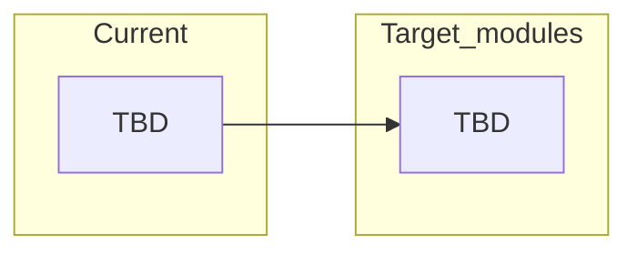

# Code map

> **Fill as you scaffold.** Empty until the repo has real paths.  
> Keep current → target renames visible so agents don’t invent parallel trees.

## Frontend / client

| Current path | Target module | Route / entry | Notes |
|--------------|---------------|---------------|-------|
| — | — | — | — |

## Backend / API

| Current path | Target module | API prefix | Notes |
|--------------|---------------|------------|-------|
| — | — | — | — |

## Shared types / contracts

| Path | Owns | Notes |
|------|------|-------|
| — | — | — |

## Import / ownership rules

- One module directory → one owner / one PR when possible
- Do not silently fall back from DB to in-memory fakes in production paths
- Cross-module communication via documented events/APIs — record here when introduced
