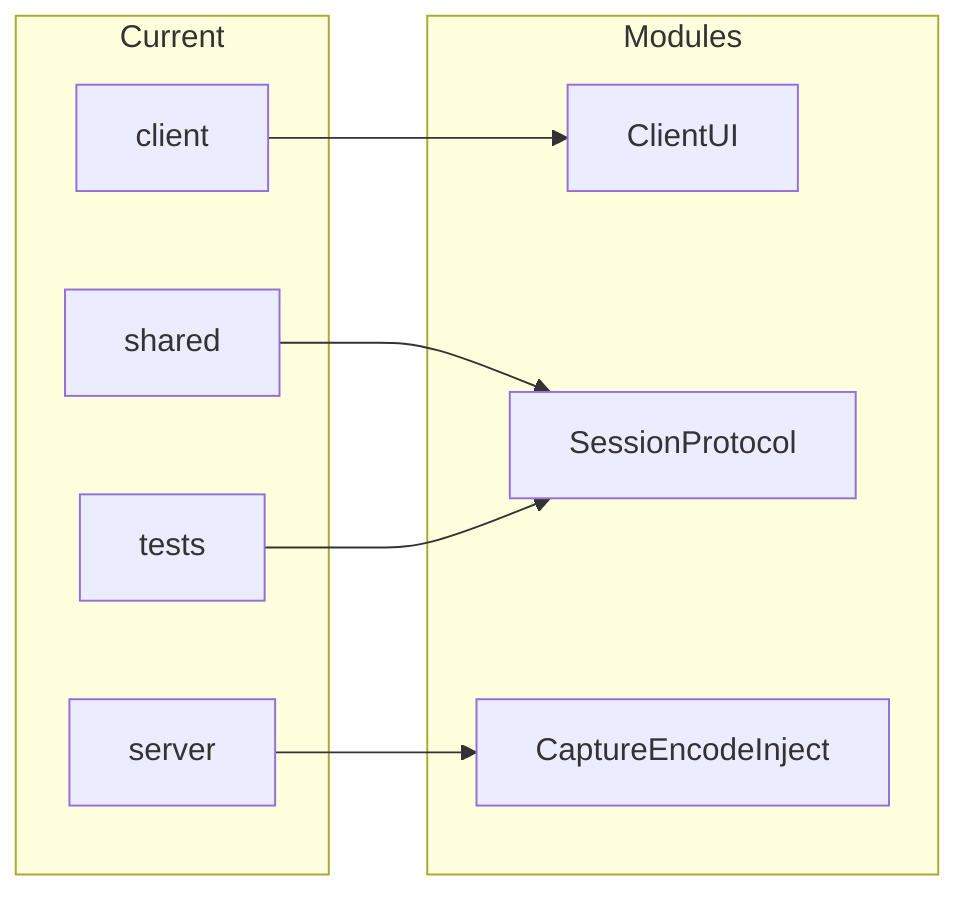

# Code map

> Keep current → target renames visible so agents don’t invent parallel trees.

## Frontend / client

| Current path | Target module | Route / entry | Notes |
|--------------|---------------|---------------|-------|
| `client/` | Client UI + decode/render | `peerdesk-client` | Qt6 Widgets; J1–J3 |
| `shared/` | Wire types, TLS, auth, coord map | linked by both binaries | B4 |

## Backend / API

| Current path | Target module | API prefix | Notes |
|--------------|---------------|------------|-------|
| `server/` | Server | none (TLS TCP) | J0–J3 |

## Shared types / contracts

| Path | Owns | Notes |
|------|------|-------|
| `shared/include/peerdesk/` | Frame types, auth, TLS, JPEG, mapping | After architecture lock |
| `tests/` | `peerdesk-smoke` + unit tests | Auth, protocol, J1/J3 without Qt |

## Import / ownership rules

- One module directory → one owner / one PR when possible
- Do not silently fall back from file credential store to hardcoded passwords on the server path (CLI bootstrap may *create* the file)
- `--synthetic` is an explicit flag, not a silent capture fake
- Server owns credentials and session occupancy; client owns UI and coordinate mapping ([DECISIONS.md](./DECISIONS.md) B1–B2)
