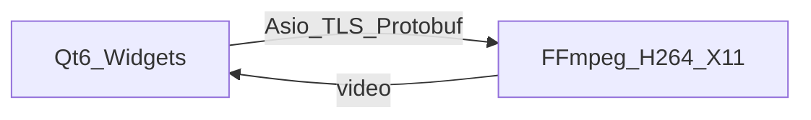

# Memory (compact)

**PeerDesk** — LAN/VPN remote desktop: Ubuntu host, macOS/Ubuntu viewer, mouse+keyboard, reconnect without restarting the server. No files/audio/clipboard/relay/Wayland/multi-mon in v1.

## Stack lock (use this — PRD / production)

| Layer | Locked |
|-------|--------|
| Client | C++17/20 + Qt6 **Widgets** (macOS + Ubuntu) |
| Host | C++ Ubuntu only; X11 XShm/XDamage + XTest |
| Wire | TLS TCP via **Asio** + OpenSSL; **Protobuf** control + length-prefixed frames |
| Video | **FFmpeg** H.264 (`libx264`, VAAPI when present) |
| Auth | Argon2id hashes; nonce + HMAC; verified host cert (no verify-none) |
| Build | **CMake + vcpkg** |
| Ship | macOS `.app` client; Ubuntu `.deb`/AppImage client+server |

**Locked by:** Armaghan Asghar, 2026-08-31 (main proposal as written; Widgets + vcpkg in P0). J0–J3 = `build-ready`. Paths: [CODEMAP.md](./CODEMAP.md). Detail: [DECISIONS.md](./DECISIONS.md), [PROJECT_DESIGN.md](../../PROJECT_DESIGN.md).
