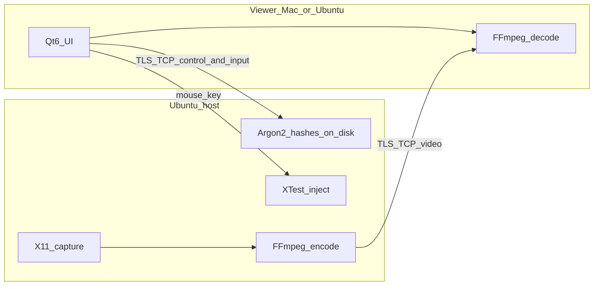

# Decisions (locked)

> Nothing below is locked until discovery writes it. Agent proposes; human locks.  
> Stack lock happens **after** D0 stories (DISCOVERY Step ARCH), unless human asked early.

## Product locks

| ID | Decision | Locked? |
|----|----------|---------|
| P1 | North star — small team remote view+control of Ubuntu hosts from macOS/Ubuntu, including reconnect — [PRODUCT.md](./PRODUCT.md) | **Yes** (Q1 + CLIENT ingest 2026-08-30) |
| P2 | Devices day one: desktop client macOS + Ubuntu; server Ubuntu only. No browser/mobile | **Yes** |
| P2b | Deploy: desktop installers + self-hosted server on the Ubuntu host; LAN/VPN IP:port; no public web, stores, or relay | **Yes** |
| P3 | User model: small team, one org; host operator vs viewer; authenticated = full control | **Yes** |
| P4 | Offline: not required; always-online to host | **Yes** |
| P5 | Out of scope for v1 — file transfer, audio, clipboard, mobile/web, Mac host, relay, Wayland, multi-monitor, view-only, saved profiles, multi-viewer | **Yes** |

## Deploy lock

| Field | Value |
|-------|--------|
| Primary deploy target | Desktop installers (macOS `.app` client; Ubuntu `.deb`/AppImage client + server) plus self-hosted server on the Ubuntu host |
| Secondary (later) | Optional relay / “connect from anywhere”; App Store not planned |
| Locked by / date | Discovery Q2 from CLIENT context — 2026-08-30 |

## NFR locks

| Area | Locked choice | Locked? |
|------|---------------|---------|
| Scale / expected users | Small team; one active session per host | Yes |
| Security / privacy | TLS all traffic; no plaintext passwords; challenge-response; hashed host credentials | Yes |
| Availability / backup | Server survives client disconnect; reconnect without restart | Yes |
| Accessibility / languages | English first | Yes |
| Compliance | None | Yes |
| Builder constraints | Fast screen path in C++; hobby time/cost; no paid cloud relay | Yes |

Detail tables may live in [PRODUCT.md](./PRODUCT.md); this section is the lock summary.

## Architecture (locked after DISCOVERY ARCH step — after D0 stories)

**Profile:** Native C++ peer desktop (not web/SaaS profiles 3–4; not Tauri local-app profile 1)

| Layer | Choice |
|-------|--------|
| Client | C++17/20 + Qt6 desktop app (macOS + Ubuntu), Qt Widgets (not QML): connection UI, decode, render, widget input, coordinate mapping |
| API | No HTTP API. Custom TLS TCP session: control channel (handshake, auth, keepalive, errors) + length-prefixed data frames (video, mouse, key, ping). Protobuf schemas shared by both binaries |
| Data | Host file for salted credential hashes only. No Postgres/cloud DB. No session store beyond the running server process |
| Auth | Host-local usernames; Argon2id hashes; TLS (OpenSSL); challenge-response (nonce + HMAC). Authenticated = full control |
| Sync / jobs | N/A. In-process threads: server capture → encode → net; client net → decode → Qt render. Input sent on its own path |
| Concrete starter | CMake + vcpkg or Conan; FFmpeg libavcodec (x264 + VAAPI when present); Asio; X11 XShm/XDamage + XTest (v1); installers `.app` / `.deb` or AppImage |

**Why this fits:** Small team, desktop installers, self-hosted host (P2/P2b). C++ speed NFR for capture/encode (PRODUCT). J0–J3 are a peer session, not CRUD over REST — a Postgres/web profile would ignore deploy and the media path. Qt6 keeps UI in-process with decode (no Electron IPC). X11-only matches v1 scope (C1).  
**Tradeoff:** Two native binaries and Linux display APIs instead of a faster-to-scaffold Tauri/web app. Wayland stays D1.  
**Lock?** Locked as proposed — no changes.

**Locked by:** Armaghan Asghar  
**Date:** 2026-08-30

Rejected default from ARCHITECTURE_DEFAULTS (“Desktop + installers → Tauri + SQLite”): that profile assumes local-only CRUD, not a real-time screen protocol or a C++ capture pipeline.

## Boundaries (ownership)

Who is system of record / UI owner. Fill as MODULES and journeys clarify.

| ID | Decision | Locked? |
|----|----------|---------|
| B1 | Server owns credentials, session occupancy, capture, encode, input inject | Yes (provisional MODULES) |
| B2 | Client owns connection UI, decode, render, local input capture, coordinate mapping | Yes (provisional MODULES) |
| B3 | No fake CRUD for out-of-scope features (files, audio, clipboard, relay, Wayland, multi-monitor) | Yes |

## Journey / process locks

| ID | Decision |
|----|----------|
| G1 | Feature work needs journey `build-ready` or waiver ([FLOWS.md](./FLOWS.md), [STORIES.md](./STORIES.md)) |
| G2 | Discovery is hybrid: personas + CLIENT evidence |
| G3 | Agent proposes one architecture; human locks or tweaks one thing |
| G4 | Journey statuses: `draft` → `persona-ready` → `client-validated` → `build-ready` |
| G5 | MODULES stays provisional until boundary lock or dedicated boundary journey |
| G6 | Requirements-first: D0 stories before stack proposal (B-S9), unless human asks early |

## Locked defaults (was: open until revisited)

Locked by Armaghan Asghar, 2026-08-30 — same pass as the architecture lock.

| Topic | Decision | Locked? |
|-------|----------|---------|
| Second client while one session is live | Reject with a clear error (do not silently steal the session) | Yes |
| Host display | Capture the primary X11 screen only | Yes |
| Wayland host | Fail startup/connect with “X11 required for v1” | Yes |
| Client saved passwords | Optional later (J4); v1 may leave password field empty after quit | Yes |
| Codec | Low-latency H.264 (detail at ARCH) | Yes |

## Open questions (blocking)

| ID | Question | Blocking? |
|----|----------|-----------|
| — | — | — |

None currently — architecture lock, J0–J3 build-ready promotion, and persona confirmation (the three items previously tracked here) were all resolved 2026-08-30.

## Rejected options (so we don’t re-litigate)

| Option | Why rejected |
|--------|----------------|
| Browser/Electron-only product | Desktop native clients; C++ media path; no web deploy |
| Cloud relay / TeamViewer-style anywhere | Explicitly out of scope unless requested |
| Wayland + multi-monitor in v1 | Q1 chose reconnect slice, not the bigger v1 |
| Mac as host | Server is Ubuntu only |
| File transfer / audio / clipboard in v1 | Not in purpose |
| Tauri/Electron + SQLite desktop default | Ignores C++ capture NFR and peer TLS session (J0–J3) |
