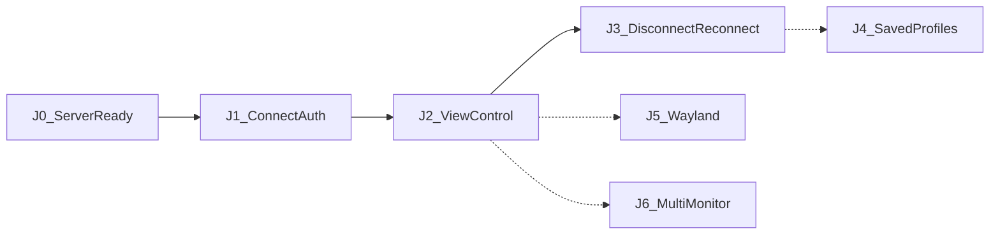
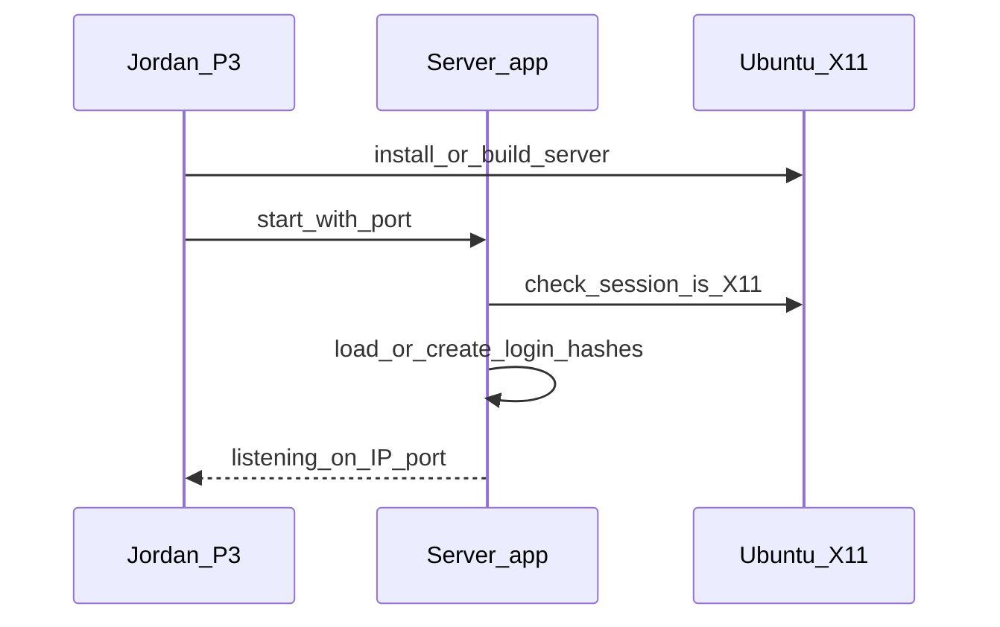
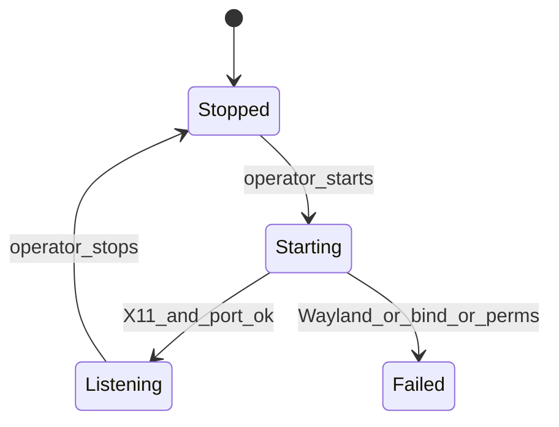
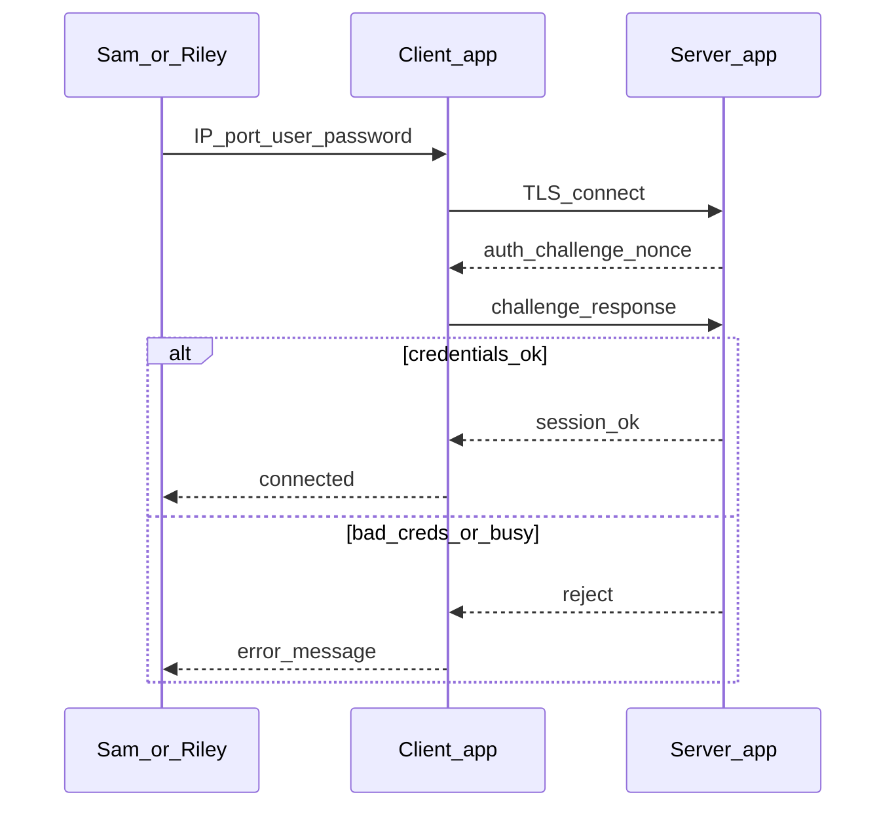
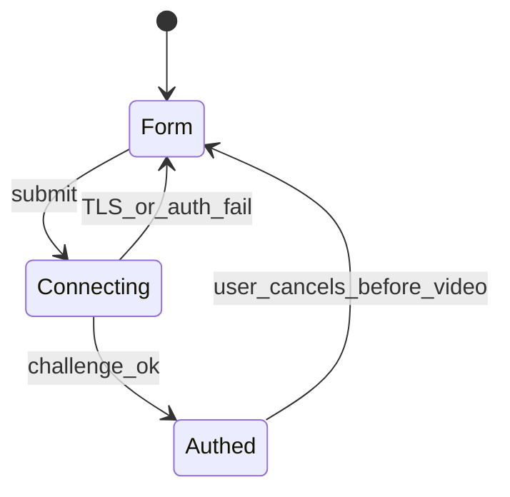
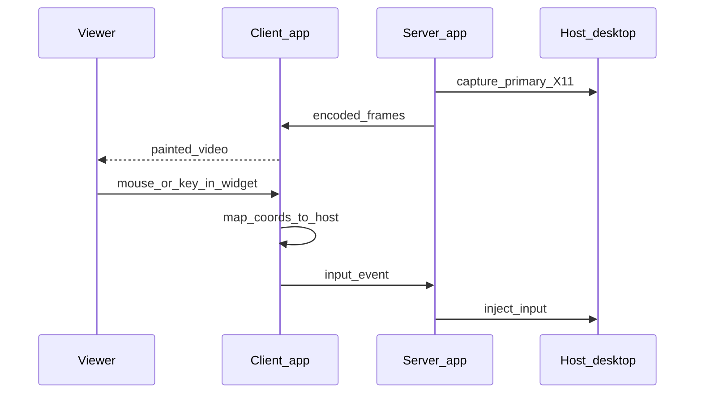
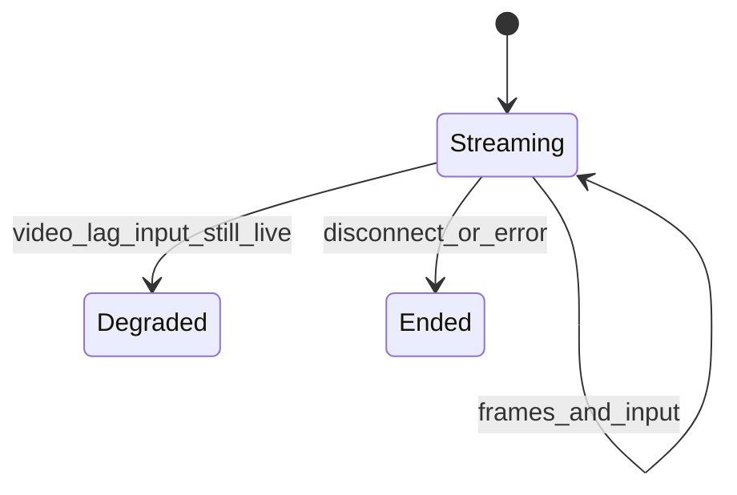
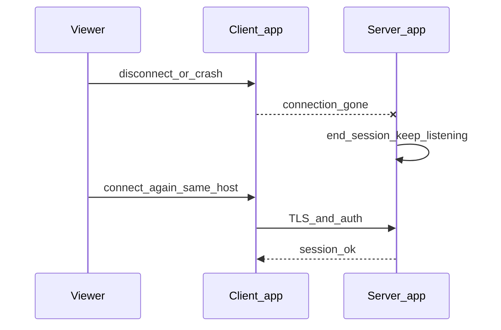
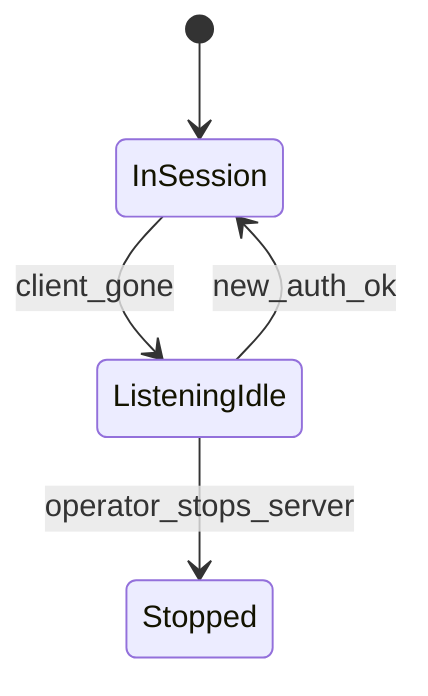

# Flows

> **Filled by:** DISCOVERY FLOWS step.  
> **Statuses:** `draft` → `persona-ready` → `client-validated` → `build-ready`.  
> Feature code needs **`build-ready`** or an explicit waiver in [STORIES.md](./STORIES.md).  
> **D0:** detail first 2–4 journeys only; later titles may stay thin until D1.



| ID | Title | Status | Primary personas | Wave |
|----|-------|--------|------------------|------|
| J0 | Host prepares the Ubuntu server | build-ready | P3 | D0 |
| J1 | Viewer connects and authenticates | build-ready | P1, P2 | D0 |
| J2 | View remote screen and control mouse/keyboard | build-ready | P1, P2 | D0 |
| J3 | Disconnect and reconnect without restarting the server | build-ready | P1, P2, P3 | D0 |
| J4 | Saved connection profiles | draft | P1, P2 | D1 |
| J5 | Wayland host capture and inject | draft | P3 | D1 |
| J6 | Multi-monitor host | draft | P1, P3 | D1 |
| J7 | NAT relay / connect from anywhere | draft | — | Out of scope v1 |

---

## J0 — Host prepares the Ubuntu server

**Status:** build-ready  
**Goal:** Jordan can install or run the server on an X11 Ubuntu session so it listens on a port with at least one login, and the team can reach that IP:port on the LAN/VPN.





**Happy path:** Jordan starts the server on X11 Ubuntu; it binds the chosen port; at least one username exists with a hashed password; status shows it is listening.  
**Failures:** Not X11 (Wayland) → clear error, do not hang. Port in use. Missing capture/inject permissions. No credential configured. Firewall still blocking (document; app cannot fix the network).  
**Evidence:** [CLIENT.md](./CLIENT.md) E10–E12  
**Open conflicts:** none (C1: Wayland deferred)

---

## J1 — Viewer connects and authenticates

**Status:** build-ready  
**Goal:** Sam or Riley enter IP, port, username, and password and either get an authenticated session or a clear refusal.





**Happy path:** Reachable host, valid login, no existing session → client is authenticated and ready to receive video (J2). Password is not stored or sent as plaintext.  
**Failures:** Wrong IP/port; TLS/handshake fail; wrong user/password; host already has a viewer; timeout. Errors are specific enough to act (unreachable vs rejected vs busy) without leaking extra accounts.  
**Evidence:** [CLIENT.md](./CLIENT.md) E20–E22, E4  
**Open conflicts:** none

---

## J2 — View remote screen and control mouse/keyboard

**Status:** build-ready  
**Goal:** After auth, the client shows the host desktop and the viewer’s mouse and keyboard drive that desktop. Clicks land on the right host pixels even when the window size differs.





**Happy path:** Live picture of the primary display; move, click, type take effect on the host; input is not stuck behind a slow video queue; widget coordinates are scaled to host resolution.  
**Failures:** Capture fails after auth (permissions, display gone) → error, session ends cleanly. Decode/render fail → error, not a frozen silent window. Keys that cannot map → ignored or logged, session continues.  
**Evidence:** [CLIENT.md](./CLIENT.md) E30–E34  
**Open conflicts:** none (single display, X11)

---

## J3 — Disconnect and reconnect without restarting the server

**Status:** build-ready  
**Goal:** Viewer closes or loses the client; the server keeps listening; the same or another teammate can authenticate again and resume view/control without Jordan restarting the process.





**Happy path:** Clean disconnect or abrupt drop → server returns to listening; new connect with valid credentials streams again (J2). Jordan does not restart anything.  
**Failures:** Server died with the client (bug) → J3 fails the success metric. Stale session blocks the new client → must release on drop. Auth still required on reconnect (no anonymous resume).  
**Evidence:** [CLIENT.md](./CLIENT.md) E40–E41, E7  
**Open conflicts:** none (C2 resolved: J3 is D0)

---

## J4 — Saved connection profiles (D1)

**Status:** draft  
**Goal:** Remember IP/port/username (not necessarily password) so viewers do not retype every time.  
**Evidence:** context client QSettings note  
**Open conflicts:** none

---

## J5 — Wayland host capture and inject (D1)

**Status:** draft  
**Goal:** Server works when `XDG_SESSION_TYPE=wayland` via portal/PipeWire and a permitted inject path.  
**Evidence:** context open questions  
**Open conflicts:** none

---

## J6 — Multi-monitor host (D1)

**Status:** draft  
**Goal:** Operator or viewer selects which host display to capture and where to inject.  
**Evidence:** context open questions  
**Open conflicts:** none

---

## Template for additional journeys

Copy for J7+ when entering D1:

```markdown
## Jn — _

**Status:** draft  
**Goal:** _

sequenceDiagram ...

**Happy path:** _  
**Failures:** _  
**Evidence:** [CLIENT.md](./CLIENT.md) §Jn  
**Open conflicts:** _
```
