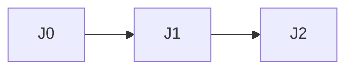
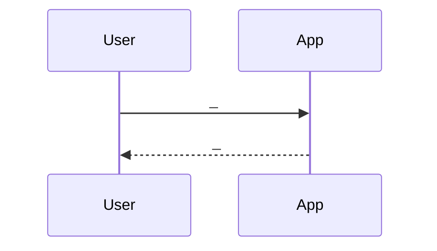
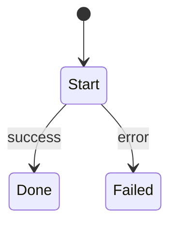

# Flows

> **Filled by:** DISCOVERY FLOWS step.  
> **Statuses:** `draft` → `persona-ready` → `client-validated` → `build-ready`.  
> Feature code needs **`build-ready`** or an explicit waiver in [STORIES.md](./STORIES.md).  
> **D0:** detail first 2–4 journeys only; later titles may stay thin until D1.



| ID | Title | Status | Primary personas | Wave |
|----|-------|--------|------------------|------|
| J0 | _e.g. First open / login / who can see what_ | draft | — | D0 |
| J1 | _e.g. Setup / first core task_ | draft | — | D0 |
| J2 | _TBD — expand in D1 if needed_ | draft | — | D1 |

---

## J0 — _

**Status:** draft  
**Goal:** _





**Happy path:** _  
**Failures:** _  
**Evidence:** [CLIENT.md](./CLIENT.md) §J0  
**Open conflicts:** _

---

## J1 — _

**Status:** draft  
**Goal:** _


**Happy path:** _  
**Failures:** _  
**Evidence:** [CLIENT.md](./CLIENT.md) §J1  
**Open conflicts:** _

---

## Template for additional journeys

Copy for J2+ when entering D1:

```markdown
## Jn — _

**Status:** draft  
**Goal:** _

\`\`\`mermaid
sequenceDiagram
  participant U as User
  participant App as App
  U->>App: _
  App-->>U: _
\`\`\`

**Happy path:** _  
**Failures:** _  
**Evidence:** [CLIENT.md](./CLIENT.md) §Jn  
**Open conflicts:** _
```
