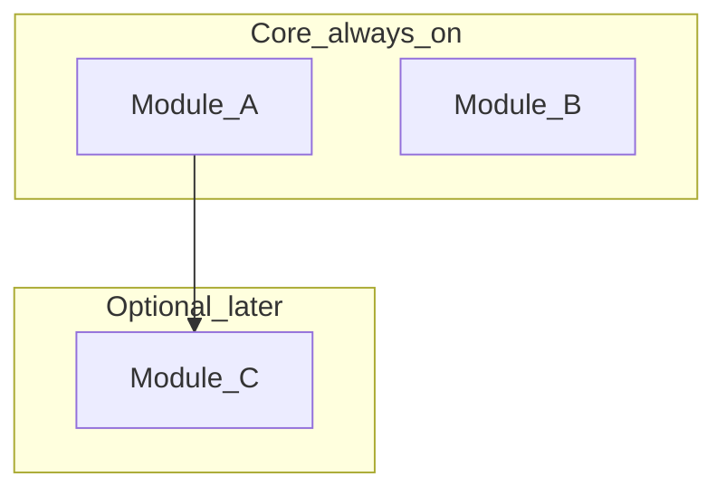

# Modules

> **Provisional** until boundary decisions lock in [DECISIONS.md](./DECISIONS.md) or a dedicated boundary journey is `client-validated`.  
> Draft after D0 FLOWS; refine when architecture is locked.

## Core (day one)

| Module | Owns (system of record / UI) | Notes |
|--------|------------------------------|-------|
| — | — | — |

## Optional / later

| Module | Depends on | Notes |
|--------|------------|-------|
| — | — | — |

## Boundary rules

- Disabled / unpaid / deferred modules: status or upgrade UI only — **no fake CRUD**
- Cross-module writes go through documented ownership (see DECISIONS §Boundaries)
- _

## Open questions

- _
