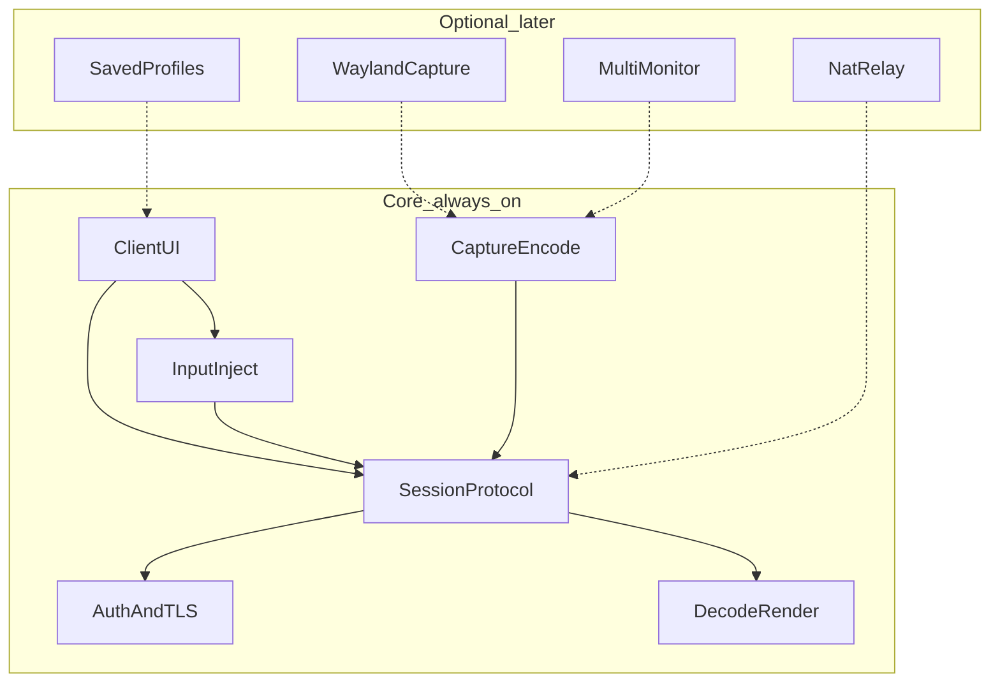

# Modules

> **Provisional** until boundary decisions lock in [DECISIONS.md](./DECISIONS.md) or a dedicated boundary journey is `client-validated`.  
> Draft after D0 FLOWS; refine when architecture is locked.

## Core (day one)

| Module | Owns (system of record / UI) | Notes |
|--------|------------------------------|-------|
| Client UI | Connection form; video widget; disconnect | J1–J3; no saved profiles in v1 |
| Session / protocol | Control + data framing on one TLS TCP link | Handshake, keepalive, errors |
| Auth & TLS | Credential hashes on host; challenge-response; TLS | Server is system of record for logins |
| Capture & encode | X11 primary display → encoded frames | Server thread pipeline |
| Input inject | Apply mapped mouse/keyboard on host | X11 path in v1 |
| Decode & render | Frames → widget; local input capture + coordinate map | Client; input path not behind video |

## Optional / later

| Module | Depends on | Notes |
|--------|------------|-------|
| Saved profiles | Client UI | J4 |
| Wayland capture/inject | Capture & inject | J5 |
| Multi-monitor | Capture & inject + UI picker | J6 |
| NAT relay | Protocol + extra deploy | J7 — out of scope unless requested |

## Boundary rules

- Disabled / unpaid / deferred modules: status or upgrade UI only — **no fake CRUD**
- Cross-module writes go through documented ownership (see DECISIONS §Boundaries)
- Server owns credentials, session occupancy (one viewer), capture, encode, inject
- Client owns form, decode, paint, widget-scoped input, coordinate mapping
- Do not ship file/audio/clipboard APIs in v1

## Resolved at architecture lock (2026-08-30)

- UI toolkit: **Qt Widgets** (not QML) — see [DECISIONS.md](./DECISIONS.md) §Architecture
- Input inject on X11 (v1): **XTest** — uinput stays a D1/Wayland (J5) question, not reopened here
