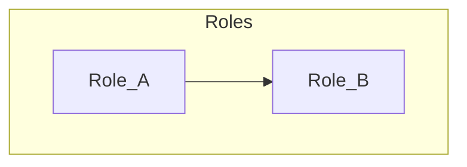

# Personas

> **Filled by:** DISCOVERY PERSONAS step (after Q1–Q3). Agent drafts; human corrects.  
> Status legend used in [FLOWS.md](./FLOWS.md): `draft` → `persona-ready` → `client-validated` → `build-ready`.

## Roster

| ID | Name / role | Goal | Main pain | Primary journeys |
|----|-------------|------|-----------|------------------|
| — | — | — | — | — |

## Org (when multi-role)

## Role cards

Every persona needs the sections below (LoomLogic-style contract).

### Persona —

- **Job:** _
- **Sees:** _
- **Does:** _
- **Does not:** _
- **Journeys:** _

### Persona —

- **Job:** _
- **Sees:** _
- **Does:** _
- **Does not:** _
- **Journeys:** _

## Day-in-the-life (optional depth)

### Persona —

- Morning: _
- Core task: _
- Failures they hit today: _

## Notes

Persona defaults are **fiction** until [CLIENT.md](./CLIENT.md) evidence or solo walkthrough marks journeys `client-validated`. Conflicts override these cards when resolved.
