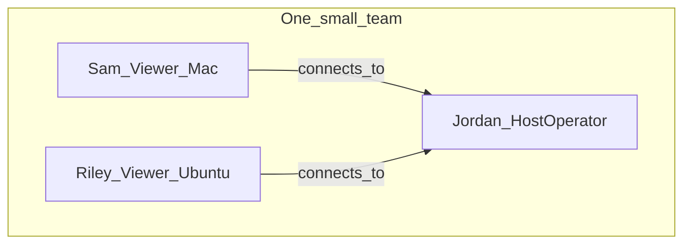

# Personas

> **Filled by:** DISCOVERY PERSONAS step (after Q1–Q3). Agent drafts; human corrects.  
> Status legend used in [FLOWS.md](./FLOWS.md): `draft` → `persona-ready` → `client-validated` → `build-ready`.

## Roster

| ID | Name / role | Goal | Main pain | Primary journeys |
|----|-------------|------|-----------|------------------|
| P1 | Sam — Viewer (Mac) | Control a teammate’s Ubuntu box from a Mac without buying TeamViewer | Session dies and someone has to restart the host agent | J1, J2, J3 |
| P2 | Riley — Viewer (Ubuntu) | Same control from another Ubuntu desktop | Same as Sam; also lives on Linux already | J1, J2, J3 |
| P3 | Jordan — Host operator | Leave an Ubuntu workstation reachable on the LAN/VPN with a login | Server hard to start, or X11/permissions fail silently | J0, J3 |

## Org (when multi-role)

Same humans can wear both hats (operator in the morning, viewer from home VPN at night).

## Role cards

Every persona needs the sections below (LoomLogic-style contract).

### Persona P1 — Sam, Viewer (Mac)

- **Job:** Help the team by using an Ubuntu workstation without sitting at it.
- **Sees:** A desktop app: fields for IP, port, username, password; then a window of the remote screen.
- **Does:** Connects, watches the desktop, moves mouse, types, disconnects, connects again later.
- **Does not:** Install the server on the Mac; transfer files; use a phone; punch through random home NATs without VPN.
- **Journeys:** J1, J2, J3

### Persona P2 — Riley, Viewer (Ubuntu)

- **Job:** Same as Sam, from another Ubuntu machine (office PC or laptop).
- **Sees:** The same client app on Ubuntu.
- **Does:** Connects to Jordan’s host with the shared team login (or Riley’s own host account).
- **Does not:** Need a different protocol than Sam; does not administer Wayland capture in v1.
- **Journeys:** J1, J2, J3

### Persona P3 — Jordan, Host operator

- **Job:** Keep the Ubuntu machine available for the team: server running, logins issued, port reachable.
- **Sees:** A server process (or tray/service) on Ubuntu; maybe a short “listening on port …” status.
- **Does:** Installs/starts the server, creates or sets username/password, opens firewall on the LAN/VPN, leaves it running.
- **Does not:** Build a cloud account system; support Wayland hosts in v1; host from a Mac.
- **Journeys:** J0, J3 (server must stay up)

## Day-in-the-life (optional depth)

### Persona P1 — Sam

- Morning: VPN into the office, open the client, type the host IP.
- Core task: Drive the Ubuntu desktop for a build or a stuck UI.
- Failures they hit today: TeamViewer license nag; VNC dies and Jordan has to restart something on the box.

### Persona P3 — Jordan

- Morning: Log into the Ubuntu workstation, start the server once.
- Core task: Confirm it is listening; tell Sam the IP, port, and a login.
- Failures they hit today: Display session is Wayland and capture is blank; `/dev/uinput` permission denied.

## Notes

Persona defaults are **fiction** until [CLIENT.md](./CLIENT.md) evidence or solo walkthrough marks journeys `client-validated`. Conflicts override these cards when resolved.

Names and roles confirmed by Armaghan Asghar, 2026-08-30 — Sam/Riley/Jordan and the viewer/host-operator split stand as-is. v1 has **no view-only** persona.
