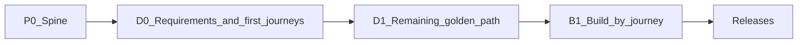

# Phases

Delivery is **journey-locked**: implement domain features only after the matching journey in [FLOWS.md](./FLOWS.md) is `build-ready` (or human waiver in [STORIES.md](./STORIES.md)).

Discovery is **requirements-first**: product → deploy → users/NFRs → personas/flows/stories → **then** architecture lock.

| Phase | Deliver | Status |
|-------|---------|--------|
| **P0** | Brain + rules; empty app shell / tooling as needed | Complete — vcpkg manifest, Protobuf, Asio TLS, Qt Widgets |
| **D0** | RE intake + PERSONAS + first **2–4** journeys `persona-ready` + stories → **then** architecture lock | **Complete** — main stack locked 2026-08-31 (Asio + vcpkg + Widgets); J0–J3 `build-ready` |
| **D1** | Remaining golden-path journeys to `persona-ready` | Unblocked — J4–J6 remain `draft` |
| **B1** | Feature work per `build-ready` journey | J0–J3 on the locked stack (H.264 / Protobuf / Asio / vcpkg / installers) |

Journey statuses: `draft` → `persona-ready` → `client-validated` → `build-ready` (solo may self-mark `client-validated`).

## D0 acceptance

- [x] PRODUCT north star, devices, deploy, user model, pains, workaround, out-of-scope, NFRs filled
- [x] PERSONAS drafted with role cards
- [x] First 2–4 journeys `persona-ready` with stories
- [x] MODULES provisional draft
- [x] Architecture locked in [DECISIONS.md](./DECISIONS.md) **after** D0 stories (2026-08-31: main proposal + Asio; Widgets + vcpkg)
- [x] RULES step: `stack-contracts.mdc` present and pointing at DECISIONS
- [x] [REQUIREMENTS.md](./REQUIREMENTS.md) checklist largely complete for D0
- [x] CLIENT inbox process understood (optional evidence)

## D1 acceptance

- [ ] Remaining golden-path journeys named and at least `persona-ready`
- [ ] Boundary / packaging decisions drafted if the product has Core vs optional modules

D1 titles already named as `draft` in FLOWS (J4 profiles, J5 Wayland, J6 multi-monitor). Expand after D0 lock.

## P0 spine hints (generic)

- [x] `.cursor/brain/` present and linked from rules (includes DISCOVERY + ARCHITECTURE_DEFAULTS + REQUIREMENTS)
- [x] Production app skeleton (vcpkg, Protobuf, Asio, FFmpeg) — JPEG demo is not the spine
- [x] Auth/shell only if multi-user model is locked

Auth model is locked. B1 implements J0–J3 on the production stack.

## Build rule

Do not schedule “build all modules.” Schedule **journeys**. Module roadmaps are depth hints only after journeys lock.

Suggested build order after gates: **J0 → J1 → J2 → J3**.
