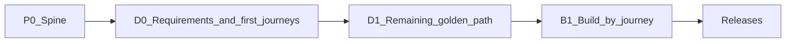

# Phases

Delivery is **journey-locked**: implement domain features only after the matching journey in [FLOWS.md](./FLOWS.md) is `build-ready` (or human waiver in [STORIES.md](./STORIES.md)).

Discovery is **requirements-first**: product → deploy → users/NFRs → personas/flows/stories → **then** architecture lock.

| Phase | Deliver | Status |
|-------|---------|--------|
| **P0** | Brain + rules; empty app shell / tooling as needed | Planned |
| **D0** | RE intake + PERSONAS + first **2–4** journeys `persona-ready` + stories → **then** architecture lock | **Start here** |
| **D1** | Remaining golden-path journeys to `persona-ready` | Blocked on D0 |
| **B1** | Feature work per `build-ready` journey | Blocked on gates |

Journey statuses: `draft` → `persona-ready` → `client-validated` → `build-ready` (solo may self-mark `client-validated`).

## D0 acceptance

- [ ] PRODUCT north star, devices, deploy, user model, pains, workaround, out-of-scope, NFRs filled
- [ ] PERSONAS drafted with role cards
- [ ] First 2–4 journeys `persona-ready` with stories
- [ ] MODULES provisional draft
- [ ] Architecture locked in [DECISIONS.md](./DECISIONS.md) **after** D0 stories
- [ ] RULES step: `stack-contracts.mdc` present and pointing at DECISIONS
- [ ] [REQUIREMENTS.md](./REQUIREMENTS.md) checklist largely complete for D0
- [ ] CLIENT inbox process understood (optional evidence)

## D1 acceptance

- [ ] Remaining golden-path journeys named and at least `persona-ready`
- [ ] Boundary / packaging decisions drafted if the product has Core vs optional modules

## P0 spine hints (generic)

- [ ] `.cursor/brain/` present and linked from rules (includes DISCOVERY + ARCHITECTURE_DEFAULTS + REQUIREMENTS)
- [ ] Runnable empty app or repo skeleton (no invented domain CRUD)
- [ ] Auth/shell only if multi-user model is locked

## Build rule

Do not schedule “build all modules.” Schedule **journeys**. Module roadmaps are depth hints only after journeys lock.
