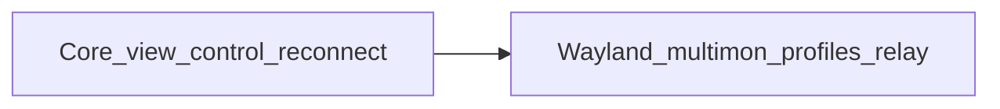

# Product

> **Filled by:** DISCOVERY Q1–Q4. Leave placeholders until then.  
> Completeness index: [REQUIREMENTS.md](./REQUIREMENTS.md).

## North star

A small team on macOS and Ubuntu can view and control Ubuntu machines on their LAN or VPN with mouse and keyboard, including disconnect and reconnect without restarting the host server.

## Audience / stakeholders

| Segment | Description | Priority |
|---------|-------------|----------|
| Viewer | Teammate who connects from a Mac or Ubuntu desktop to control a host | P0 |
| Host operator | Teammate who runs the Ubuntu machine and the server app | P0 |
| Builder | Hobby/learning owner of this repo | P0 (constraints) |

## Platforms (day one) — devices

| Platform | Day one? | Later? | Notes |
|----------|----------|--------|-------|
| Browser (web) | No | No (v1) | Not a web app |
| Mobile phone | No | Maybe later | Out of scope |
| Tablet | No | Maybe later | Out of scope |
| Desktop app | **Yes** | — | **Client:** macOS + Ubuntu. **Server:** Ubuntu only |

## Deploy / distribution (where the finished app lives)

| Target | Day one? | Notes |
|--------|----------|-------|
| Public web (hosted) | No | No cloud control plane |
| App Store / Play | No | Not mobile |
| Desktop installers | **Yes** | macOS `.app` for client; Ubuntu `.deb` or AppImage for client + server |
| Self-hosted / on-prem | **Yes** | Server lives on the Ubuntu host the team already has |
| Local-only (no server) | No | There is a server, but it is on the host — not a vendor SaaS |

Client must already reach `IP:port` (LAN or VPN). No public relay.

## User model

| Question | Answer |
|----------|--------|
| Solo / small team / multi-tenant | **Small team in one company** (Q1). Not multi-tenant SaaS. |
| Roles needed? | Two jobs, same permission once in: **host operator** (run server, issue logins) and **viewer** (connect and full mouse/keyboard). No partial “view-only” role in v1. Multiple named logins on a host are allowed. |
| Offline required? | **No.** Always-online to the host. Offline host = cannot connect. |

## Success metric (first useful version)

A teammate types IP, username, password, and port; sees the remote Ubuntu screen; moves the mouse and types; then disconnects and connects again **without restarting the server**.

## Pains (if v1 never ships)

| Pain | Who feels it | Severity |
|------|--------------|----------|
| Team keeps paying for or fighting commercial remote-desktop tools for simple LAN/VPN control | Viewers + operators | High |
| Dropped session means walking to the machine or restarting a flaky host agent | Viewers | High (explicit in Q1) |
| Slow or laggy screen/control if capture is naive | Viewers | Medium |
| Host is Ubuntu-only in this product; Mac-as-host is not solved | Operators on Mac | Rejected — see DECISIONS §Rejected options |

## Current workaround

Commercial TeamViewer-class apps, VNC (direct IP), SSH with X11 forwarding, or sitting at the Ubuntu desk. This project is a self-hosted, LAN/VPN, mouse+keyboard slice of that.

## Out of scope (for v1)

| Item | Why deferred |
|------|----------------|
| File transfer | Not in stated purpose |
| Audio | Not in stated purpose |
| Clipboard sync | Not mentioned; keep v1 small |
| Browser / phone / tablet clients | Desktop-only day one |
| Mac or Windows as the **host** | Server is Ubuntu only |
| NAT traversal / relay / “connect from anywhere” | Needs extra infra; context marked out unless requested |
| Wayland host sessions | Biggest complexity fork; Q1 did not pick the bigger v1 |
| Multi-monitor | Needs monitor picker in capture and injection |
| View-only sessions / fine-grained RBAC | Authenticated = full control |
| Saved connection profiles | Convenience; not required to prove reconnect |
| Multiple simultaneous viewers on one host | v1 = one active session per host |

## Non-functional requirements (NFRs)

| Area | Requirement | Notes |
|------|-------------|-------|
| Scale / expected users | One small team; **one active session per host**; a handful of hosts | Not a public SaaS |
| Security / privacy | TLS for all traffic; no plaintext password storage or wire; challenge-response; hashed credentials on host | Screen content is sensitive; LAN/VPN is not an excuse to skip TLS |
| Availability / backup | Server process stays up across client disconnect; new client can auth again | No cloud backup product; host disk holds credential hashes |
| Accessibility / languages | English UI first | No a11y mandate stated |
| Compliance | None stated | Hobby / internal team |
| Builder constraints | Screen path **fast** and **C++**; UI may be any modern OSS stack but staying in C++/Qt avoids a second runtime next to video | Time: hobby; cost: no paid cloud relay |

## Assumptions & risks

| Item | Type | Mitigation |
|------|------|------------|
| Client can already TCP-connect to host IP:port (LAN/VPN/firewall opened) | assumption | Document in J1 failures; no relay in v1 |
| Host desktop session is **X11** for v1 | assumption | Detect Wayland and fail with a clear message (J0/J2) |
| Host has a single display | assumption | Capture primary screen only |
| One client at a time per host | assumption | Reject or replace a second connection with a clear error |
| Coordinate mapping is required even without multi-monitor | assumption | Scale widget coords → host pixels in J2 |
| Saved profiles are not required to meet the reconnect metric | assumption | Reconnect = new connect to a still-running server |
| C++ capture/encode is non-negotiable | risk | If stack debate appears, keep media path C++; UI can still be Qt |
| Wayland hosts will be common on modern Ubuntu | risk | Honest error in v1; D1 journey for PipeWire/portal |
| uinput / XTest permissions on the host | risk | J0 must state what the operator has to allow |

## Commercial / packaging (optional)

Hobby / internal tool. No paid add-ons. Core = connect, view, control, reconnect. Optional later = Wayland, multi-monitor, profiles, relay.

## Tech summary

Locked 2026-08-30: native C++ peer desktop — Qt6 (Widgets) clients, C++ Ubuntu server, TLS TCP session, FFmpeg, X11 capture. Full table in [DECISIONS.md](./DECISIONS.md) §Architecture.
