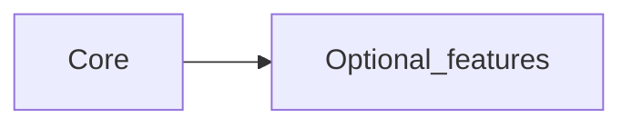

# Product

> **Filled by:** DISCOVERY Q1–Q4. Leave placeholders until then.  
> Completeness index: [REQUIREMENTS.md](./REQUIREMENTS.md).

## North star

_One sentence: what you are building and for whom._

<!-- Filled by Q1 -->
_

## Audience / stakeholders

| Segment | Description | Priority |
|---------|-------------|----------|
| — | — | — |

## Platforms (day one) — devices

| Platform | Day one? | Later? | Notes |
|----------|----------|--------|-------|
| Browser (web) | | | |
| Mobile phone | | | |
| Tablet | | | |
| Desktop app | | | |

<!-- Filled by Q2 -->

## Deploy / distribution (where the finished app lives)

| Target | Day one? | Notes |
|--------|----------|-------|
| Public web (hosted) | | |
| App Store / Play | | |
| Desktop installers | | |
| Self-hosted / on-prem | | |
| Local-only (no server) | | |

<!-- Filled by Q2 -->

## User model

| Question | Answer |
|----------|--------|
| Solo / small team / multi-tenant | _TBD — Q3_ |
| Roles needed? | _TBD — Q3_ |
| Offline required? | _TBD — Q4_ |

## Success metric (first useful version)

_What “working” looks like._

<!-- Filled by Q1 -->
_

## Pains (if v1 never ships)

| Pain | Who feels it | Severity |
|------|--------------|----------|
| — | — | — |

<!-- Filled by Q1b -->

## Current workaround

_How people solve this today (Excel, WhatsApp, paper, competitor, nothing)._

<!-- Filled by Q1b -->
_

## Out of scope (for v1)

| Item | Why deferred |
|------|----------------|
| — | — |

<!-- Filled by Q1b -->

## Non-functional requirements (NFRs)

| Area | Requirement | Notes |
|------|-------------|-------|
| Scale / expected users | — | |
| Security / privacy | — | PII, auth strength |
| Availability / backup | — | |
| Accessibility / languages | — | |
| Compliance | — | if any |
| Builder constraints | — | skills, time, cost |

<!-- Filled by Q4; lock summary also in DECISIONS -->

## Assumptions & risks

| Item | Type | Mitigation |
|------|------|------------|
| — | assumption / risk | — |

## Commercial / packaging (optional)

_Core vs add-ons / profiles — fill when relevant._

## Tech summary

_Pointer only — stack is locked in [DECISIONS.md](./DECISIONS.md) **after** D0 stories._
