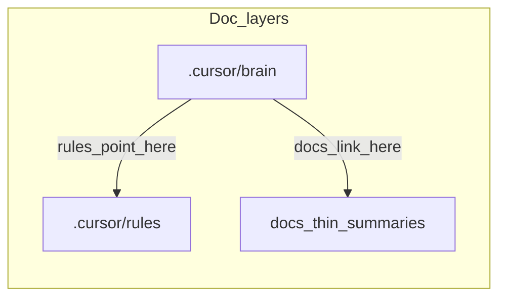

# Project brain

Single source of truth for **product scope, journeys, modules, phases, and locked decisions**.

Agents act as the project’s **requirements engineer**: interview first, write here, draft stories, then recommend stack. Do not invent feature CRUD early.

**Discovery:** If incomplete, follow [DISCOVERY.md](../DISCOVERY.md). Track completeness in [REQUIREMENTS.md](./REQUIREMENTS.md).  
**Example snippets:** kit `examples/solo-habit-tracker.md`.

| File | Purpose |
|------|---------|
| [CONTEXT.md](./CONTEXT.md) | Compact lock + planning snapshot |
| [DISCOVERY.md](../DISCOVERY.md) | RE interview playbook |
| [ARCHITECTURE_DEFAULTS.md](../ARCHITECTURE_DEFAULTS.md) | Stack profiles (after stories) |
| [REQUIREMENTS.md](./REQUIREMENTS.md) | Completeness checklist (index) |
| [PRODUCT.md](./PRODUCT.md) | North star, devices, deploy, pains, NFRs |
| [PERSONAS.md](./PERSONAS.md) | Role cards |
| [FLOWS.md](./FLOWS.md) | Journeys + status gate |
| [STORIES.md](./STORIES.md) | Acceptance stories (build gate) |
| [CLIENT.md](./CLIENT.md) | Notes / interview evidence + ingest |
| [MODULES.md](./MODULES.md) | Core vs optional features |
| [PHASES.md](./PHASES.md) | P0 → D0 → D1 → build-by-journey |
| [GLOSSARY.md](./GLOSSARY.md) | Domain terms |
| [DECISIONS.md](./DECISIONS.md) | Locked product + deploy + NFRs + architecture |
| [CODEMAP.md](./CODEMAP.md) | Code paths → modules |

## How layers relate

| Layer | Role |
|-------|------|
| `.cursor/brain/*.md` | Full product memory |
| `.cursor/rules/*.mdc` | Short agent rules that **point here** |
| `docs/` | Thin team summaries + links here |

## Plans & diagrams

Agent plans / architecture / multi-step proposals lead with **1–3 Mermaid diagrams**, then bullets. See `.cursor/rules/mermaid-plans.mdc`.

## Journey statuses

`draft` → `persona-ready` → `client-validated` → `build-ready`

## Current phase

See [CONTEXT.md](./CONTEXT.md) (compact lock). D0 J0–J3 `build-ready`. Production stack locked; production build has not started.
