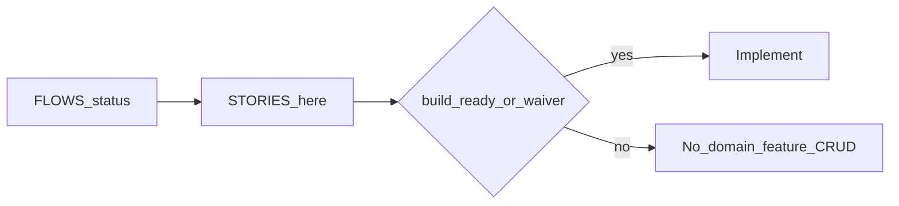

# Acceptance stories

Stories for journeys at **`persona-ready`** or higher.  
**Feature work** requires journey **`build-ready`** in [FLOWS.md](./FLOWS.md), or an explicit human **waiver** below.

Statuses: `draft` → `persona-ready` → `client-validated` → `build-ready`.

## Waiver log

| Date | Journeys | Waived by | Scope |
|------|----------|-----------|-------|
| 2026-08-30 | J0–J3 | Builder (senior-demo request) | Ship a LAN demo slice: TLS + Argon2 challenge-response + X11/synthetic capture + mouse/keyboard + disconnect/reconnect. JPEG frames (not H.264). No J4–J7 features. |

Solo walkthrough of existing CLIENT evidence + the explicit “make a demo” ask marks J0–J3 `client-validated` then `build-ready`.

## Build gate summary

| Journey | FLOWS status | Stories | Feature work allowed? |
|---------|--------------|---------|------------------------|
| J0 | build-ready | Yes | Yes — demo slice |
| J1 | build-ready | Yes | Yes — demo slice |
| J2 | build-ready | Yes | Yes — demo slice |
| J3 | build-ready | Yes | Yes — demo slice |
| J4–J6 | draft | No | No |

Spine / tooling (repo setup, lint, auth shell with no domain inventing) may proceed during discovery.

---

## J0 — Host prepares the Ubuntu server

### J0-S1 — Start listening on X11
**As a** host operator  
**I need** to start the server on my Ubuntu X11 session  
**So that** teammates can reach it on a known port

- **Given** Ubuntu with an X11 session and a free port  
- **When** I start the server with that port  
- **Then** it binds and reports that it is listening (IP/port or equivalent status)

### J0-S2 — Refuse Wayland clearly
**As a** host operator  
**I need** a clear failure if the session is Wayland  
**So that** I do not debug a black screen

- **Given** `XDG_SESSION_TYPE` is wayland  
- **When** I start the server  
- **Then** it exits or stays stopped with a message that v1 requires X11

### J0-S3 — Host login exists
**As a** host operator  
**I need** at least one username with a hashed password  
**So that** viewers can authenticate

- **Given** the server is starting or has a setup step  
- **When** I set or load a username and password  
- **Then** the password is stored hashed (not plaintext) and the server will accept that login later

### J0-S4 — Port already in use
**As a** host operator  
**I need** to know if the port cannot bind  
**So that** I can pick another port or stop the other process

- **Given** the chosen port is already taken  
- **When** I start the server  
- **Then** it fails with a bind/port error and does not pretend to be listening

### J0-S5 — Capture or inject permission missing
**As a** host operator  
**I need** a failure I can act on if screen capture or input injection is not permitted  
**So that** I can fix groups/udev/display access before the team tries to connect

- **Given** the process cannot capture the X11 screen or inject input  
- **When** I start the server (or on first session)  
- **Then** the operator sees a permission/display error, not a silent hang

---

## J1 — Viewer connects and authenticates

### J1-S1 — Connect with IP, port, user, password
**As a** viewer  
**I need** a form for IP, port, username, and password  
**So that** I can reach the host Jordan gave me

- **Given** the client app is open  
- **When** I fill IP, port, username, password and connect  
- **Then** the client attempts a TLS connection to that address

### J1-S2 — Successful challenge-response
**As a** viewer  
**I need** to prove I know the password without sending the password in plaintext  
**So that** a packet sniffer on the LAN does not get the password

- **Given** a reachable server and valid credentials  
- **When** the handshake runs  
- **Then** the client is authenticated and ready for video; the raw password is not written to the wire

### J1-S3 — Wrong password or unknown user
**As a** viewer  
**I need** to be told the login failed  
**So that** I can retry without assuming the host is down

- **Given** a reachable server  
- **When** I connect with bad credentials  
- **Then** I see an authentication failure and remain on the connection form

### J1-S4 — Host unreachable
**As a** viewer  
**I need** to know the network failed  
**So that** I check VPN/IP/port instead of my password

- **Given** the IP:port does not accept TLS  
- **When** I connect  
- **Then** I see an unreachable/timeout/handshake error distinct from auth failure

### J1-S5 — Host already has a viewer
**As a** viewer  
**I need** a busy error if someone else is already in a session  
**So that** I do not silently steal or corrupt the session

- **Given** the server already has an active session  
- **When** I authenticate successfully otherwise  
- **Then** I am rejected with a “session in use” (or equivalent) error

---

## J2 — View remote screen and control mouse/keyboard

### J2-S1 — See the primary display
**As a** viewer  
**I need** to see the host’s primary screen  
**So that** I know I am on the right machine

- **Given** an authenticated session  
- **When** the server captures and sends frames  
- **Then** the client shows updating video of that display

### J2-S2 — Mouse maps to host pixels
**As a** viewer  
**I need** clicks in the video widget to hit the matching place on the host  
**So that** I can use the remote UI when our screen sizes differ

- **Given** the client widget size is not equal to the host resolution  
- **When** I click a point in the widget  
- **Then** the host cursor/click lands on the proportionally mapped host coordinate

### J2-S3 — Keyboard reaches the host
**As a** viewer  
**I need** keys I type (while the widget is focused) to type on the host  
**So that** I can use the remote desktop, not only the mouse

- **Given** the video widget has focus  
- **When** I press keys  
- **Then** the host receives corresponding key events

### J2-S4 — Input does not wait behind video
**As a** viewer  
**I need** mouse/keyboard to stay usable if video is briefly behind  
**So that** control does not feel stuck

- **Given** an active session under load  
- **When** video decode/render is delayed  
- **Then** new input events are still sent promptly (not queued behind the frame backlog)

### J2-S5 — Capture failure ends cleanly
**As a** viewer  
**I need** an error if the picture cannot be produced  
**So that** I do not stare at a black silent window

- **Given** an authenticated session  
- **When** capture or encode fails  
- **Then** the client shows an error and the session ends; the server returns to listening (J3)

---

## J3 — Disconnect and reconnect without restarting the server

### J3-S1 — Clean disconnect leaves server listening
**As a** viewer  
**I need** to disconnect from the client  
**So that** the host stays available for the next connection

- **Given** an active session  
- **When** I disconnect from the client  
- **Then** the server has no active session and is still listening on the same port without a process restart

### J3-S2 — Abrupt drop is treated as disconnect
**As a** host operator  
**I need** a crashed or killed client to free the session  
**So that** the next teammate is not blocked

- **Given** an active session  
- **When** the client process dies or the TCP connection drops  
- **Then** within a short keepalive/timeout the server returns to idle listening

### J3-S3 — Reconnect with same credentials
**As a** viewer  
**I need** to connect again after disconnect  
**So that** I can keep working without Jordan restarting the server

- **Given** the server has been listening since J0 and I just disconnected  
- **When** I enter the same IP, port, username, password and connect  
- **Then** I authenticate and receive video/control again (J1 then J2)

### J3-S4 — Reconnect still requires auth
**As a** host operator  
**I need** reconnects to authenticate  
**So that** a dropped session cannot be resumed by anyone on the LAN

- **Given** a previous session has ended  
- **When** a client connects  
- **Then** it must complete the same auth challenge; there is no anonymous resume token in v1
