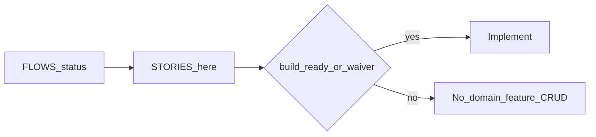

# Acceptance stories

Stories for journeys at **`persona-ready`** or higher.  
**Feature work** requires journey **`build-ready`** in [FLOWS.md](./FLOWS.md), or an explicit human **waiver** below.

Statuses: `draft` → `persona-ready` → `client-validated` → `build-ready`.

## Waiver log

| Date | Journeys | Waived by | Scope |
|------|----------|-----------|-------|
| — | — | — | No waivers yet |

## Build gate summary

| Journey | FLOWS status | Stories | Feature work allowed? |
|---------|--------------|---------|------------------------|
| J0 | draft | No | No — need `build-ready` (after `client-validated` preferred) |
| J1 | draft | No | No |

Spine / tooling (repo setup, lint, auth shell with no domain inventing) may proceed during discovery.

---

## J0 — _

### J0-S1 — _
**As a** _  
**I need** _  
**So that** _

- **Given** _  
- **When** _  
- **Then** _

### J0-S2 — _
**As a** _  
**I need** _  
**So that** _

- **Given** _  
- **When** _  
- **Then** _

<!-- Add J0-S3… then J1 stories after J0 is persona-ready -->

---

## J1 — _

### J1-S1 — _
**As a** _  
**I need** _  
**So that** _

- **Given** _  
- **When** _  
- **Then** _
