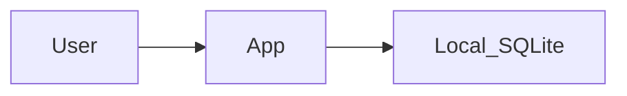

# Example: solo habit tracker (snippets)

**Not a full brain.** Shows **requirements-first** order: product → deploy → users → stories → **then** stack.  
Use when the human is stuck; adapt — do not copy as if it were their product.

## PRODUCT (excerpt)

**North star:** A personal habit tracker for one person to log daily habits on their phone.

**Success metric:** I can create three habits and check them off every day for a week without losing data.

**Devices day one:** Mobile phone (primary); browser later.

**Deploy:** Local-only (no server) for v1; optional App Store later.

**User model:** Solo — just me; no roles.

**Pain:** I forget whether I already logged a habit; streaks die in Notes app chaos.

**Current workaround:** Apple Notes checklist + calendar reminders.

**Out of scope (v1):** Social sharing, coaches, multi-user households, Apple Watch, cloud sync.

**NFRs:** Offline required; data must survive app restart; no PII beyond habit names; builder = solo, prefer simple stack.

## PERSONAS (one card)

### Solo user (Alex)

- **Job:** Stick to a few daily habits.
- **Sees:** Habit list, today checkmarks, simple streak count.
- **Does:** Add/edit habits; check off today; glance at streak.
- **Does not:** Manage other users; export analytics dashboards (v1).
- **Journeys:** J0, J1.

## FLOWS (D0 wave)

| ID | Title | Status | Wave |
|----|-------|--------|------|
| J0 | First open → empty state → add first habit | persona-ready | D0 |
| J1 | Daily check-off + streak | persona-ready | D0 |
| J2 | Edit / archive habits | draft | D1 |

### J0 happy path
Open app → empty state CTA → name habit → save → see habit on Today.

### J0 failures
Empty name rejected; duplicate name warned.

### J1 happy path
Open Today → tap check → streak increments → reopen later same day still checked.

## STORIES (samples)

**J0-S1** — As Alex I need to add a habit so that it appears on Today.  
Given empty store, when I save “Meditate”, then Today shows Meditate unchecked.

**J1-S1** — As Alex I need to check off a habit so that my streak updates.  
Given Meditate unchecked today, when I check it, then it stays checked after relaunch.

## Architecture lock (after stories)

**Profile:** Local single-user (from ARCHITECTURE_DEFAULTS).  
**Why:** Solo + phone + local-only deploy + offline NFR + J0/J1 are on-device only.

| Layer | Choice |
|-------|--------|
| Client | Mobile app (or mobile web PWA) |
| API | None |
| Data | Local SQLite / on-device store |
| Auth | None (device lock) |
| Sync | N/A |

## Gate reminder

Do not build J2 until J0–J1 are at least `persona-ready`, preferably `client-validated` (solo walkthrough), then `build-ready`.
