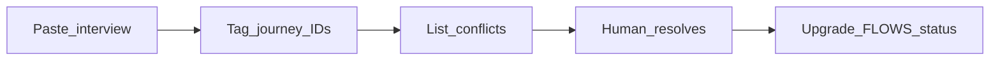

# Client evidence

Hybrid discovery: **domain personas first** ([PERSONAS.md](./PERSONAS.md)), **client notes second** (this file), then upgrade journey status in [FLOWS.md](./FLOWS.md).

## Intake status

| Field | Value |
|-------|-------|
| Client / mill | _TBD — physical visit; Setup screenshots + owner J0 answers_ |
| Profile assumed | `integrated` (golden path) |
| Last ingest | 2026-08-27 — J0 owner decisions (partial; roles/nav await mill meeting) |
| Open conflicts | 2 (C-J0-1 roles; C-J0-2 StoreKeeper nav) |

**How to paste:** Drop messy bullets, WhatsApp exports, or transcript chunks under **Raw inbox**, then ask an agent to “ingest CLIENT.md” — they move items into **Evidence by journey**, update conflict table, and propose FLOWS status bumps (`persona-ready` → `client-validated`).

---

## Raw inbox

<!-- Paste new notes below this line. Do not edit structured sections until ingest. -->

_(empty)_

---

## Evidence by journey

### J0 — Login / roles

| ID | Quote or paraphrase | Source | Implication |
|----|---------------------|--------|-------------|
| J0-E1 | Only Admin may create users | Owner 2026-08-27 | Users CRUD = Admin only; matches DECISIONS |
| J0-E2 | New users: system temp password; must change before other screens; OK | Owner 2026-08-27 | Keep must_change_password gate |
| J0-E3 | Lockout 5 fails / 15 min → lock 15 min; Admin unblock; OK | Owner 2026-08-27 | Keep brute-force defaults |
| J0-E4 | Second Admin allowed; peer Admins cannot edit/delete each other; OK | Owner 2026-08-27 | Keep peer-Admin protection |
| J0-E5 | Unpaid Accounting / Analytics / LoomSage: show **Upgrade to Pro+** (not plain Coming soon) | Owner 2026-08-27 | Copy + CTA on unpaid add-on routes; still no fake CRUD |
| J0-E6 | Need **force logout all devices** | Owner 2026-08-27 | Revoke all sessions on password change + Admin “Sign out everywhere” |
| J0-E7 | After password change, land on **Home** | Owner 2026-08-27 | Post-change redirect = home/shell |
| J0-E8 | Password: **≥12 chars** and **≥1 uppercase**; no other complexity for J0 | Owner 2026-08-27 | Tighten password policy beyond min length alone |
| J0-E9 | Final role list — discuss with mill client | Owner 2026-08-27 | Roles stay provisional until meeting (see C-J0-1) |
| J0-E10 | StoreKeeper (and role) nav — confirm with mill client | Owner 2026-08-27 | J0-S4 matrix not client-locked (see C-J0-2) |

### J1 — Setup masters

| ID | Quote or paraphrase | Source | Implication |
|----|---------------------|--------|-------------|
| — | — | — | — |

### J2 — Buyer order → CONFIRMED

| ID | Quote or paraphrase | Source | Implication |
|----|---------------------|--------|-------------|
| — | — | — | — |

### J3 — Yarn receive / bales

| ID | Quote or paraphrase | Source | Implication |
|----|---------------------|--------|-------------|
| — | — | — | — |

### J4 — Weaving

| ID | Quote or paraphrase | Source | Implication |
|----|---------------------|--------|-------------|
| — | — | — | — |

### J5 — Dye / finish / failed lots

| ID | Quote or paraphrase | Source | Implication |
|----|---------------------|--------|-------------|
| — | — | — | — |

### J6 — QC

| ID | Quote or paraphrase | Source | Implication |
|----|---------------------|--------|-------------|
| — | — | — | — |

### J7 — Pack / dispatch

| ID | Quote or paraphrase | Source | Implication |
|----|---------------------|--------|-------------|
| — | — | — | — |

### J8 — Inventory / shrinkage

| ID | Quote or paraphrase | Source | Implication |
|----|---------------------|--------|-------------|
| — | — | — | — |

### J9 — Boundaries (Analytics / LoomSage / Core)

| ID | Quote or paraphrase | Source | Implication |
|----|---------------------|--------|-------------|
| — | — | — | — |

---

## Conflicts (persona vs client)

| Conflict ID | Journey | Persona default | Client says | Resolution | Owner |
|-------------|---------|-----------------|-------------|------------|-------|
| C-J0-1 | J0 | Six roles: Admin, Sales, StoreKeeper, FloorSupervisor, Operator, Accountant | Owner must discuss final list with mill | **Parked** until mill meeting (owner 2026-08-27) — keep six as agenda | Owner + mill |
| C-J0-2 | J0 | StoreKeeper sees Gate / Yarn / Inventory (+ Setup articles use); no Users | Needs mill confirmation | **Parked** until mill meeting (owner 2026-08-27) — still blocks full J0 `client-validated` / `build-ready` | Owner + mill |
| C-J0-3 | J0 / J9 | Unpaid add-ons = Coming soon | Owner: **Upgrade to Pro+** | **Resolved** — use Upgrade to Pro+; no fake CRUD | Owner 2026-08-27 |

When resolved, update [FLOWS.md](./FLOWS.md) status and [PERSONAS.md](./PERSONAS.md) if role cards change.

---

## Ingest checklist (agent)

1. Move Raw inbox items into Evidence tables; tag `J0`…`J9`.
2. Add Conflict rows where client contradicts PERSONAS/FLOWS.
3. Do **not** silently change locked DECISIONS 1–8 without human confirm.
4. Propose status: `client-validated` only after human ack on that journey.
5. Clear Raw inbox after structured move (keep archive subsection if needed).
