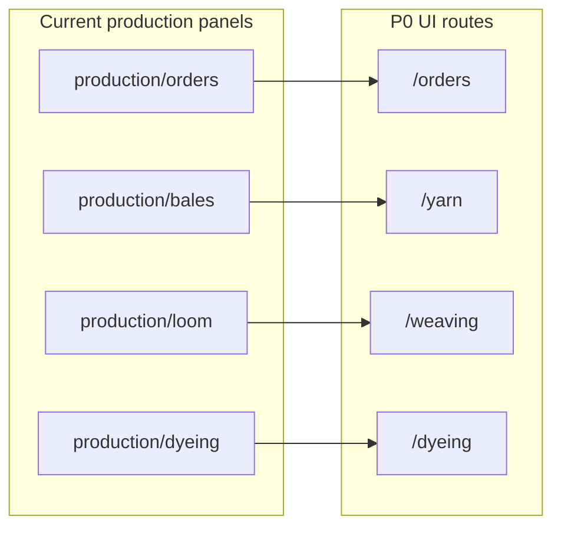
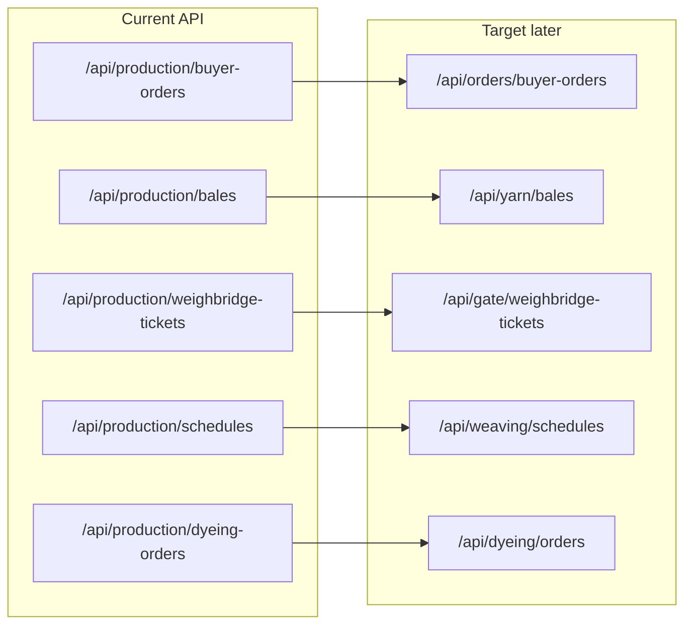
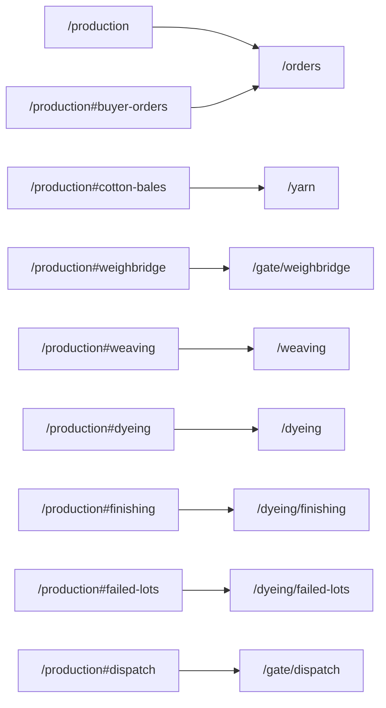

# Code map (current → target)

P0 keeps existing API prefixes and panel code paths; UI routes move. Physical folder moves can follow in later PRs (one slice per PR).

## Frontend modules

| Current path | Target module | P0 UI route | Notes |
|--------------|---------------|-------------|-------|
| `frontend/src/modules/production/orders/` | Core: Buyer Orders | `/orders` | Re-export panel |
| `frontend/src/modules/production/bales/` | Pack: Yarn | `/yarn` | Cotton bales |
| `frontend/src/modules/production/weighbridge/` | Core: Gate | `/gate/weighbridge` | |
| `frontend/src/modules/production/dispatch/` | Core: Gate | `/gate/dispatch` | |
| `frontend/src/modules/production/loom/` | Pack: Weaving | `/weaving` | Loom schedules; WO in P1 |
| `frontend/src/modules/production/dyeing/` | Pack: Dyeing | `/dyeing` | |
| `frontend/src/modules/production/finishing/` | Pack: Dyeing | `/dyeing/finishing` | |
| `frontend/src/modules/production/failed_lots/` | Pack: Dyeing | `/dyeing/failed-lots` | |
| `frontend/src/modules/inventory/` | Core: Inventory | `/inventory` | Stub until Inventory phase |
| `frontend/src/modules/setup/` | Core: Setup | `/setup`, `/setup/color-codes` | Color Codes live; other masters soon |
| `frontend/src/modules/accounting/` | Paid add-on | `/accounting` | Stub |
| `frontend/src/modules/ai/` | Paid add-on | `/ai` | Stub |
| `frontend/src/modules/compliance/` | Fold into Accounting/FBR later | `/compliance` | Stub; keep route for now |
| `frontend/src/modules/production/ProductionPage.tsx` | Deprecated hub | `/production` → redirect | Hash redirects in AppRouter |

## Backend API (current vs target)

Keep current prefixes in P0. Target rename is documentation only until a dedicated API PR.

| Current API | Target (later) | Owner area |
|-------------|----------------|------------|
| `/api/production/buyer-orders` | `/api/orders/buyer-orders` | Orders |
| `/api/production/order-catalogs` | `/api/orders/catalogs` | Orders |
| `/api/production/bales` | `/api/yarn/bales` | Yarn |
| `/api/production/weighbridge-tickets` | `/api/gate/weighbridge-tickets` | Gate |
| `/api/production/dispatch-notes` | `/api/gate/dispatch-notes` | Gate |
| `/api/production/schedules` | `/api/weaving/schedules` | Weaving |
| `/api/production/dyeing-orders` | `/api/dyeing/orders` | Dyeing |
| `/api/production/finishing-cards` | `/api/dyeing/finishing-cards` | Dyeing |
| `/api/production/failed-lots` | `/api/dyeing/failed-lots` | Dyeing |
| `/api/inventory/status` | `/api/inventory/...` | Inventory |
| `/api/accounting/status` | `/api/accounting/...` | Paid add-on |
| `/api/ai/status` | `/api/ai/...` | Paid add-on |
| `/api/setup/color-codes` | `/api/setup/color-codes` | Setup masters |

## Hash → route redirects (P0)

| Old | New |
|-----|-----|
| `/production` | `/orders` |
| `/production#buyer-orders` | `/orders` |
| `/production#cotton-bales` | `/yarn` |
| `/production#weighbridge` | `/gate/weighbridge` |
| `/production#weaving` | `/weaving` |
| `/production#dyeing` | `/dyeing` |
| `/production#finishing` | `/dyeing/finishing` |
| `/production#failed-lots` | `/dyeing/failed-lots` |
| `/production#dispatch` | `/gate/dispatch` |
