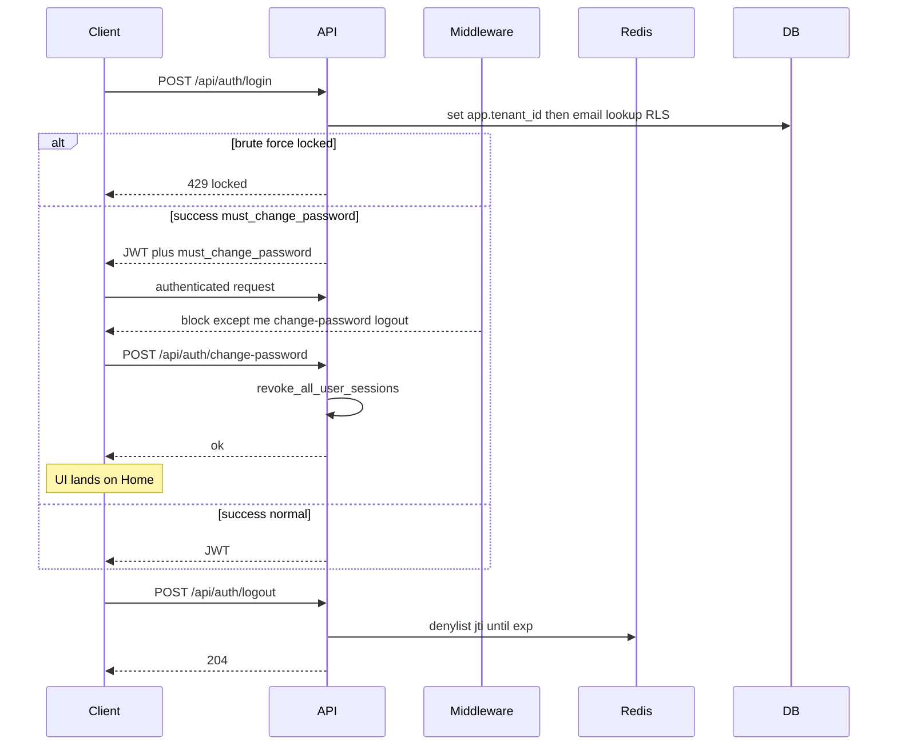
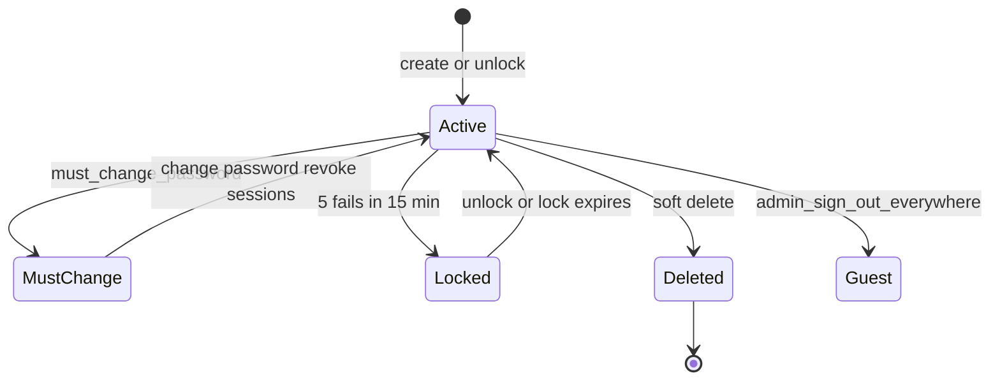

# Decisions (locked)

## Product confirmation (1–8)

1. North star = **full integrated mill**; packs add/remove by profile/need.
2. Core = Buyer Orders + Gate + Inventory + Setup + shared QC.
3. Packs = Yarn, Weaving, Dyeing & Processing, Fabric purchase.
4. Paid add-ons (one bucket) = Accounting/FBR/Reporting, Analytics, LoomSage.
5. Confirmed BPO → **DRAFT** work docs only for **enabled** packs; Weaving owns weaving WOs/job cards.
6. Inventory = stock system of record; job-work first-class; FBR paid; chat explore separate.
7. Kill hash mega-page; real module routes.
8. Deliver in **journey-locked** phases (see [PHASES.md](./PHASES.md)); old P1–P6 pack labels are depth hints only.
9. **SDLC:** `develop` → `qa` → `main` + semver Releases on `main` only ([docs/SDLC.md](../../docs/SDLC.md)).
10. **Discovery:** hybrid personas + client evidence ([PERSONAS.md](./PERSONAS.md), [CLIENT.md](./CLIENT.md)); feature PRs need journey `build-ready` or human waiver ([FLOWS.md](./FLOWS.md), [STORIES.md](./STORIES.md)).

## Boundary revision (J9) — working locks

Provisional until client validates J9 evidence. Overrides MODULES paid-add-on blur.

| ID | Decision |
|----|----------|
| **K1** | Golden path first = **integrated** Yarn→Dispatch; other profiles are entitlement subsets later |
| **K2** | **Core day-1 UI** = Orders + Gate + Inventory + Setup + shared QC service; thin ops lists allowed in Core |
| **K3** | **Gate owns weighbridge/dispatch UI**; Yarn pack owns lot/bale identity; Inventory posts stock |
| **K4** | **Analytics** = paid cross-module KPIs/dashboards/exports — not transactional Core screens; **deferred past first useful ERP** (owner 2026-08-27) |
| **K5** | **LoomSage** = paid assistant over existing data — **deferred past first useful ERP** (owner 2026-08-27); no parallel ledger; cannot bypass QC lock / Inventory post rules |
| **K6** | **Accounting/FBR** remains paid statutory/reporting bucket (unchanged **H**/**J**) |
| **K7** | MODULES.md stays **provisional** until J9 `client-validated` |

## Earlier locks

| ID | Decision |
|----|----------|
| **B** | Profiles as default (`weaving` \| `dyeing` \| `converter` \| `integrated`); add/remove packs later |
| **D** | Process proposes stock moves; Inventory posts |
| **E** | External job-work is first-class |
| **F** | Shared QC service (not owned by one pack) |
| **H** | FBR / DTRE / compliance reporting = paid add-on |
| **I** | White-label chat = explore track (anti–WhatsApp leak) |
| **J** | Commercial: Core + packs → Paid add-ons bucket |

## Open but non-blocking (defaults)

| Topic | Default until revisited |
|-------|-------------------------|
| **G** Sales vs fabric purchase UI | One Orders engine; two entry points later |
| Inventory depth in P0 | Issue/receipt + multi-UOM only; bins later |
| Chat packaging | Separate explore; not bundled with Core yet |
| WO commercial fields (yarn deduct, quality A/B %) | Weaving P1 detail |
| **Backup** | Automatic scheduled DB/volume backup — no manual routine mill-IT steps (owner 2026-08-27) |
| C-J0-1 / C-J0-2 | Parked until mill meeting |

## Auth & users (locked)

| Topic | Decision |
|-------|----------|
| Roles | Default agenda: `Admin` \| `Sales` \| `StoreKeeper` \| `FloorSupervisor` \| `Operator` \| `Accountant` — **provisional** until mill confirms ([CLIENT.md](./CLIENT.md) C-J0-1) |
| User create | **Admin only** creates users |
| Tenancy | **On-prem single mill** (owner 2026-08-27); `DEFAULT_TENANT_ID` + RLS as one-tenant isolation; multi-tenant hosted SaaS out of v1 |
| Seed Admin | `admin@loomlogic.com` / `admin123` (hashed), `must_change_password=true` — first login must change password |
| Logout (current) | Redis denylist by JWT `jti` (TTL until exp); memory backend = in-process; db mode → 503 if Redis down |
| Logout (all devices) | **Required:** revoke **all** sessions for a user on password change; Admin action “Sign out everywhere” (implementation TBD — user-level revoke, not only current `jti`) |
| Peer Admins | Second Admin allowed; peer Admins cannot PATCH/DELETE each other |
| must_change_password | Middleware blocks all authenticated traffic except `GET /api/auth/me`, `POST /api/auth/change-password`, `POST /api/auth/logout` |
| After password change | UI lands on **Home** (app shell home) |
| New users | System temp password returned once as `temporary_password`; `must_change_password=true` |
| Passwords | Min 12 / max 128; **≥1 uppercase** required; no other complexity for J0; MFA stub column `mfa_enabled=false` only |
| Brute force | 5 fails / 15 min → lock 15 min; key = IP+email; Admin lockout list/unblock |
| Unpaid add-ons UI | Show **Upgrade to Pro+** (Accounting / Analytics / LoomSage); `GET /status` only — **no fake CRUD** |
| Live auth | Every request reloads user from DB (role, is_active, deleted_at, must_change_password) + denylist `jti` |
| Role nav matrix | PERSONAS sketch remains default; StoreKeeper nav **not** mill-confirmed ([CLIENT.md](./CLIENT.md) C-J0-2) — blocks full J0 `build-ready` |

## Security risks (TODO)

| Risk | Status |
|------|--------|
| **HIBP (Have I Been Pwned) password check** | TODO — do not implement yet; add k-anonymity range API check on password set/change when scheduled |

---

## Brainiac training — Deploy lock

| Field | Value |
|-------|--------|
| Primary deploy target | **On-prem single mill** (self-hosted) — locked owner 2026-08-27 |
| Devices day one | **Browser only** — locked owner 2026-08-27 |
| Locked by / date | Owner / 2026-08-27 |

**Tenancy note:** Auth section’s `DEFAULT_TENANT_ID` / RLS remains fine for a single mill install (one tenant id). Multi-tenant hosted SaaS is **out of scope for v1**; do not design billing/multi-org UX yet.

## Brainiac training — Architecture (already locked in code)

**Profile:** Small team / one org (on-prem) — web browser + API + Postgres. RLS/tenant_id kept as isolation primitive for one mill.

| Layer | Choice |
|-------|--------|
| Client | React + TypeScript (Vite), Tailwind, Shadcn, TanStack Table |
| API | FastAPI (Python 3.12+), WebSockets, SSE |
| Data | PostgreSQL + RLS (+ pgvector later) |
| Auth | JWT + Redis denylist; roles; must_change_password |
| Sync / jobs | Redis + Celery |
| Deploy | On-prem single mill; browser clients |
