# Flows — integrated golden path

**Profile:** `integrated` · Yarn → Weave → Dye/Finish → QC → Pack → Dispatch.  
**Statuses:** `draft` → `persona-ready` → `client-validated` → `build-ready`.  
Feature PRs need **`build-ready`** or an explicit human **persona-ready waiver** ([STORIES.md](./STORIES.md), [docs/SDLC.md](../../docs/SDLC.md)).

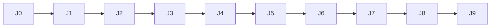

| ID | Title | Status | Primary personas |
|----|-------|--------|------------------|
| J0 | Login, roles, who can see what | **persona-ready** | Admin, all |
| J1 | Setup masters enough to run a day | **persona-ready** | Admin, StoreKeeper, Sales |
| J2 | Buyer order → CONFIRMED | **persona-ready** | Sales, Admin |
| J3 | Yarn receive / bale lots | **persona-ready** | StoreKeeper |
| J4 | Weaving DRAFT WO → production | draft | FloorSupervisor, Operator |
| J5 | Dye / finish / failed lots | draft | FloorSupervisor, Operator |
| J6 | QC grade + lock | draft | FloorSupervisor, StoreKeeper |
| J7 | Pack + dispatch | draft | StoreKeeper, Sales |
| J8 | Stock truth / shrinkage | draft | StoreKeeper |
| J9 | Boundary pass (Core / packs / add-ons) | draft | Admin |

Do **not** start J4+ feature code until J0–J3 are at least `persona-ready` (met) and preferably `client-validated` / `build-ready`.

---

## J0 — Login, roles, visibility

**Status:** persona-ready _(partial owner evidence 2026-08-27; roles + nav await mill — not yet `client-validated`)_  
**Goal:** Right people reach the right nav; locked/must-change-password work; unpaid add-ons show **Upgrade to Pro+** (no fake CRUD); Admin can revoke all sessions.

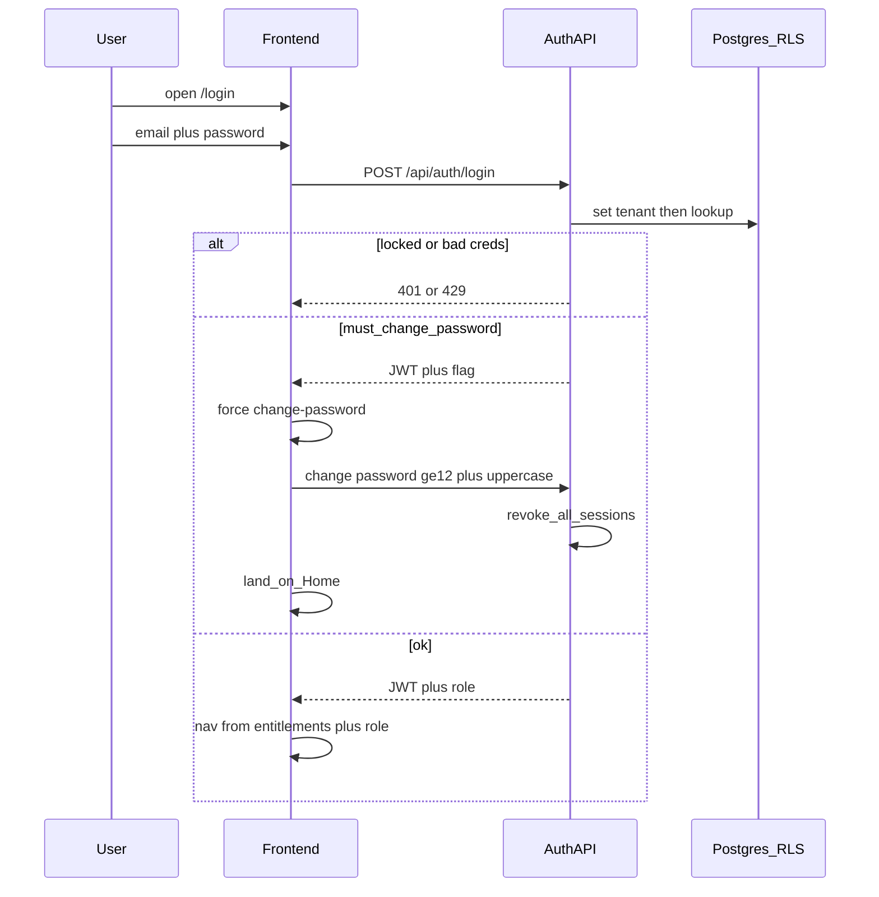

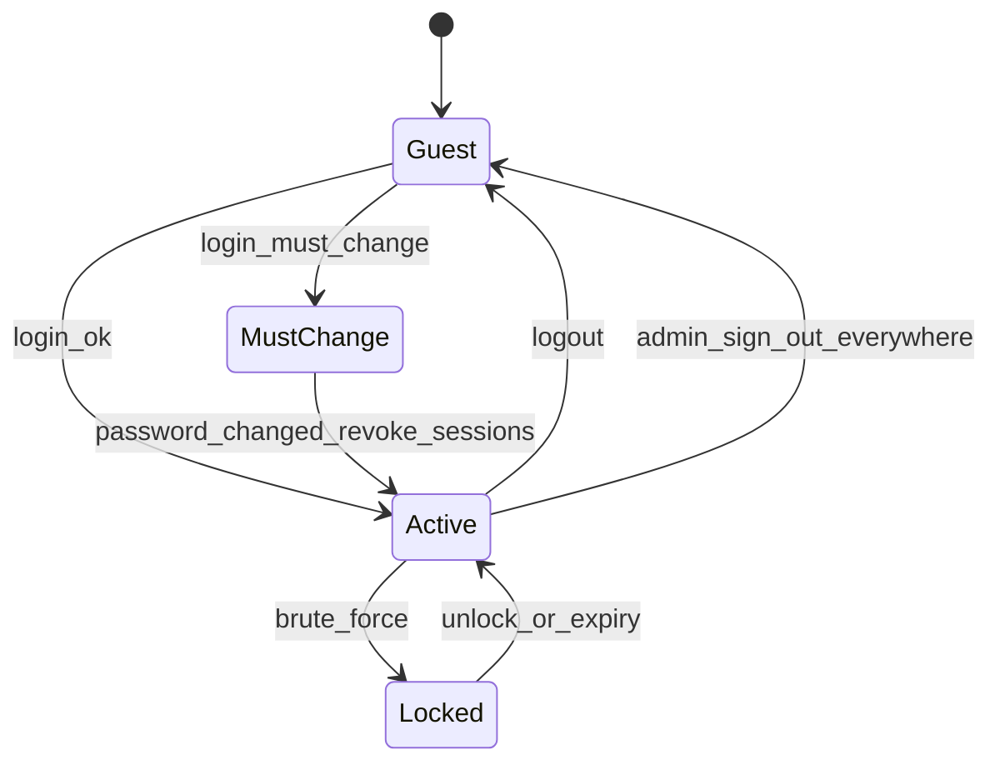

**Happy path:** Admin creates users → user logs in → must-change if flagged → Home → sees integrated nav for role.  
**Failures:** Wrong password; lockout; peer Admin cannot delete peer Admin; weak password (<12 or no uppercase).  
**Evidence:** [CLIENT.md](./CLIENT.md) §J0 (J0-E1…E10). **Open:** C-J0-1 roles, C-J0-2 StoreKeeper nav.

---

## J1 — Setup masters for a mill day

**Status:** persona-ready  
**Goal:** Minimum masters so J2–J3 can run: parties (buyer, yarn supplier), articles (yarn count / fabric construction), UoM, machines/looms (light).

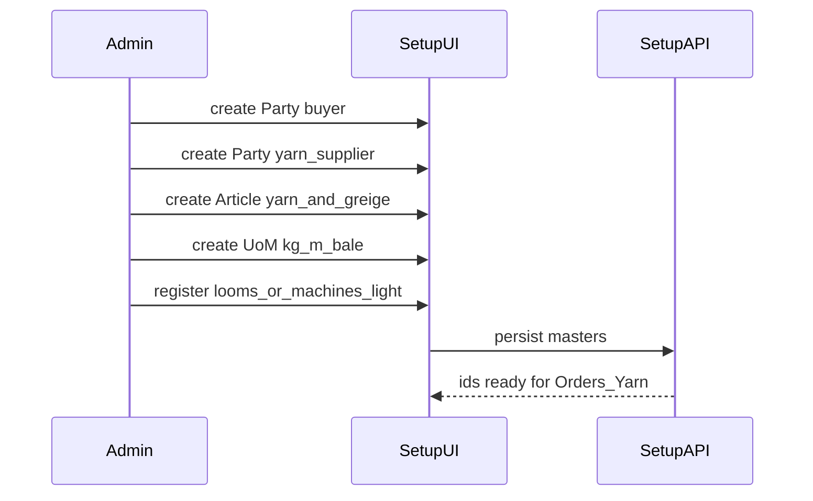

**Happy path:** Masters exist before first BPO and first weighbridge ticket.  
**Out of scope here:** Full BOM trees; bin locations (later Inventory).  
**Evidence:** CLIENT §J1.

---

## J2 — Buyer order → CONFIRMED

**Status:** persona-ready  
**Goal:** Sales creates BPO; on `CONFIRMED`, system creates **DRAFT** work docs only for **enabled** packs (weaving/dyeing/yarn as entitled)—humans confirm later (J4+).

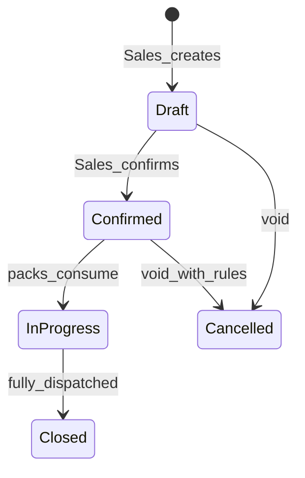

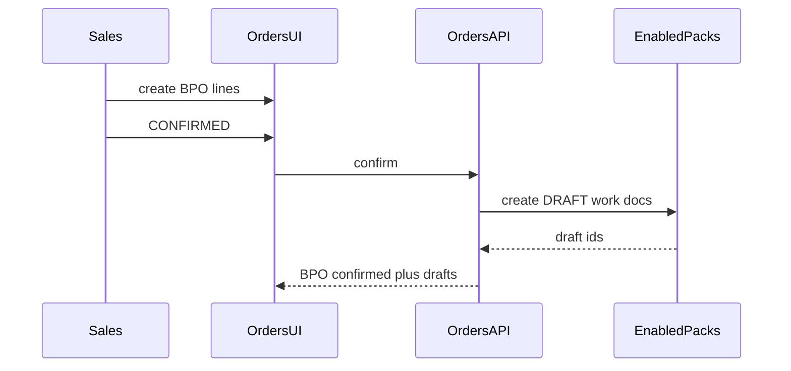

**Happy path:** Confirmed BPO shows linked DRAFT WOs/job docs; rollup stays on Orders.  
**Rules:** No auto-start of production; Inventory not posted on confirm.  
**Evidence:** CLIENT §J2.

---

## J3 — Yarn receive / bale lots

**Status:** persona-ready  
**Goal:** Truck at gate → weighbridge ticket → yarn/bale lots in Yarn pack; Inventory **proposal** then StoreKeeper **post** (or single post if ticket is the receive).

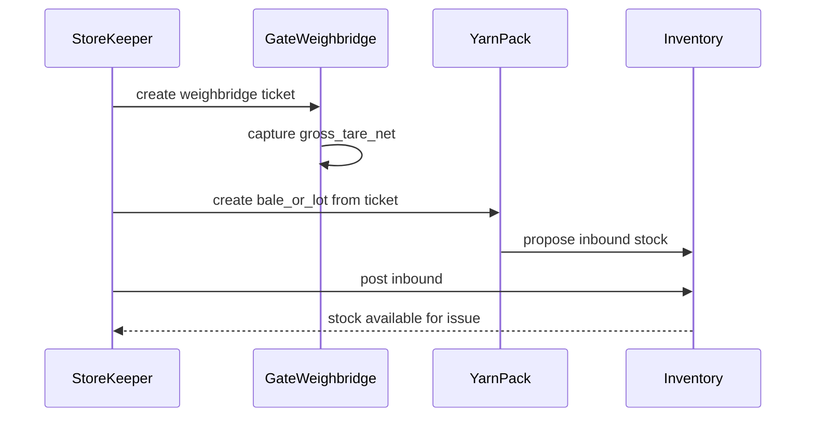

**Happy path:** Net weight and supplier party link to lots; lots visible on `/yarn`.  
**Edge:** Job-work inbound (converter-like) deferred; integrated path is own purchase/receive first.  
**Evidence:** CLIENT §J3.

---

## J4 — Weaving DRAFT WO → production (draft)

**Status:** draft  
**Goal:** FloorSupervisor confirms DRAFT weaving WO; Operator/Supervisor records greige output; Yarn issue proposed → Inventory posts.

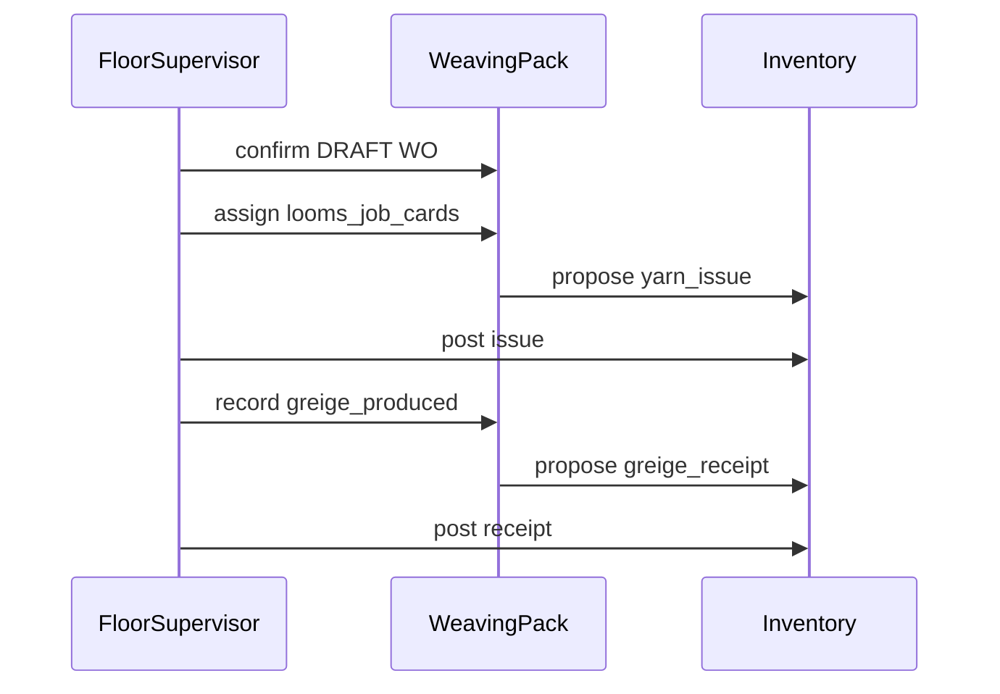

---

## J5 — Dye / finish / failed lots (draft)

**Status:** draft  
**Goal:** Confirm dyeing/finishing DRAFTs; process greige; open failed lots; propose yield/shrinkage.

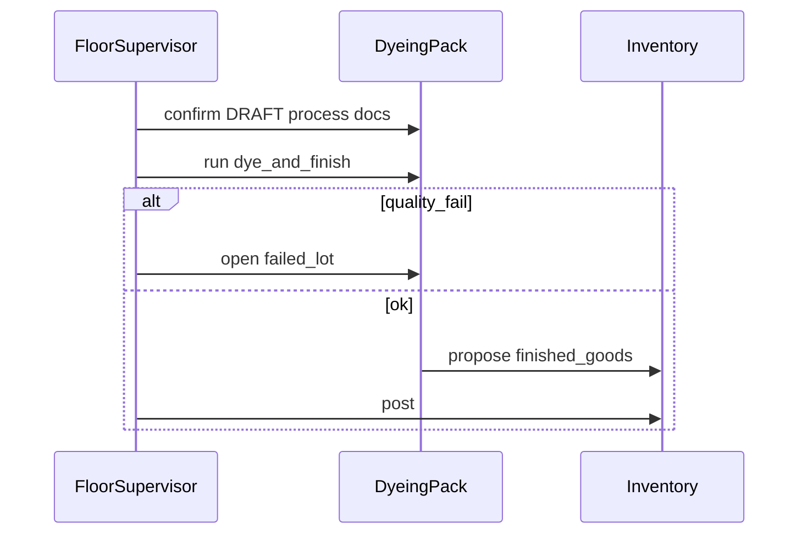

---

## J6 — QC grade + lock (draft)

**Status:** draft  
**Goal:** Shared QC grades fabric; grade_lock on Inventory; Gate cannot dispatch locked stock.

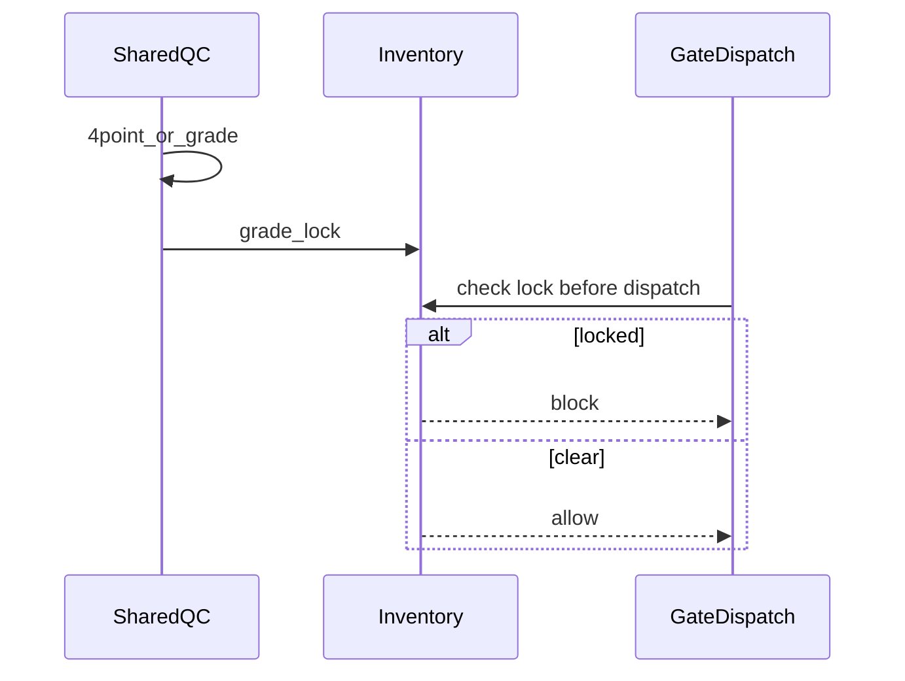

---

## J7 — Pack + dispatch (draft)

**Status:** draft  
**Goal:** Pack finished goods; Dispatch note; weighbridge out; BPO progress updates.

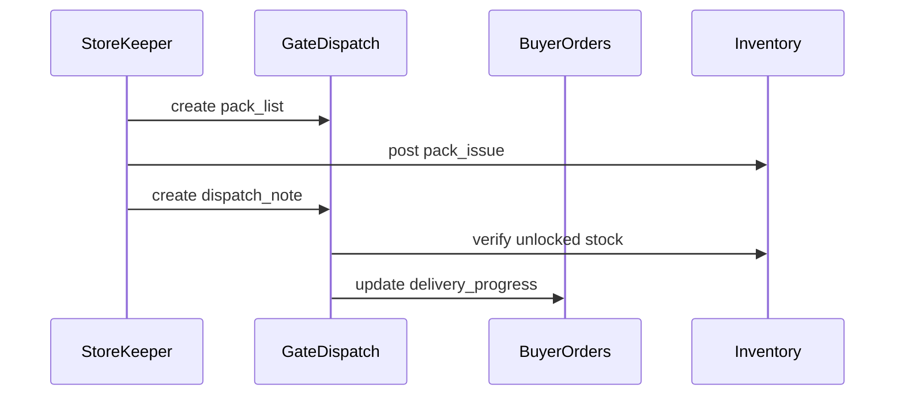

---

## J8 — Stock truth / shrinkage (draft)

**Status:** draft  
**Goal:** Inventory is system of record; multi-UOM; shrinkage/yield from packs posted, not double-counted in packs.

---

## J9 — Boundary pass (draft → revised with discovery)

**Status:** draft (working conclusions in [MODULES.md](./MODULES.md) / [DECISIONS.md](./DECISIONS.md) §Boundary)  
**Goal:** Lock what is Core vs process pack vs Analytics vs LoomSage after J0–J8 shape is clear.

See **Boundary revision (J9)** in DECISIONS — provisional answers from golden-path analysis; client may override.
