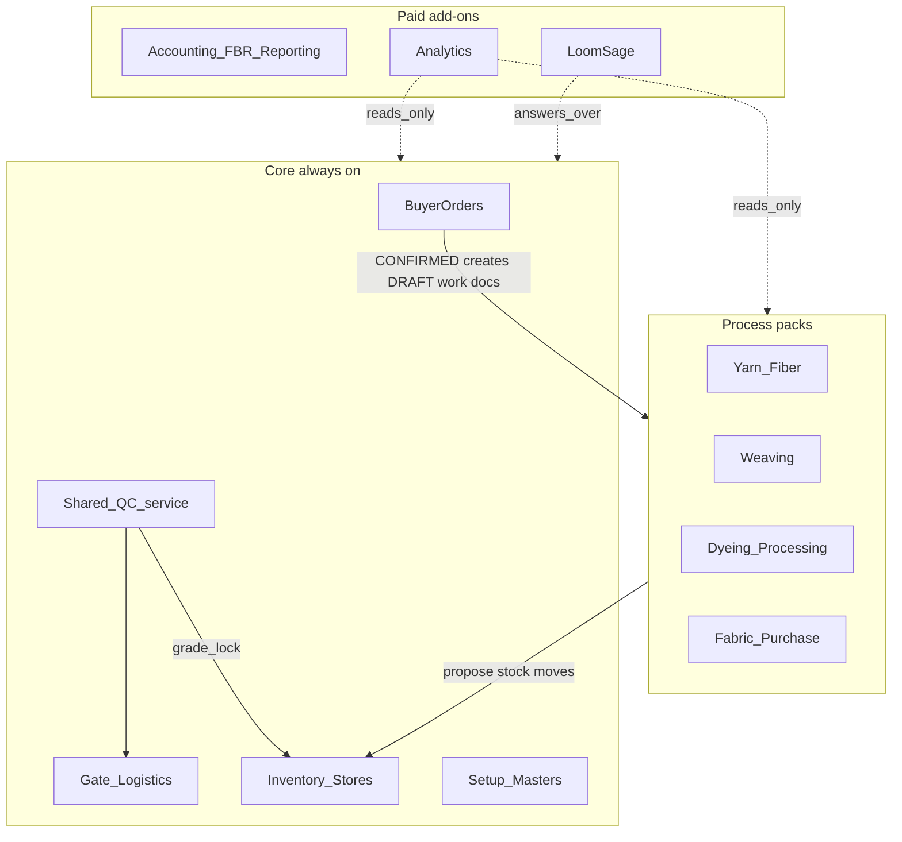
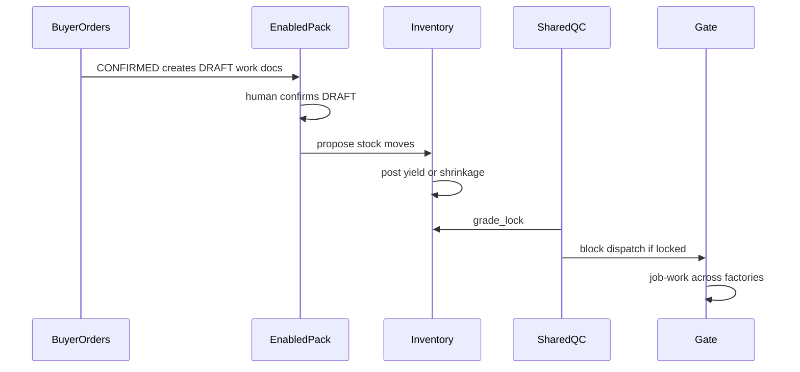

# Modules

> **Provisional until J9 client-validated.** Golden-path analysis produced working boundaries below ([DECISIONS.md](./DECISIONS.md) §Boundary). Pack feature depth stays frozen until matching journeys are `build-ready`.

## Diagram

## Core (always on) — day-1 integrated tenant

Every integrated tenant must see these on day 1 (ops, not paid analytics):

| Module | Frontend route(s) | Notes |
|--------|-------------------|-------|
| Buyer Orders | `/orders` | Commercial BPO; progress rollup |
| Gate & Logistics | `/gate/weighbridge`, `/gate/dispatch` | Receive, pack, dispatch; job-work later |
| Inventory & Stores | `/inventory` | Stock system of record |
| Setup / Masters | `/setup` | Parties, articles, UoM, machines |
| Shared QC | service used by packs/gate | 4-point / grade / lock — not a sole nav home until J6 |

**Core may include thin ops lists** (open orders, stock on hand, dispatch queue). That is **not** the Analytics add-on.

## Process packs (add/remove)

| Pack | Frontend route(s) | Owns on golden path |
|------|-------------------|---------------------|
| Yarn & Fiber | `/yarn` | Bales / yarn lots; proposes inbound/issue (J3, J4) |
| Weaving | `/weaving` | Weaving WOs / job cards; greige output proposals (J4) |
| Dyeing & Processing | `/dyeing`, `/dyeing/finishing`, `/dyeing/failed-lots` | Process docs, finish, failed lots (J5) |
| Fabric Purchase | `/orders/purchases` later | Same Orders engine; **after** integrated path |

Pack vs Core: **weighbridge ticket UI lives in Gate (Core)**; yarn lot identity lives in Yarn pack. Inventory posts all stock.

## Paid add-ons (revised working definitions)

| Add-on | Route | Boundary (J9 working) |
|--------|-------|------------------------|
| Accounting / FBR / Reporting | `/accounting` | Statutory e-invoicing, DTRE, GL — not floor ops |
| Analytics | `/analytics` | Cross-module trends, dashboards, exportable KPIs beyond Core ops lists |
| LoomSage | `/ai` | Conversational assistant **over** Core/pack data; not a second ERP; unpaid = **Upgrade to Pro+** |

Until entitled: **Upgrade to Pro+** / `GET /status` only — **no fake CRUD**.

## Cross-cutting contracts

1. **BPO `CONFIRMED`** → create **DRAFT** work docs only for **enabled** packs; human confirms.
2. **Weaving pack** owns weaving WOs / job cards; Buyer Orders owns PO + rollup.
3. **Inventory** posts stock; process packs propose movements.
4. **Job-work** across factory boundaries is first-class (Gate) — full depth after integrated receive path.
5. **QC** is a shared service; can lock stock / block dispatch.
6. **Nav** uses real paths — no `/production#…` mega-page as the model.
7. Disabled packs / unpaid add-ons: **Upgrade to Pro+** / gated — no fake CRUD.
8. **Analytics** reads aggregates; must not own transactional posting.
9. **LoomSage** answers questions; must not silently bypass Inventory/QC locks.

## Entitlements

See `frontend/src/app/entitlements.ts`. Default profile for discovery: `integrated` (all process packs on; paid add-ons off / stub). Role matrix: [PERSONAS.md](./PERSONAS.md).

## Journeys

See [FLOWS.md](./FLOWS.md) J0–J9. Do not deepen pack CRUD until that journey is `build-ready`.
