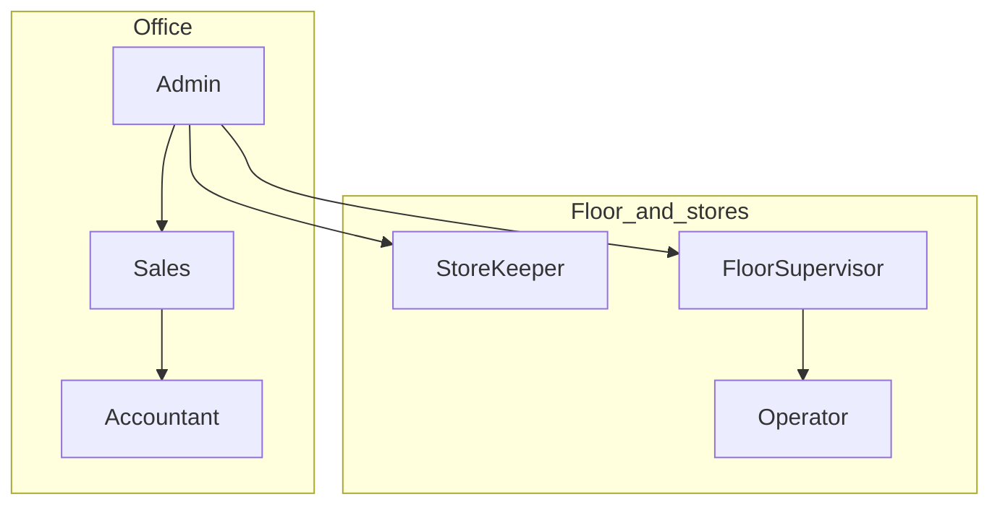

# Personas — Pakistan SME integrated mill

Golden path profile: **`integrated`** (Yarn → Weave → Dye/Finish → QC → Pack → Dispatch).  
Roles match auth (default agenda until mill confirms): `Admin` | `Sales` | `StoreKeeper` | `FloorSupervisor` | `Operator` | `Accountant`.  
See [CLIENT.md](./CLIENT.md) C-J0-1 / C-J0-2 — role list and StoreKeeper nav not mill-locked yet.

Status legend used in [FLOWS.md](./FLOWS.md): `draft` → `persona-ready` → `client-validated` → `build-ready`.

## Mill context (persona fiction until client validates)

| Field | Persona default |
|-------|-----------------|
| Location | Faisalabad-area power-loom + processing integrated unit |
| Scale | ~40–120 looms; own dye/finish or shared line; one weighbridge |
| Systems today | Excel + WhatsApp + paper gate slips |
| Language | Urdu/English mix on floor; English OK for ERP labels |
| Pain | Order blindness, yarn vs greige mismatch, dispatch without QC lock |

## Role cards

### Admin

- **Job:** Own the tenant: users, roles, profile/packs, unlock accounts, Setup governance, sign users out everywhere.
- **Sees:** All nav; Users; Setup; overrides when floor is stuck.
- **Does:** **Only** role that creates users; can revoke all sessions for a user.
- **Does not:** Enter every bale or loom pick — delegates to StoreKeeper / FloorSupervisor.
- **Journeys:** J0, J1 (approve masters), J9 (commercial boundaries).

### Sales

- **Job:** Take buyer orders, confirm commercial terms, track delivery promises.
- **Sees:** `/orders`, party masters (read), progress rollup; not loom scheduling detail.
- **Does:** Create BPO → move to `CONFIRMED`; answer “where is my order?”
- **Journeys:** J2 primary; J7 (dispatch visibility); J8 (stock availability questions).

### StoreKeeper

- **Job:** Gate receive, yarn lots/bales, inventory truth, issue to packs, pack/dispatch stock.
- **Sees:** `/yarn`, `/gate/*`, `/inventory`, Setup articles/UoM (use).
- **Does:** Weighbridge ticket → yarn lot; post Inventory after pack proposes; block bad issue.
- **Journeys:** J1 (use masters), J3, J7, J8.

### FloorSupervisor

- **Job:** Confirm DRAFT work docs; run weaving/dyeing/finish; escalate failed lots; release to QC.
- **Sees:** `/weaving`, `/dyeing/*`, related Inventory proposals; order context read-only.
- **Does:** Confirm DRAFT WO/job cards; record production; open failed lots.
- **Journeys:** J4, J5, J6 (hand-off to QC).

### Operator

- **Job:** Execute assigned loom/machine tickets; minimal data entry.
- **Sees:** Narrow job list (future); for now same pack screens with limited actions when RBAC deepens.
- **Does:** Start/stop job card steps; report meter/kg produced (supervisor may enter until Operator UI exists).
- **Journeys:** J4, J5 (execution slice).

### Accountant

- **Job:** Margin, invoices, FBR when paid add-on on; until then read commercial totals only.
- **Sees:** Orders totals; `/accounting` when entitled; not floor CRUD.
- **Does:** Not on golden-path ops until Accounting add-on `build-ready`.
- **Journeys:** J2 (price visibility); paid add-on later.

## Entitlement sketch (integrated)

| Role | Orders | Yarn | Weaving | Dyeing | Gate | Inventory | Setup | Users | Accounting | Analytics | LoomSage |
|------|--------|------|---------|--------|------|-----------|-------|-------|------------|-----------|----------|
| Admin | RW | RW | RW | RW | RW | RW | RW | RW | if paid | if paid | if paid |
| Sales | RW | R | R | R | R | R | R parties | — | R if paid | if paid | if paid |
| StoreKeeper | R | RW | R | R | RW | RW | R | — | — | — | — |
| FloorSupervisor | R | R | RW | RW | R | R propose | R | — | — | — | — |
| Operator | — | — | R/W narrow | R/W narrow | — | — | — | — | — | — | — |
| Accountant | R | — | — | — | — | R | — | — | RW if paid | if paid | — |

R = read, RW = read/write, — = no nav.  
Unpaid Accounting / Analytics / LoomSage: **Upgrade to Pro+** (no fake CRUD) — [CLIENT.md](./CLIENT.md) J0-E5.  
Exact matrix refined in J0; StoreKeeper row provisional until mill meeting (C-J0-2).

## Client validation

Persona defaults above are **domain fiction**. Paste interview evidence into [CLIENT.md](./CLIENT.md); conflicts override these cards when marked `client-validated`.
