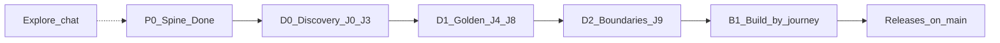

# Phases

Delivery is **journey-locked**: implement only after the matching journey in [FLOWS.md](./FLOWS.md) is `build-ready` (or human persona-ready waiver). P0 remains the architecture spine — not locked domain CRUD.

| Phase | Deliver | Status |
|-------|---------|--------|
| **P0** | Brain + rules + docs; real routes; entitlements stub; reuse panels; auth spine | **Done** (spine only) |
| **D0** | Personas + CLIENT intake + FLOWS/STORIES for J0–J3 (`persona-ready`) | **In progress** |
| **D1** | Draft then validate J4–J8 (weave → dispatch + inventory) | Planned |
| **D2** | J9 boundary pass: Core vs packs vs Analytics vs LoomSage | Planned (provisional answers exist) |
| **B1** | Feature PRs on `develop` per `build-ready` journey; promote `qa` → `main` | Blocked on gates |
| **Explore** | White-label chat | Separate |

## Legacy pack roadmap (superseded as primary plan)

Previous P1–P6 “build pack depth first” labels are **not** the scheduling law anymore. Keep as optional depth hints after journeys lock:

| Old | Hint after journeys |
|-----|---------------------|
| P1 Weaving | Aligns with J4 |
| P2 Yarn/Gate | Aligns with J3 / J7 |
| P3 Dyeing | Aligns with J5 |
| P4 Fabric/job-work | After integrated golden path; converter subset |
| P5 Accounting/FBR | Paid add-on; after J9 |
| P6 Analytics/LoomSage | Paid add-ons; after J9 |

## P0 acceptance (spine — unchanged)

- [x] `.cursor/brain/` complete and linked from rules/docs/README
- [x] Nav uses `/orders`, `/yarn`, `/weaving`, `/dyeing/*`, `/gate/*` (no hash mega-page)
- [x] Existing panels reachable on new routes
- [x] `/production` and old hashes redirect to new routes
- [x] Entitlements filter nav by profile
- [x] Stub / unpaid modules remain status-only / **Upgrade to Pro+** (no fake CRUD)

## D0 acceptance

- [x] [PERSONAS.md](./PERSONAS.md), [FLOWS.md](./FLOWS.md), [STORIES.md](./STORIES.md), [CLIENT.md](./CLIENT.md) exist
- [x] J0–J3 at least `persona-ready` with acceptance stories
- [ ] First client interview ingested into CLIENT.md
- [ ] J0–J3 `client-validated` or explicit waiver before domain CRUD PRs
