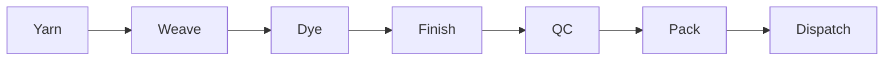
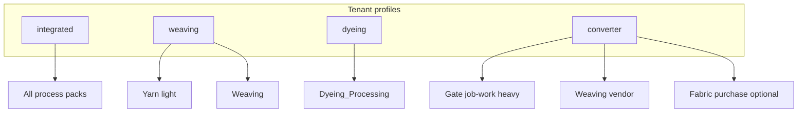
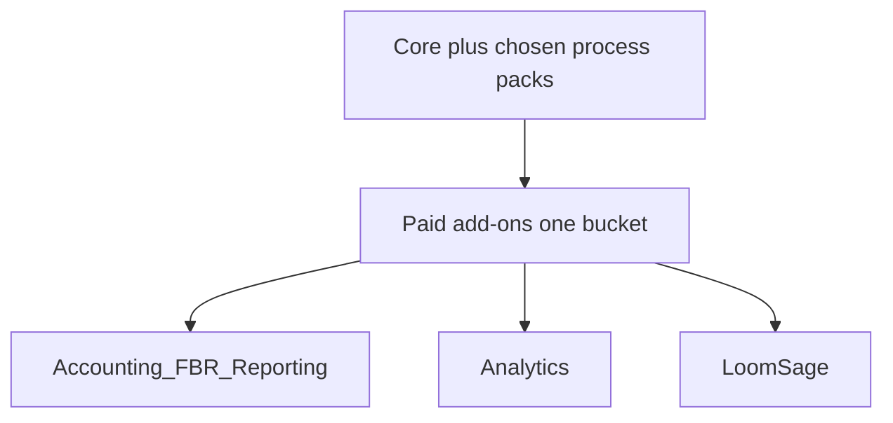

# Product

LoomLogic is a textile ERP for **small-to-medium mills in Pakistan** (Faisalabad, Lahore, Karachi hubs).

## North star

Ship a **full integrated mill** system (Yarn → Weave → Dye/Process → Finish → QC → Pack → Dispatch).  
Tenants who are not fully integrated **add/remove process packs** via profile + entitlements.

## Business models (profiles)

| Profile | Typical ops | Default packs |
|---------|-------------|---------------|
| `integrated` | Fiber to pack in-house | All process packs |
| `weaving` | Loom shed / power loom | Yarn (light) + Weaving |
| `dyeing` | Processing house | Dyeing & Processing |
| `converter` | Buy yarn, job-work out, sell | Job-work-heavy Gate + Weaving (vendor) + optional Fabric purchase |

## Pain points addressed

| Pain | Product response |
|------|------------------|
| Order blindness | Buyer Orders + linked DRAFT work docs per enabled pack |
| Hidden process loss | Process packs propose; Inventory posts yield/shrinkage |
| Multi-UOM | Inventory & Stores as system of record |
| Tax / margin lag | Paid add-on: Accounting / FBR / Reporting |

## Commercial ladder

Pricing tiers inside the paid bucket may differ; architecture treats all three as `kind: addon`.

## Explore (not in module tree yet)

White-label chat to reduce WhatsApp data leak — separate product track.

## Success metric (first useful version)

**Complete operational ERP** for the mill’s day-to-day ops (orders → yarn → weave → dye/finish → QC → pack → dispatch + inventory/setup/gate as in Core/packs) — **excluding** Analytics engine and LoomSage AI (built later as paid add-ons).

Owner lock 2026-08-27.

## Current workaround

Excel + WhatsApp + paper gate slips (persona default until mill validates).

## Platforms (day one) — devices

| Platform | Day one? | Later? | Notes |
|----------|----------|--------|-------|
| Browser (web) | **Yes** | | Primary — locked 2026-08-27 |
| Mobile phone | No | Maybe | Out of scope for v1 |
| Tablet | No | Maybe | Out of scope for v1 |
| Desktop app | No | No | Use browser |

## Deploy / distribution

| Target | Day one? | Notes |
|--------|----------|-------|
| Public web (hosted multi-tenant SaaS) | No | Not v1 |
| App Store / Play | No | |
| Desktop installers | No | |
| **Self-hosted / on-prem** | **Yes** | **Single mill** — locked 2026-08-27 |
| Local-only (no server) | No | |

## Out of scope (for v1 / near-term)

| Item | Why deferred |
|------|----------------|
| White-label chat in Core | Explore track |
| Deep Accounting/FBR CRUD | Paid add-on; after J9 |
| Native mobile / tablet apps | Browser only day one (owner 2026-08-27) |
| Multi-tenant hosted SaaS | v1 = on-prem single mill |

## Non-functional requirements (NFRs)

| Area | Requirement | Notes |
|------|-------------|-------|
| Scale / expected users | **≤50 people** at the mill | Locked owner 2026-08-27 |
| Security / privacy | Tenant isolation (RLS); auth locked in J0 | On-prem single mill |
| Availability / backup | **Automatic** scheduled backups — no manual mill-IT steps for routine backup | Prefer DB dump or volume snapshot on a schedule (e.g. nightly); restore runbook separate. Locked owner 2026-08-27 |
| Accessibility / languages | Urdu/English mix on floor; English OK for ERP labels | Persona default |
| Compliance | FBR/DTRE = paid add-on later | |
| Builder constraints | Solo/small team; journey-locked build | |
| Deferred engines | Analytics + LoomSage **later** — not in first useful ERP | Success metric |

## Assumptions & risks

| Item | Type | Mitigation |
|------|------|------------|
| Role list / StoreKeeper nav not mill-locked | risk | CLIENT C-J0-1 / C-J0-2 |
| J4+ journeys still draft | assumption | D1 discovery before build |
