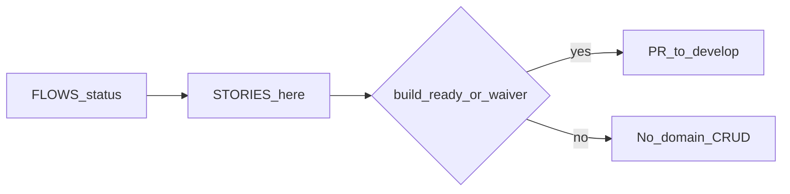

# Acceptance stories

Stories are written for journeys at **`persona-ready`** or higher.  
**Feature PRs** require journey **`build-ready`** in [FLOWS.md](./FLOWS.md), or an explicit human **persona-ready waiver** noted below.

## Waiver log

| Date | Journeys | Waived by | Scope |
|------|----------|-----------|-------|
| — | — | — | No waivers yet — J0–J3 stories are persona-ready only |

## Build gate summary

| Journey | FLOWS status | Stories | Feature PRs allowed? |
|---------|--------------|---------|----------------------|
| J0 | persona-ready | Yes | No — partial owner evidence; roles/nav open (C-J0-1/2). Auth hardening OK without waiver |
| J1 | persona-ready | Yes | No |
| J2 | persona-ready | Yes | No |
| J3 | persona-ready | Yes | No |
| J4–J9 | draft | No | No |

Auth hardening that does **not** invent domain flows may proceed under [docs/SDLC.md](../../docs/SDLC.md) without a journey waiver.

---

## J0 — Login, roles, visibility

### J0-S1 — Login success
**As an** Admin (or any active user)  
**I need** to sign in with email and password  
**So that** I reach the app shell for my role.

- **Given** a seeded active user with a known password  
- **When** they POST login with correct credentials  
- **Then** they receive a JWT and land on the entitled home/nav  

### J0-S2 — Must change password
**As a** new user  
**I need** to be forced to change a temporary password  
**So that** shared temp passwords are not left active.

- **Given** `must_change_password=true`  
- **When** they authenticate  
- **Then** only me / change-password / logout work until password changed  
- **And** the new password is ≥12 chars with ≥1 uppercase  
- **And** after success they land on **Home**  
- **And** all prior sessions for that user are revoked  

### J0-S3 — Lockout
**As the** system  
**I need** to lock after repeated failures  
**So that** brute force is limited.

- **Given** 5 failed attempts in 15 minutes for IP+email  
- **When** another login is attempted  
- **Then** API returns locked / 429 until unlock or expiry  

### J0-S4 — Role nav
**As a** StoreKeeper  
**I need** Gate / Yarn / Inventory nav without Users admin  
**So that** I only see my job.

- **Given** integrated profile and role StoreKeeper  
- **When** they open the shell  
- **Then** nav matches [PERSONAS.md](./PERSONAS.md) entitlement sketch  
- **Note:** Matrix provisional until mill confirms ([CLIENT.md](./CLIENT.md) C-J0-2)  

### J0-S5 — Unpaid add-ons
**As any** user  
**I need** unpaid Analytics / LoomSage / Accounting to show **Upgrade to Pro+**  
**So that** we never show fake CRUD and the upsell is clear.

- **Given** add-ons not entitled  
- **When** they hit those routes  
- **Then** Upgrade to Pro+ / status only — no fake CRUD  

### J0-S6 — Admin-only users + sign out everywhere
**As an** Admin  
**I need** to create users and force-sign-out a user’s devices  
**So that** only Admins provision access and stolen sessions can be killed.

- **Given** an Admin session  
- **When** they create a user  
- **Then** a one-time temp password is returned and `must_change_password=true`  
- **And** non-Admins cannot create users  
- **When** they choose “Sign out everywhere” for a user  
- **Then** all of that user’s sessions are revoked  

---

## J1 — Setup masters

### J1-S1 — Parties
**As an** Admin  
**I need** buyer and yarn-supplier parties  
**So that** Orders and Yarn receive have counterparties.

- **Given** Admin on Setup  
- **When** they create Party records with type  
- **Then** Sales/StoreKeeper can select them on BPO / receive  

### J1-S2 — Articles and UoM
**As an** Admin  
**I need** yarn and greige articles with UoM (kg, m, bale)  
**So that** order lines and lots share vocabulary.

- **Given** Setup masters empty of articles  
- **When** Admin creates article + UoM  
- **Then** J2/J3 forms can reference them  

### J1-S3 — Machines light
**As an** Admin  
**I need** a light loom/machine register  
**So that** J4 can assign work later.

- **Given** integrated mill  
- **When** Admin registers looms (id, shed optional)  
- **Then** list is available to Weaving (read) without full CMMS  

### J1-S4 — Block order without party
**As** Sales  
**I need** BPO create to require a buyer party  
**So that** commercial docs are not orphaned.

- **Given** no buyer selected  
- **When** Sales tries to save BPO  
- **Then** validation error (no silent defaults)  

---

## J2 — Buyer order → CONFIRMED

### J2-S1 — Create draft BPO
**As** Sales  
**I need** to create a draft buyer order with lines  
**So that** commercial intent is captured before production.

- **Given** buyer party + articles exist  
- **When** Sales saves BPO as Draft  
- **Then** no DRAFT work docs are created yet  

### J2-S2 — Confirm creates pack drafts
**As** Sales  
**I need** CONFIRMED to spawn DRAFT work docs for enabled packs only  
**So that** floor work is proposed, not auto-started.

- **Given** integrated entitlements (Yarn/Weaving/Dyeing on)  
- **When** Sales confirms BPO  
- **Then** DRAFT docs exist per enabled pack; Inventory unchanged  

### J2-S3 — Disabled pack skipped
**As** the system  
**I need** to skip DRAFT creation for disabled packs  
**So that** weaving-only tenants are not spammed.

- **Given** a profile with Dyeing off (future subset test)  
- **When** BPO confirms  
- **Then** no dyeing DRAFT is created  

### J2-S4 — Progress rollup owned by Orders
**As** Sales  
**I need** order-level progress from pack signals later  
**So that** I answer buyers without opening every pack screen.

- **Given** confirmed BPO  
- **When** packs later report progress (J4+)  
- **Then** Orders shows rollup; packs do not own the commercial PO  

---

## J3 — Yarn receive / bale lots

### J3-S1 — Weighbridge ticket
**As a** StoreKeeper  
**I need** to capture gross/tare/net at gate  
**So that** inbound weight is auditable.

- **Given** supplier party exists  
- **When** StoreKeeper saves weighbridge ticket  
- **Then** net weight is stored and linkable to a lot  

### J3-S2 — Create yarn lot from ticket
**As a** StoreKeeper  
**I need** to create a bale/lot on `/yarn` from the ticket  
**So that** yarn identity exists for issue to weaving.

- **Given** a posted or saved ticket  
- **When** lot is created with article + qty  
- **Then** lot appears in Yarn list with ticket reference  

### J3-S3 — Inventory post inbound
**As a** StoreKeeper  
**I need** Inventory to post inbound (pack proposes, Inventory posts)  
**So that** stock truth lives in Inventory.

- **Given** yarn lot created  
- **When** inbound is posted  
- **Then** Inventory shows available qty; Yarn does not become a second ledger  

### J3-S4 — Reject silent memory fallback
**As** the system  
**I need** DB errors to surface (503), not fake empty success from memory  
**So that** StoreKeeper trusts the receive.

- **Given** `PERSISTENCE_BACKEND=db`  
- **When** DB is unavailable  
- **Then** API fails closed — no silent memory backend  

---

## J4–J9

Stories deferred until those journeys leave `draft` in FLOWS.md.
