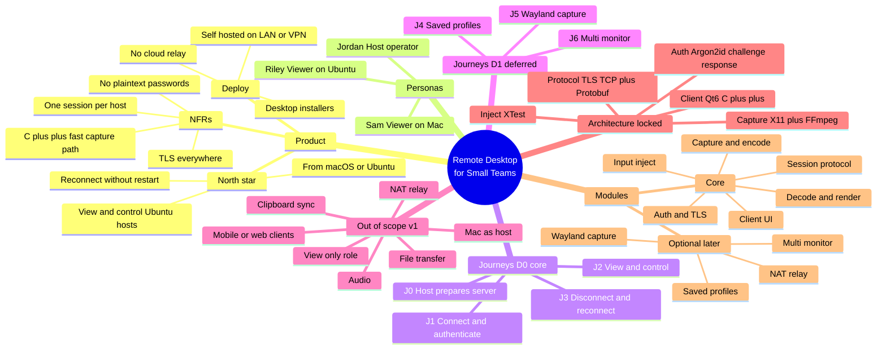
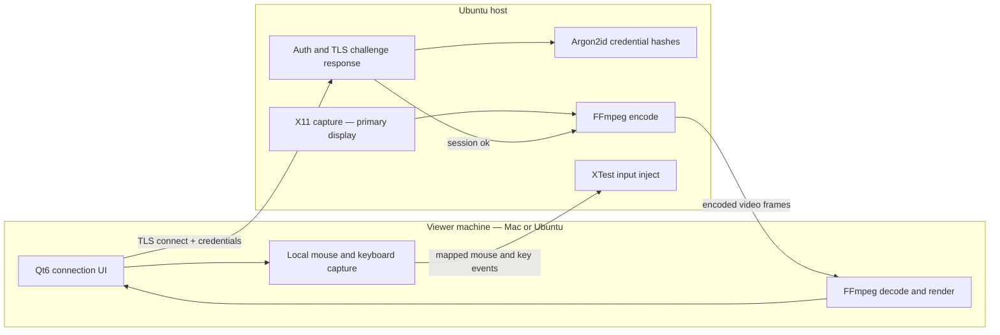
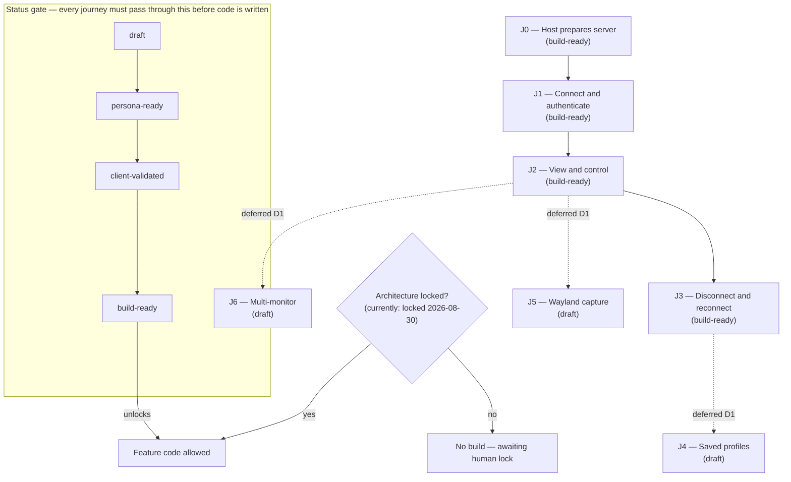

# Project design — Remote Desktop for Small Teams

Generated from the `.cursor/brain/` project brain (PRODUCT, DECISIONS, PERSONAS, FLOWS, MODULES, PHASES). This file is a snapshot — the brain files are the source of truth if they diverge later.

## 1. Project mind map

## 2. System architecture (technical design)

## 3. Journey pipeline and build gate

## Current status

- Architecture: **locked** — FFmpeg H.264, Protobuf, vcpkg/Conan, installers ([CONTEXT.md](.cursor/brain/CONTEXT.md))
- Journeys J0–J3: `build-ready`
- Planning snapshot: **production build has not started**. JPEG/packed-struct trees are a throwaway demo, not the starter.
