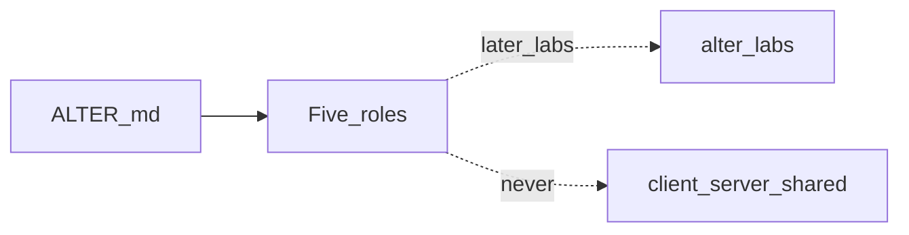

# ALTER learning path

This repo is a **systems-programming curriculum** for a self-hosted, peer-to-peer remote desktop and terminal (conceptually modeled on NoMachine NX). There is **no application code yet**. Labs start from scratch when you ask for a stage.

Syllabus: [`.cursor/brain/ALTER.md`](.cursor/brain/ALTER.md) (Advisor, Librarian, Tutor, Editor, Roommate). Do not implement labs under `client/`, `server/`, or `shared/` — those names are reserved for a future shipped product. When a lab is requested, it gets its own tree (for example `alter-labs/`).

Product discovery notes still live under `.cursor/brain/` (PRODUCT, DECISIONS, …). They are **not** the teaching syllabus and they do not imply source trees exist.
