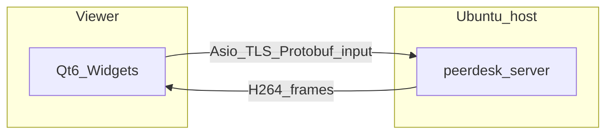

# PeerDesk

Small-team **LAN/VPN remote desktop**: a teammate on macOS or Ubuntu views and controls an **Ubuntu** host with mouse and keyboard, then disconnects and reconnects **without restarting the host server**.

Shipped name is **PeerDesk** (repo nickname “TeamViewer”).



## Build

Locked stack: CMake + **vcpkg**, Qt6 Widgets, Asio TLS, Protobuf, FFmpeg H.264. See [`.cursor/brain/DECISIONS.md`](.cursor/brain/DECISIONS.md).

```bash
# Preferred (locked):
export VCPKG_ROOT=/path/to/vcpkg
./scripts/bootstrap-vcpkg.sh

# Local Homebrew prefixes (macOS, same APIs):
cmake --preset homebrew
cmake --build --preset homebrew -j
```

| Binary | Role |
|--------|------|
| `peerdesk-server` | Ubuntu host (J0) |
| `peerdesk-client` | Viewer UI (J1–J3); macOS `.app` |
| `peerdesk-smoke` | Protocol, auth, busy session, reconnect, H.264 |

```bash
./build/peerdesk-smoke
./scripts/run_demo.sh          # synthetic host canvas
# or: ./scripts/run_demo.sh x11
```

Default login: **jordan** / **peerdesk**. The server prints a TLS fingerprint and the `PEERDESK_CA_FILE` path; the client must trust that `server.crt`. Walkthrough: [docs/DEMO.md](docs/DEMO.md).

## What v1 is (and is not)

| In v1 | Explicitly out of scope |
|-------|-------------------------|
| TLS 1.2+ with pinned host cert | File transfer, audio, clipboard |
| Protobuf control + H.264 video | Wayland host, multi-monitor |
| Mouse + keyboard with coordinate mapping | Relay / “connect from anywhere” |
| One viewer per host; reconnect without restart | Saved profiles, view-only role |

## Packaging

- macOS client: `./scripts/package-macos.sh` (`.app` via `macdeployqt`)
- Ubuntu: `./scripts/package-linux.sh` (`.deb` via CPack; AppImage if `linuxdeploy` is installed)
