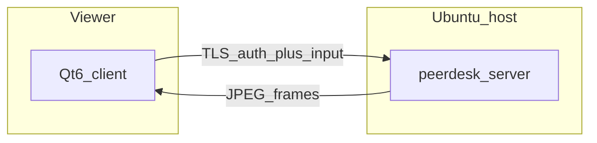

# PeerDesk

Small-team **LAN/VPN remote desktop**: a teammate on macOS or Ubuntu views and controls an **Ubuntu** host with mouse and keyboard, then disconnects and reconnects **without restarting the host server**.

This is a hobby / internal tool (repo nickname “TeamViewer”). The shipped name is **PeerDesk**.



## Show a senior engineer

```bash
cmake -S . -B build && cmake --build build -j
./build/peerdesk-smoke
./scripts/run_demo.sh          # synthetic host canvas
# or: ./scripts/run_demo.sh x11
```

Default login: **jordan** / **peerdesk**. Walkthrough: [docs/DEMO.md](docs/DEMO.md).  
Product memory (journeys, stories, locks): [`.cursor/brain/`](.cursor/brain/).

## What v1 is (and is not)

| In the demo | Explicitly out of scope |
|-------------|-------------------------|
| TLS session, Argon2id + HMAC auth | File transfer, audio, clipboard |
| View primary display (X11 or `--synthetic`) | Wayland host, multi-monitor |
| Mouse + keyboard with coordinate mapping | Relay / “connect from anywhere” |
| One viewer per host; reconnect without restart | Saved profiles, view-only role |

## Build

Needs: CMake, g++/clang C++20, Qt6 Widgets, OpenSSL, libjpeg, libargon2, X11 + XTEST.

```bash
sudo apt install cmake g++ qt6-base-dev libssl-dev libjpeg-dev libargon2-dev \
  libx11-dev libxtst-dev pkg-config
cmake -S . -B build
cmake --build build -j
```

| Binary | Role |
|--------|------|
| `peerdesk-server` | Ubuntu host (J0) |
| `peerdesk-client` | Viewer UI (J1–J3) |
| `peerdesk-smoke` | Protocol, auth, busy session, reconnect |

## Architecture (locked)

Native C++ peer desktop. Details and demo-slice shortcuts: [`.cursor/brain/DECISIONS.md`](.cursor/brain/DECISIONS.md).
