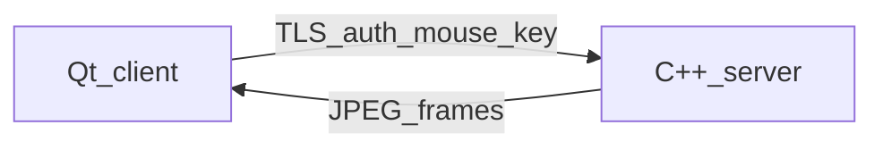

# PeerDesk — senior walkthrough

## What to show (5 minutes)

1. **Requirements first** — `.cursor/brain/` J0–J3 are `build-ready`. Out of scope is explicit (no files, audio, clipboard, relay, Wayland).
2. **Run the host** — `peerdesk-server --synthetic` prints `listening on …`. That is J0.
3. **Connect** — client form: IP, port, username, password. Wrong password stays on the form. That is J1.
4. **View + control** — live frames; clicks map through a letterbox to host pixels. Synthetic mode paints a clock + last input. X11 mode captures the real display. That is J2.
5. **Disconnect / reconnect** — close the session; the server process is still listening; connect again with the same login. That is J3 (the success metric).

## Defaults

| Field | Value |
|-------|--------|
| User | `jordan` |
| Password | `peerdesk` (Argon2id on disk, HMAC on the wire) |
| Port | `4473` |

## Honest demo shortcuts

JPEG frames, packed structs, self-signed TLS. Production increment is H.264 + Protobuf + pinned certs — recorded in DECISIONS, not hidden.
